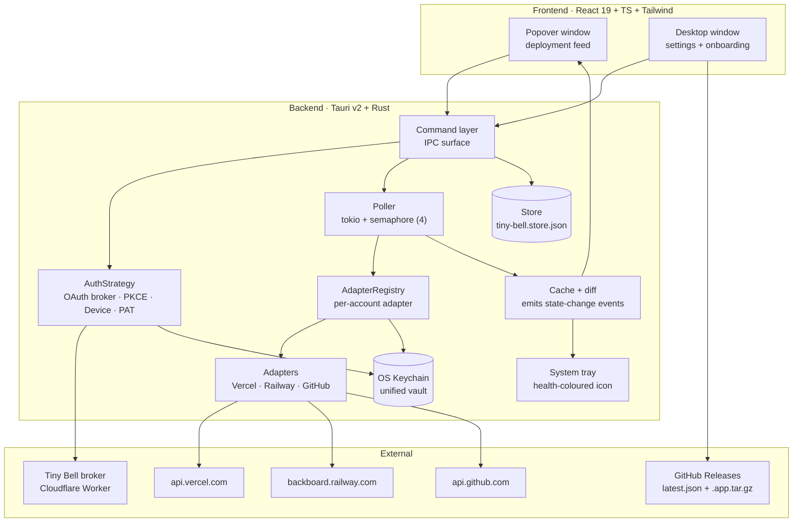
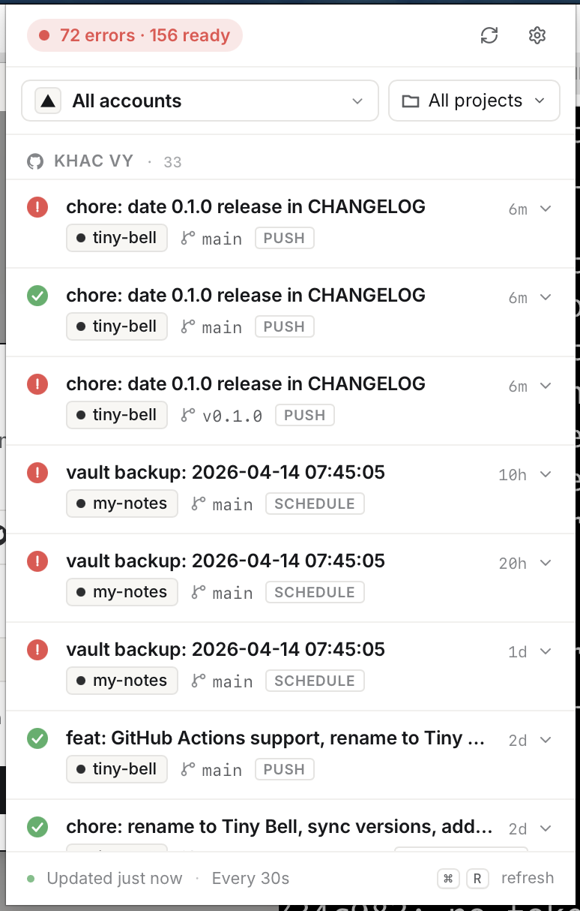
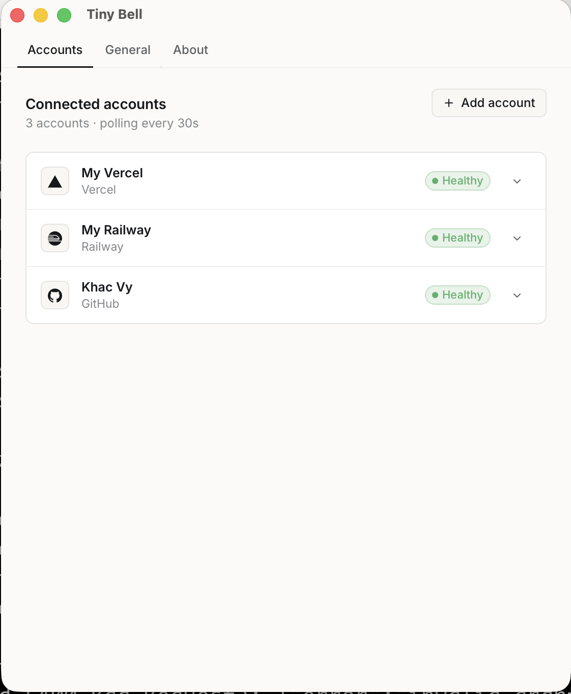
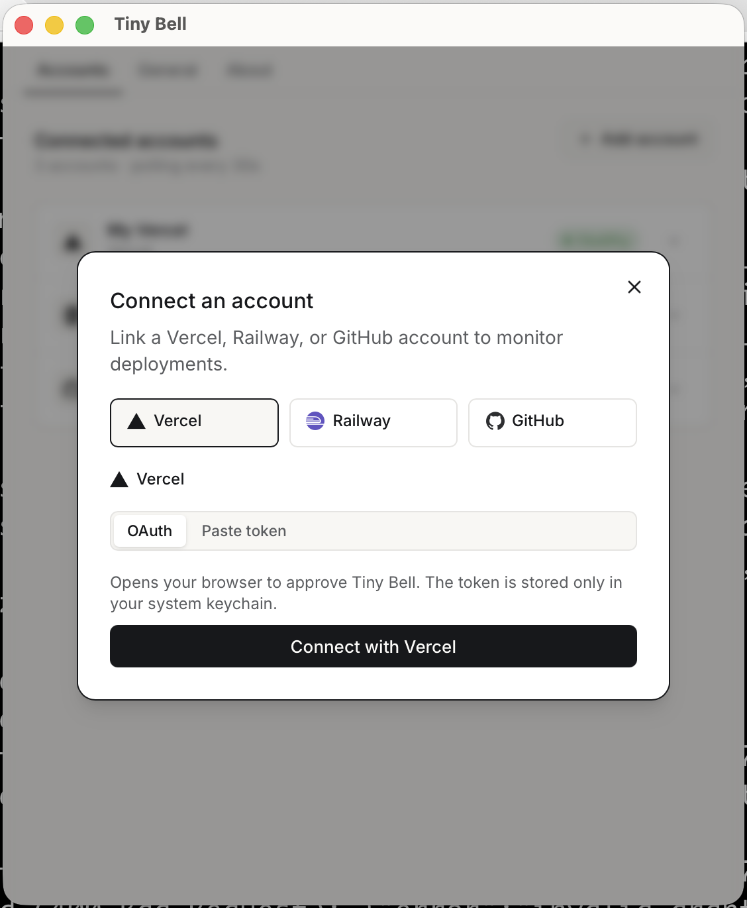

<p align="center">
  
</p>

<h1 align="center">Tiny Bell</h1>

<p align="center"><em>Tune in to your deploys.</em></p>

A quiet menubar app that watches your builds and deployments across **Vercel**, **Railway**, and **GitHub Actions**, and gently tells you when one finishes, fails, or recovers.

## Stack

- **Frontend** — React 19, TypeScript, Vite, Tailwind v4, shadcn/ui, lucide-react
- **Backend** — Rust (Tauri v2), adapter pattern over cloud APIs, tokio + reqwest
- **Secrets** — OS keychain only (macOS Keychain, never on disk)
- **OAuth broker** — stateless Cloudflare Worker (`./broker/`) that holds provider `client_secret`s so they never ship in the desktop binary
- **Updates** — Tauri's minisign-signed auto-updater, delivered through GitHub Releases

## Development

```bash
pnpm install
pnpm tauri dev
```

Optional env (all values are public — copy `.env.example` → `.env.local`):

```bash
VERCEL_CLIENT_ID=           # public identifier
RAILWAY_CLIENT_ID=          # public identifier (PKCE public client)
GITHUB_CLIENT_ID=           # public identifier (Device Flow)
TINY_BELL_BROKER_BASE=      # URL of the deployed broker (see ./broker/)
```

Any combination you leave blank simply disables that provider's OAuth path; paste-token still works everywhere.

### Tests & typecheck

```bash
pnpm typecheck                              # TypeScript
cd src-tauri && cargo test --lib            # Rust unit tests
cd broker && pnpm typecheck && pnpm test    # broker
```

## Architecture



Key modules: `src-tauri/src/adapters/` (per-platform clients), `src-tauri/src/auth/strategy.rs` (flow dispatch), `src-tauri/src/keychain.rs` (vault), `src-tauri/src/poller.rs` (background loop), `broker/src/index.ts` (OAuth broker).

## Authentication model

Tiny Bell is distributed as a binary. **No provider `client_secret` is compiled into the binary** — any secret shipped this way is effectively public (`strings`, a hex editor, or mitmproxy extract it in minutes).

Each provider picks one of four flows, based on what it supports:

| Provider | Flow | Needs broker? |
|---|---|---|
| **Vercel** | Broker-mediated OAuth (Cloudflare Worker holds `client_secret`) | Yes |
| **Railway** | Pure PKCE public client (no secret involved) | No |
| **GitHub** | OAuth Device Flow (no secret involved) | No |
| *All three* | Paste-token (PAT) fallback, always available | No |

The broker is stateless: it does the code→token exchange on your behalf and forwards the token to a loopback URL on your machine. Tokens never persist server-side.

## Status

- **Platforms supported:** macOS (Apple Silicon + Intel). Windows/Linux builds are out of scope for v1.
- **Builds are unsigned.** The developer hasn't enrolled in the Apple Developer Program yet, so macOS will warn that the app is from an unidentified developer. See [Installing an unsigned build](#installing-an-unsigned-build) below.
- **Auto-updates** are on: the app checks for new releases from Settings → About → **Check for updates**.
- **Open source** under MIT (see [LICENSE](./LICENSE)).

## First run

1. Download the DMG for your architecture from the latest [release](https://github.com/trankhacvy/tiny-bell/releases).
2. Install, then see [Installing an unsigned build](#installing-an-unsigned-build) to bypass Gatekeeper.
3. Launch Tiny Bell from Applications or Spotlight.
4. Click the tray icon → **Add account**, then follow the provider-specific flow (OAuth or paste-token).

### Installing an unsigned build

Because the build isn't signed with an Apple Developer ID, macOS treats it as coming from an "unidentified developer". Two options:

**Right-click to open** (one-time per install):

1. Drag Tiny Bell into Applications.
2. Right-click (or Ctrl-click) the app → **Open** → **Open** again in the confirmation dialog.

**Or strip the quarantine attribute:**

```bash
xattr -dr com.apple.quarantine /Applications/Tiny\ Bell.app
```

After either, the app launches normally on subsequent runs.

## Screenshots

<table>
  <tr>
    <td align="center"><strong>Deployment feed</strong><br>Live status, commit, branch, one-click inspect<br></td>
    <td align="center"><strong>Connected accounts</strong><br>Per-account health, rename, re-auth, removal<br></td>
  </tr>
  <tr>
    <td align="center" colspan="2"><strong>Add account</strong><br>OAuth, Device Flow, or paste-token — per provider<br></td>
  </tr>
</table>

## Security

- Tokens live in the OS keychain and are never written to disk or log files after initial paste.
- All logs pass through a redactor (`src-tauri/src/redact.rs`) that masks common secret patterns (Bearer headers, `client_secret`, `access_token`, etc.).
- Content-Security-Policy restricts outbound `connect-src` to the three provider API hosts.
- The binary contains no provider `client_secret`s — they live only in the broker's Cloudflare Workers secret store.

## Contributing

Issues and PRs welcome. See [CONTRIBUTING.md](./CONTRIBUTING.md).

## License

[MIT](./LICENSE) © Khac Vy
