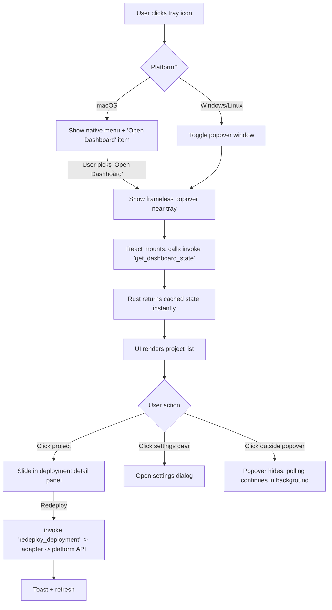
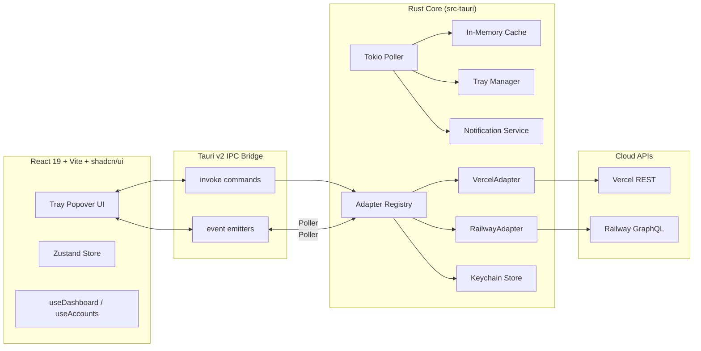

# PRODUCT REQUIREMENTS DOCUMENT (PRD)

## 1. Executive Summary

**Dev Radio** is a lightweight, native-feeling, cross-platform desktop menu-bar / system-tray application that gives developers real-time visibility into the health of their cloud build and deployment pipelines on **Vercel** and **Railway**, with an adapter architecture designed to extend to Netlify, Render, Fly.io, GitHub Actions, and beyond.

Built on **Tauri v2 (Rust)** with a **React 19 + TypeScript + Vite + shadcn/ui + TailwindCSS** frontend (bootstrapped from the `agmmnn/tauri-ui` template), Dev Radio lives primarily in the OS tray/menu bar. A single glance at a color-coded icon tells a developer whether all their projects are green, building, or broken — without the context-switch of opening a browser, logging into multiple dashboards, or juggling Slack alerts.

Dev Radio supports **multiple simultaneous accounts** per platform (personal + work/team/workspace), stores API tokens in the **OS-native keychain**, polls deployment state at a configurable cadence (default 15s), surfaces desktop notifications on state transitions, and exposes one-click actions (open, copy URL, redeploy).

The product is positioned as a **zero-friction, always-on deploy status companion** for solo indie hackers and engineers inside larger companies.

---

## 2. Problem Statement & Opportunity

### 2.1 Problem
Modern developers ship code across **multiple platforms, multiple accounts, and multiple projects simultaneously**. Checking deployment status today requires:

- Opening 3–5 browser tabs (Vercel personal, Vercel team, Railway personal, Railway company).
- Context-switching away from the editor.
- Repeatedly refreshing dashboards.
- Relying on noisy Slack / email notifications that are easy to miss or mute.
- Discovering a failed preview deploy minutes or hours after the fact.

Existing solutions are fragmented:
- **Platform-native dashboards** → siloed, one platform at a time, no multi-account view.
- **Slack integrations** → noisy, tied to a workspace, delayed.
- **Vercel CLI / Railway CLI** → manual polling, no passive ambient awareness.
- **General-purpose monitors (Datadog, etc.)** → overkill, expensive, enterprise-focused.

### 2.2 Opportunity
A **lightweight, ambient, local-first menu-bar app** that:

1. Unifies deploy status across platforms in one tray icon.
2. Handles multi-account reality of modern devs (personal + work).
3. Costs nothing to run (no SaaS backend), respects privacy (tokens stay local).
4. Extends easily to any future platform via a clean trait-based architecture.

### 2.3 Market Signal
- Vercel API and Railway GraphQL are stable, documented, and widely used.
- Tauri v2 mature enough for production tray apps.
- Active demand signal: existing niche tools (e.g. unofficial Vercel menu-bar apps) have thousands of GitHub stars despite limited feature sets.

---

## 3. Goals & Success Metrics

### 3.1 Product Goals
| # | Goal | Why it matters |
|---|------|----------------|
| G1 | Reduce time-to-awareness of a failed deploy from minutes to <20s | Core value prop |
| G2 | Unify multi-platform, multi-account deploy state in one glance | Differentiator |
| G3 | Stay invisible when everything is green | Respect developer focus |
| G4 | Be trivially extensible to new platforms | Long-term relevance |

### 3.2 Quantitative Success Metrics (North Star + Supporting)

| Metric | Target (v1.0) | Target (v1.3) |
|---|---|---|
| **North Star:** Median time from deploy state change to user notification | ≤ 20 seconds | ≤ 10 seconds |
| Idle CPU usage | < 0.5 % on M-series Mac, < 1.0 % on Windows | < 0.3 % / 0.7 % |
| Idle RAM footprint (RSS) | < 120 MB | < 80 MB |
| Installer bundle size (per OS) | < 12 MB (macOS), < 8 MB (Windows MSI), < 10 MB (Linux AppImage) | Same |
| App cold-start to tray-icon-ready | < 800 ms | < 500 ms |
| Crash-free sessions (Sentry / Tauri logs) | ≥ 99.5 % | ≥ 99.9 % |
| Failed API calls that recover automatically without user intervention | ≥ 98 % | ≥ 99.5 % |
| GitHub stars (6 months post-launch) | 1,500 | 5,000 |
| Weekly active installs (self-reported opt-in telemetry) | 500 | 3,000 |
| Average number of linked accounts per user | ≥ 1.6 | ≥ 2.2 |

---

## 4. User Personas & User Stories

### 4.1 Personas

**Persona A — "Maya, the Indie Hacker"**
- 32, full-stack dev, ships 2–3 side projects.
- 1 Vercel personal account, 1 Railway personal account.
- Values: minimal distraction, fast feedback, zero-config.
- Pain: forgets to check deploys after `git push`, discovers broken preview links from a user email.

**Persona B — "Daniel, the Staff Engineer at a Startup"**
- 38, works at a Series B company.
- Vercel personal + Vercel team ("acme-web"), Railway personal + Railway workspace ("acme-backend").
- Values: reliability, team visibility, secure token handling (company SSO concerns).
- Pain: juggles 4 dashboards daily, gets paged when staging breaks, wants proactive warnings before teammates notice.

### 4.2 User Stories with Acceptance Criteria

> Format: **US-xxx**: As a [persona], I want [action], so that [outcome]. AC = Acceptance Criteria.

---

**US-001 — First-run onboarding**
*As a new user, I want to add my first Vercel account in under 90 seconds, so that I can see status immediately.*

- **AC1**: On first launch, app opens a welcome popover with a "Connect Vercel" and "Connect Railway" button.
- **AC2**: Clicking "Connect Vercel" opens a dialog explaining where to generate a token, with a link opening the browser to `https://vercel.com/account/tokens`.
- **AC3**: Pasting a valid token immediately validates it via `/v2/user` and displays the account email + avatar on success.
- **AC4**: Invalid tokens show an inline error message without leaking the token to logs.
- **AC5**: Token is stored in OS keychain; never written to plain disk.

---

**US-002 — Ambient tray status**
*As Maya, I want to glance at my menu bar and know instantly if anything is broken.*

- **AC1**: Tray icon is one of four states: **green (all Ready)**, **yellow (any Building/Queued)**, **red (any Error in last 30 min)**, **gray (no data / offline / no accounts)**.
- **AC2**: Icon updates within one polling interval (≤ 15s default) of remote state change.
- **AC3**: Yellow takes precedence over green; red takes precedence over yellow.
- **AC4**: Template/monochrome icon on macOS for native dark/light menu-bar theming; colored accent rendered as a small dot overlay.

---

**US-003 — Multi-account unified view**
*As Daniel, I want to see all projects from all 4 of my accounts in one list, grouped or filterable.*

- **AC1**: Popover lists projects grouped by account, with account avatar + name as section header.
- **AC2**: User can collapse/expand each account.
- **AC3**: User can filter by status (All / Building / Failing / Ready) and by platform.
- **AC4**: Per-account toggle to temporarily mute notifications without disconnecting.

---

**US-004 — Deployment history per project**
*As a user, I want to click a project and see its last 10 deployments with full metadata.*

- **AC1**: Clicking a project opens a detail view (slide-in panel) listing ≥ 10 most-recent deployments.
- **AC2**: Each row shows: status badge, environment (prod/preview), commit SHA (7-char), commit message (truncated), author avatar + name, relative timestamp (e.g. "2 min ago"), duration.
- **AC3**: Row menu exposes: Open in Browser, Copy Deploy URL, Copy Commit SHA, Redeploy (if supported by platform).

---

**US-005 — Desktop notifications on state change**
*As Maya, I want a native notification the moment a deploy fails or goes live.*

- **AC1**: Notification fires within ≤ 1 polling interval after transition to Ready or Error.
- **AC2**: Clicking the notification opens the popover focused on that deployment.
- **AC3**: Users can disable notifications globally, per-platform, per-account, or per-project in Settings.
- **AC4**: No duplicate notification for the same deployment ID across app restarts.

---

**US-006 — Configurable polling**
*As a power user, I want to set polling cadence between 5s and 5min so I can balance freshness vs API cost.*

- **AC1**: Settings page exposes a slider: 5s / 10s / 15s (default) / 30s / 60s / 5min.
- **AC2**: Changing the interval takes effect immediately without restart.
- **AC3**: If an API returns 429, the app enters exponential backoff up to 2× the configured interval, with a gentle tray warning indicator.

---

**US-007 — Launch at login**
- **AC1**: Settings toggle for "Launch at login".
- **AC2**: Uses `tauri-plugin-autostart`.
- **AC3**: Launches headless into tray (no popover on autostart).

---

**US-008 — Redeploy from tray**
- **AC1**: For Vercel projects, a "Redeploy" action on any Ready/Error deployment calls `POST /v13/deployments`.
- **AC2**: For Railway services, calls the `serviceInstanceRedeploy` mutation.
- **AC3**: Shows in-app toast on success; error toast with platform message on failure.

---

**US-009 — Remove / rotate account**
- **AC1**: Settings → Accounts → delete removes keychain entry and all in-memory cache.
- **AC2**: Rotating token replaces keychain entry atomically.

---

**US-010 — Offline resilience**
- **AC1**: On network loss, tray turns gray; popover shows a banner "You're offline — showing last known state (N min ago)".
- **AC2**: Polling auto-resumes on network return without user action.

---

## 5. User Flows

### 5.1 Primary Flows (numbered)

**Flow 1 — First Launch & First Account**
1. User installs Dev Radio; OS launches app.
2. Tray icon appears (gray, "no data").
3. Welcome popover auto-opens.
4. User clicks "Connect Vercel" → Modal opens with instructions.
5. User pastes token → Rust validates against `/v2/user`.
6. On success, Rust stores in keychain, adds account, kicks off initial fetch.
7. Tray transitions gray → green/yellow/red.
8. Popover populates with projects grouped by account.

**Flow 2 — Ambient Monitoring → Action**
1. User is coding; tray is green.
2. A Vercel build fails → next poll returns `state: ERROR`.
3. Rust emits `deployment:state_changed` event to frontend and fires OS notification.
4. Tray transitions green → red.
5. User clicks the notification.
6. Popover opens, focused on the failing project, showing the failed deployment row highlighted.
7. User clicks "Open in Browser" → Vercel deployment page opens.

**Flow 3 — Adding a Second (Team) Account**
1. User opens Settings → Accounts.
2. Clicks "Add Account" → selects Vercel.
3. Enters token; optionally enters Team ID (`team_xxx`).
4. Rust validates token and (if team ID given) `/v2/teams/{teamId}`.
5. Account saved; projects for that team begin appearing under a new account section.

### 5.2 Mermaid — Tray → Popover Flow



---

## 6. Functional Requirements

### 6.1 Tray / Menu Bar
- **FR-T1** The app MUST install a tray icon on startup on macOS, Windows, and Linux.
- **FR-T2** The tray icon MUST reflect aggregate health within the configured polling interval.
- **FR-T3** Left-click MUST open the popover (Win/Linux) or a native menu (macOS, configurable to popover).
- **FR-T4** Right-click MUST show a context menu with: Open Dashboard · Refresh Now · Settings · Pause Notifications · Quit.
- **FR-T5** Tray icon MUST use template/monochrome rendering on macOS, with a colored status dot overlay.

### 6.2 Account Management
- **FR-A1** Users MUST be able to add any number of Vercel and Railway accounts.
- **FR-A2** Each account record MUST contain: `id`, `platform`, `display_name`, `avatar_url`, `scope` (user | team | workspace), `scope_id` (optional), `enabled: bool`, `created_at`.
- **FR-A3** Tokens MUST be stored exclusively in OS keychain via `tauri-plugin-stronghold` or `keyring` crate.
- **FR-A4** Users MUST be able to rename the display name of an account.
- **FR-A5** Users MUST be able to disable an account without deleting it.
- **FR-A6** Deleting an account MUST purge: keychain entry, in-memory cache, notification-dedup store entries.

### 6.3 Project & Deployment Display
- **FR-P1** Dashboard MUST list all projects across all enabled accounts.
- **FR-P2** Projects MUST be sortable by: most-recent deployment, name, status severity.
- **FR-P3** Each project row MUST show: name, platform icon, account badge, latest deployment status badge, relative timestamp.
- **FR-P4** Clicking a project MUST show its 10 most-recent deployments with full metadata (see US-004 AC2).

### 6.4 Actions
- **FR-X1** One-click "Open in Browser" for every deployment.
- **FR-X2** One-click "Copy URL".
- **FR-X3** "Redeploy" when platform supports it.
- **FR-X4** "Refresh Now" overrides the polling interval once.

### 6.5 Notifications
- **FR-N1** Native OS notifications on transitions to Ready, Error, Canceled.
- **FR-N2** Configurable per platform / account / project.
- **FR-N3** MUST suppress duplicate notifications (dedup by `deployment_id + target_state`, persisted across restarts).

### 6.6 Settings
- **FR-S1** Settings screen MUST expose: polling interval, notification rules, launch-at-login, theme override, account list.
- **FR-S2** All settings MUST persist via `tauri-plugin-store` in an OS-appropriate config dir.

### 6.7 Extensibility
- **FR-E1** All platform-specific logic MUST reside behind the `DeploymentMonitor` trait.
- **FR-E2** Adding a new platform MUST NOT require changes to frontend business logic — only a new trait impl + platform enum entry.

---

## 7. Non-Functional Requirements

| Category | Requirement |
|---|---|
| **Performance** | Idle CPU < 0.5 % M-series, < 1 % Windows. Idle RAM < 120 MB. UI interaction p95 < 50 ms. |
| **Bundle Size** | macOS DMG < 12 MB; Windows MSI < 8 MB; Linux AppImage < 10 MB. Use Vite code-splitting and `minify: "esbuild"`. |
| **Security** | Tokens only in OS keychain. No tokens in logs, crash reports, or telemetry. All outbound requests over HTTPS. CSP enforced in `tauri.conf.json`. `allowlist` locked to minimum capabilities. |
| **Reliability** | 99.5 % crash-free sessions. Automatic retry w/ exponential backoff on API failures. Stale-while-revalidate cache. |
| **Accessibility** | WCAG 2.1 AA contrast on all text. Full keyboard navigation in popover (Tab / Arrow / Enter / Esc). VoiceOver + NVDA labels on all interactive controls. |
| **Internationalization** | v1 English only. Copy centralized in `src/lib/i18n.ts` for future locales. |
| **Logging** | Rust `tracing` + `tracing-subscriber` → rolling log file in app data dir. Frontend errors bubble to Rust via `invoke('log_error')`. |
| **Privacy** | No telemetry on by default. Opt-in only, anonymous, aggregate. Never send project names or tokens. |
| **macOS specifics** | Hardened runtime, notarized, universal binary (x86_64 + aarch64). |
| **Windows specifics** | Code-signed MSI, WebView2 runtime auto-bootstrap. |
| **Linux specifics** | AppImage + `.deb`. Tray via `libayatana-appindicator` (Tauri v2 default). |

---

## 8. Technical Architecture

### 8.1 High-Level Architecture (Mermaid)



### 8.2 The `DeploymentMonitor` Trait (complete Rust code)

```rust
// src-tauri/src/adapters/mod.rs
use async_trait::async_trait;
use serde::{Deserialize, Serialize};
use std::fmt::Debug;
use thiserror::Error;

#[derive(Debug, Error)]
pub enum AdapterError {
    #[error("authentication failed: {0}")]
    Unauthorized(String),
    #[error("rate limited, retry after {0}s")]
    RateLimited(u64),
    #[error("network error: {0}")]
    Network(#[from] reqwest::Error),
    #[error("platform error: {0}")]
    Platform(String),
    #[error("unsupported operation: {0}")]
    Unsupported(&'static str),
}

#[derive(Debug, Clone, Serialize, Deserialize, PartialEq, Eq, Hash)]
pub enum Platform {
    Vercel,
    Railway,
}

#[derive(Debug, Clone, Serialize, Deserialize, PartialEq, Eq)]
pub enum DeploymentState {
    Queued,
    Building,
    Ready,
    Error,
    Canceled,
    Unknown,
}

#[derive(Debug, Clone, Serialize, Deserialize)]
pub struct AccountProfile {
    pub id: String,
    pub platform: Platform,
    pub display_name: String,
    pub email: Option<String>,
    pub avatar_url: Option<String>,
    pub scope_id: Option<String>, // team_id / workspace_id
}

#[derive(Debug, Clone, Serialize, Deserialize)]
pub struct Project {
    pub id: String,
    pub account_id: String,
    pub platform: Platform,
    pub name: String,
    pub url: Option<String>,
    pub framework: Option<String>,
    pub latest_deployment: Option<Deployment>,
}

#[derive(Debug, Clone, Serialize, Deserialize)]
pub struct Deployment {
    pub id: String,
    pub project_id: String,
    pub state: DeploymentState,
    pub environment: String, // "production" | "preview" | "development"
    pub url: Option<String>,
    pub commit_sha: Option<String>,
    pub commit_message: Option<String>,
    pub author_name: Option<String>,
    pub author_avatar: Option<String>,
    pub created_at: i64,      // unix ms
    pub finished_at: Option<i64>,
    pub duration_ms: Option<u64>,
    pub progress: Option<u8>, // 0..=100 when available
}

#[async_trait]
pub trait DeploymentMonitor: Send + Sync + Debug {
    /// Unique identifier for this platform (e.g. "vercel").
    fn platform(&self) -> Platform;

    /// Validate the stored credential and return a profile.
    async fn validate(&self) -> Result<AccountProfile, AdapterError>;

    /// List all projects for this account / scope.
    async fn list_projects(&self) -> Result<Vec<Project>, AdapterError>;

    /// List recent deployments for a single project (most recent first).
    async fn list_deployments(
        &self,
        project_id: &str,
        limit: usize,
    ) -> Result<Vec<Deployment>, AdapterError>;

    /// Optional: trigger a redeploy. Default impl returns Unsupported.
    async fn redeploy(&self, _deployment_id: &str) -> Result<Deployment, AdapterError> {
        Err(AdapterError::Unsupported("redeploy"))
    }

    /// Optional: cancel an in-flight deployment.
    async fn cancel(&self, _deployment_id: &str) -> Result<(), AdapterError> {
        Err(AdapterError::Unsupported("cancel"))
    }

    /// Return the per-adapter suggested minimum poll interval in seconds.
    fn min_poll_interval_secs(&self) -> u64 {
        10
    }
}
```

### 8.3 Recommended Folder Structure (on top of `agmmnn/tauri-ui`)

```
dev-radio/
├── src/                               # React frontend (from template)
│   ├── app/
│   │   ├── popover/                   # Main tray popover UI
│   │   │   ├── DashboardPage.tsx
│   │   │   ├── ProjectDetailPanel.tsx
│   │   │   └── EmptyState.tsx
│   │   ├── settings/
│   │   │   ├── SettingsDialog.tsx
│   │   │   ├── AccountsPane.tsx
│   │   │   ├── GeneralPane.tsx
│   │   │   └── NotificationsPane.tsx
│   │   └── onboarding/
│   │       └── WelcomePopover.tsx
│   ├── components/
│   │   ├── ui/                        # shadcn/ui primitives (already in template)
│   │   ├── status/
│   │   │   ├── StatusBadge.tsx
│   │   │   ├── StatusDot.tsx
│   │   │   └── PlatformIcon.tsx
│   │   ├── project/
│   │   │   ├── ProjectCard.tsx
│   │   │   └── DeploymentRow.tsx
│   │   └── account/
│   │       ├── AccountSwitcher.tsx
│   │       └── AddAccountDialog.tsx
│   ├── hooks/
│   │   ├── useDashboard.ts
│   │   ├── useAccounts.ts
│   │   ├── useSettings.ts
│   │   └── useTrayEvents.ts
│   ├── lib/
│   │   ├── tauri.ts                   # typed invoke wrappers
│   │   ├── format.ts                  # relative time, duration
│   │   └── i18n.ts
│   └── store/
│       └── dashboard-store.ts         # Zustand
│
├── src-tauri/                         # Rust backend
│   ├── src/
│   │   ├── main.rs
│   │   ├── lib.rs
│   │   ├── commands/                  # Tauri commands (invoke targets)
│   │   │   ├── mod.rs
│   │   │   ├── accounts.rs
│   │   │   ├── dashboard.rs
│   │   │   ├── deployments.rs
│   │   │   └── settings.rs
│   │   ├── adapters/
│   │   │   ├── mod.rs                 # trait + types
│   │   │   ├── registry.rs            # dyn dispatch registry
│   │   │   ├── vercel/
│   │   │   │   ├── mod.rs
│   │   │   │   ├── client.rs
│   │   │   │   ├── mapper.rs          # API DTO -> domain
│   │   │   │   └── types.rs
│   │   │   └── railway/
│   │   │       ├── mod.rs
│   │   │       ├── client.rs
│   │   │       ├── graphql/
│   │   │       │   └── queries.graphql
│   │   │       └── mapper.rs
│   │   ├── poller.rs                  # Tokio scheduler
│   │   ├── tray.rs                    # Tray mgmt + icon state
│   │   ├── notifications.rs
│   │   ├── keychain.rs                # tauri-plugin-stronghold / keyring
│   │   ├── store.rs                   # settings persistence
│   │   ├── cache.rs
│   │   └── events.rs                  # emit helpers
│   ├── icons/
│   │   ├── tray/
│   │   │   ├── tray-green.png  (16/32 + @2x)
│   │   │   ├── tray-yellow.png
│   │   │   ├── tray-red.png
│   │   │   └── tray-gray.png
│   │   └── app-icon.png
│   └── tauri.conf.json
└── package.json
```

### 8.4 Background Polling Strategy (Tokio)

```rust
// src-tauri/src/poller.rs
pub struct Poller {
    registry: Arc<AdapterRegistry>,
    cache: Arc<Cache>,
    tx: tokio::sync::mpsc::Sender<PollerEvent>,
    interval: Arc<AtomicU64>, // seconds, hot-swappable
}

impl Poller {
    pub fn spawn(self: Arc<Self>) -> tokio::task::JoinHandle<()> {
        tokio::spawn(async move {
            loop {
                let ms = self.interval.load(Ordering::Relaxed) * 1000;
                let tick = tokio::time::sleep(Duration::from_millis(ms));
                tokio::pin!(tick);
                tokio::select! {
                    _ = &mut tick => self.poll_all().await,
                    // future: listen for "force refresh" commands on a channel
                }
            }
        })
    }

    async fn poll_all(&self) {
        let adapters = self.registry.enabled_adapters();
        let mut set = tokio::task::JoinSet::new();
        for a in adapters {
            set.spawn(async move {
                let projects = a.list_projects().await?;
                // fan-out: fetch deployments per project with concurrency cap
                let sem = Arc::new(Semaphore::new(4));
                let mut results = Vec::new();
                for p in projects {
                    let permit = sem.clone().acquire_owned().await.unwrap();
                    let deployments = a.list_deployments(&p.id, 10).await;
                    drop(permit);
                    results.push((p, deployments));
                }
                Ok::<_, AdapterError>(results)
            });
        }
        // collect, diff vs cache, emit events, update tray
    }
}
```

**Key strategy points:**
- Single shared `reqwest::Client` with HTTP/2, gzip, and 10s timeout.
- Concurrent adapter polling with `JoinSet`; bounded per-project fan-out via `Semaphore`.
- `AtomicU64` for hot-swappable interval without restarting the task.
- State diff against `Cache` drives two outputs: `events::emit("dashboard:update", ...)` to the frontend, and tray-icon recomputation.
- Exponential backoff on `RateLimited` / network errors per-adapter.
- "Force refresh" via `invoke('refresh_now')` sends to an mpsc channel the poll loop selects on.

### 8.5 Data Models (Rust)

See §8.2 for `Project`, `Deployment`, `AccountProfile`, `DeploymentState`, `Platform`.

Additional persistence-only models:

```rust
#[derive(Serialize, Deserialize)]
pub struct StoredAccount {
    pub id: String,             // uuid
    pub platform: Platform,
    pub display_name: String,
    pub scope_id: Option<String>,
    pub enabled: bool,
    pub created_at: i64,
    // token is NOT here; lives in keychain under key = id
}

#[derive(Serialize, Deserialize)]
pub struct Settings {
    pub poll_interval_secs: u64,      // default 15
    pub launch_at_login: bool,        // default false
    pub theme: ThemeOverride,         // System | Light | Dark
    pub notifications: NotificationRules,
}

#[derive(Serialize, Deserialize)]
pub struct NotificationRules {
    pub enabled: bool,
    pub notify_on_error: bool,
    pub notify_on_ready: bool,
    pub notify_on_canceled: bool,
    pub muted_account_ids: HashSet<String>,
    pub muted_project_ids: HashSet<String>,
}
```

### 8.6 Multi-Account Management

- Each account has a UUID. The token lives in the OS keychain under `service = "dev-radio"`, `account = <uuid>`.
- `AdapterRegistry` holds `HashMap<AccountId, Box<dyn DeploymentMonitor>>`.
- On account add: UUID minted → token stored in keychain → adapter instantiated → `validate()` called → on success, persisted `StoredAccount` + registry insert → poller picks it up on next tick.
- On account remove: registry eviction → keychain purge → settings file updated → cache entries cleared.
- `scope_id` disambiguates Vercel teams and Railway workspaces; when present, API calls include `?teamId=...` or the corresponding GraphQL scope.

---

## 9. API Integration Specs

### 9.1 Vercel REST

Base URL: `https://api.vercel.com`  ·  Auth: `Authorization: Bearer <token>`

| Purpose | Method & Path | Key Query Params | Notes |
|---|---|---|---|
| Validate token / get user | `GET /v2/user` | — | Returns `user.id`, `email`, `avatar` |
| List teams | `GET /v2/teams` | `limit=100` | For team picker UX |
| List projects | `GET /v9/projects` | `teamId`, `limit=100` | Paginate via `pagination.next` |
| List deployments | `GET /v6/deployments` | `projectId`, `teamId`, `limit=10`, `target=production,preview` | Core poll endpoint |
| Get single deployment | `GET /v13/deployments/{id}` | `teamId` | For detail view / progress |
| Redeploy | `POST /v13/deployments` | body: `{ name, deploymentId, target }` | Action |
| Cancel deployment | `PATCH /v12/deployments/{id}/cancel` | `teamId` | Action |

**State mapping:**
| Vercel `state`/`readyState` | Dev Radio `DeploymentState` |
|---|---|
| `QUEUED`, `INITIALIZING` | Queued |
| `BUILDING` | Building |
| `READY` | Ready |
| `ERROR` | Error |
| `CANCELED` | Canceled |

**Rate limits:** Vercel enforces per-team limits; adapter respects `x-ratelimit-reset` header and signals `AdapterError::RateLimited`.

### 9.2 Railway GraphQL

Endpoint: `https://backboard.railway.app/graphql/v2`  ·  Auth: `Authorization: Bearer <token>`

| Purpose | Operation | Fields of interest |
|---|---|---|
| Validate token | `query { me { id email name avatar } }` | Profile |
| List workspaces | `query { me { workspaces { id name } } }` | Scope picker |
| List projects in workspace | `query($workspaceId: String!) { projects(workspaceId: $workspaceId) { edges { node { id name services { edges { node { id name } } } } } } }` | Projects + services |
| List recent deployments for a service | `query($serviceId: String!) { deployments(first: 10, input: { serviceId: $serviceId }) { edges { node { id status createdAt meta { commitMessage commitAuthor commitHash } url } } } }` | Core poll |
| Redeploy | `mutation($id: String!) { serviceInstanceRedeploy(serviceId: $id) }` | Action |

**State mapping:**
| Railway `status` | Dev Radio `DeploymentState` |
|---|---|
| `QUEUED`, `INITIALIZING` | Queued |
| `BUILDING`, `DEPLOYING` | Building |
| `SUCCESS` | Ready |
| `FAILED`, `CRASHED` | Error |
| `REMOVED`, `SKIPPED` | Canceled |

**Concurrency note:** Dev Radio flattens Railway's *service → deployments* model into a *service = project* mapping (each Railway service shows as one "project" in the UI).

---

## 10. Extensibility Plan

Adding a new platform (e.g. Netlify) takes exactly these steps:

1. Create `src-tauri/src/adapters/netlify/` mirroring the Vercel adapter layout.
2. Implement `impl DeploymentMonitor for NetlifyAdapter`.
3. Add `Netlify` to the `Platform` enum (serde-compatible).
4. Register in `AdapterRegistry::build_from_account()`:
   ```rust
   Platform::Netlify => Box::new(NetlifyAdapter::new(token, scope_id)?),
   ```
5. Add a platform icon to `src/components/status/PlatformIcon.tsx` (Lucide or custom SVG).
6. Add onboarding flow entry in `AddAccountDialog.tsx` (just a new `<TabsTrigger>`).

**Zero changes** required in: poller, tray, notifications, cache, dashboard UI, project/deployment components.

---

## 11. Scope

### In Scope (v1.0)
- Vercel + Railway adapters
- Multi-account, multi-platform
- Tray icon w/ 4-state color semantics
- Popover dashboard + deployment detail
- Redeploy action
- Desktop notifications
- Settings (interval, launch-at-login, theme, notifications)
- Dark/light mode (template-provided)
- Keychain token storage
- macOS / Windows / Linux builds

### Out of Scope (v1.0)
- Log streaming from deployments
- Build-time metrics / historical analytics
- Team collaboration features (shared config)
- Mobile companion
- Slack/Discord mirroring
- Self-hosted backend

### Future Phases
- **v1.1**: Netlify + Render adapters; log tail for failed deploys.
- **v1.2**: GitHub Actions adapter; unified "CI → CD" timeline per commit.
- **v1.3**: Custom webhooks; Raycast extension.
- **v2.0**: Opt-in cloud sync of settings across devices.

---

## 12. Risks & Dependencies

| # | Risk | Likelihood | Impact | Mitigation |
|---|---|---|---|---|
| R1 | Vercel/Railway API changes break adapters | Med | High | Adapter pattern isolates blast radius; integration tests hit real APIs weekly |
| R2 | Rate-limit exhaustion with many accounts | Med | Med | Per-adapter backoff; UI warning; configurable interval |
| R3 | Keychain API fragility on Linux (libsecret required) | Med | Med | Fall back to `tauri-plugin-stronghold` encrypted file if libsecret missing, with user consent |
| R4 | Tray behavior differences across Linux DEs | High | Low–Med | Test on GNOME, KDE, XFCE; document minimum DE versions |
| R5 | Tauri v2 plugin churn pre-1.0 ecosystem | Med | Low | Pin plugin versions; maintain a vendored fork if necessary |
| R6 | macOS notarization delays on CI | Low | Med | Automate via GitHub Actions + stored Apple API key |
| R7 | Token leakage via logs | Low | Critical | Redact in `tracing` via custom layer; unit test redactor |

**External dependencies:** Tauri v2, `tauri-plugin-store`, `tauri-plugin-autostart`, `tauri-plugin-notification`, `tauri-plugin-log`, keyring crate or `tauri-plugin-stronghold`, `reqwest`, `tokio`, `serde`, `async-trait`, `graphql_client`, `thiserror`, `tracing`.

---
