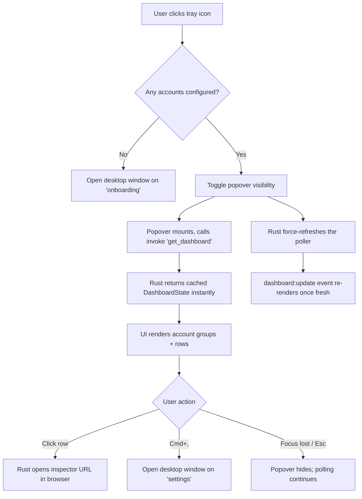
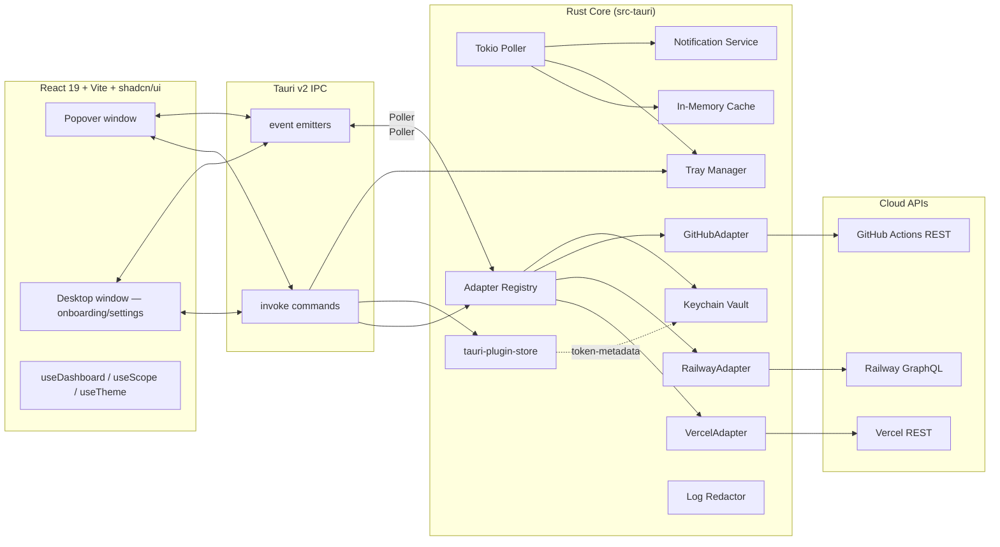

# PRODUCT REQUIREMENTS DOCUMENT (PRD)

> Updated 2026-04-20 to match the v0.1.0 implementation. Earlier drafts of this doc described a product codenamed **Dev Radio**; the shipping product is **Tiny Bell**. A few v1.0-aspirational features (redeploy, cancel, slide-in detail panel) have been deferred out of v1 — they are noted in §11.

---

## 1. Executive Summary

**Tiny Bell** is a lightweight, native-feeling, cross-platform desktop menu-bar / system-tray application that gives developers real-time visibility into the health of their cloud build and deployment pipelines on **Vercel**, **Railway**, and **GitHub Actions**, with an adapter architecture designed to extend to Netlify, Render, Fly.io, and beyond.

Built on **Tauri v2 (Rust)** with a **React 19 + TypeScript + Vite + shadcn/ui + TailwindCSS** frontend, Tiny Bell lives primarily in the OS tray/menu bar. A single glance at a color-coded icon tells a developer whether all their projects are green, building, or broken — without the context-switch of opening a browser, logging into multiple dashboards, or juggling Slack alerts.

Tiny Bell supports **multiple simultaneous accounts** per platform (personal + work / team / workspace), stores all API credentials in a **single OS-native keychain vault**, polls deployment state at a configurable cadence (default 30s, minimum 5s, maximum 10min), surfaces desktop notifications on state transitions, and exposes one-click actions (open in browser, open inspector URL).

The product is positioned as a **zero-friction, always-on deploy status companion** for solo indie hackers and engineers inside larger companies. Tagline: *"Tune in to your deploys."*

---

## 2. Problem Statement & Opportunity

### 2.1 Problem
Modern developers ship code across **multiple platforms, multiple accounts, and multiple projects simultaneously**. Checking deployment status today requires:

- Opening 3–5 browser tabs (Vercel personal, Vercel team, Railway personal, Railway company, GitHub Actions).
- Context-switching away from the editor.
- Repeatedly refreshing dashboards.
- Relying on noisy Slack / email notifications that are easy to miss or mute.
- Discovering a failed preview deploy minutes or hours after the fact.

Existing solutions are fragmented:
- **Platform-native dashboards** → siloed, one platform at a time, no multi-account view.
- **Slack integrations** → noisy, tied to a workspace, delayed.
- **Vercel CLI / Railway CLI / `gh run list`** → manual polling, no passive ambient awareness.
- **General-purpose monitors (Datadog, etc.)** → overkill, expensive, enterprise-focused.

### 2.2 Opportunity
A **lightweight, ambient, local-first menu-bar app** that:

1. Unifies deploy / CI status across platforms in one tray icon.
2. Handles multi-account reality of modern devs (personal + work).
3. Costs nothing to run (no SaaS backend), respects privacy (tokens stay local).
4. Extends easily to any future platform via a clean trait-based architecture.

### 2.3 Market Signal
- Vercel REST, Railway GraphQL, and GitHub Actions REST are stable, documented, and widely used.
- Tauri v2 is production-ready for tray apps.
- Active demand signal: existing niche tools (unofficial Vercel menu-bar apps, GitHub Actions widgets) have thousands of GitHub stars despite limited feature sets.

---

## 3. Goals & Success Metrics

### 3.1 Product Goals
| # | Goal | Why it matters |
|---|------|----------------|
| G1 | Reduce time-to-awareness of a failed deploy from minutes to <30s | Core value prop |
| G2 | Unify multi-platform, multi-account deploy state in one glance | Differentiator |
| G3 | Stay invisible when everything is green | Respect developer focus |
| G4 | Be trivially extensible to new platforms | Long-term relevance |

### 3.2 Quantitative Success Metrics (North Star + Supporting)

| Metric | Target (v1.0) | Target (v1.3) |
|---|---|---|
| **North Star:** Median time from deploy state change to user notification | ≤ 30 seconds (at default 30s interval) | ≤ 15 seconds |
| Idle CPU usage | < 0.5 % on M-series Mac, < 1.0 % on Windows | < 0.3 % / 0.7 % |
| Idle RAM footprint (RSS) | < 120 MB | < 80 MB |
| Installer bundle size (macOS) | < 15 MB DMG | < 12 MB |
| App cold-start to tray-icon-ready | < 800 ms | < 500 ms |
| Crash-free sessions | ≥ 99.5 % | ≥ 99.9 % |
| Failed API calls that recover automatically | ≥ 98 % | ≥ 99.5 % |
| GitHub stars (6 months post-launch) | 1,500 | 5,000 |
| Average number of linked accounts per user | ≥ 1.6 | ≥ 2.2 |

---

## 4. User Personas & User Stories

### 4.1 Personas

**Persona A — "Maya, the Indie Hacker"**
- 32, full-stack dev, ships 2–3 side projects.
- 1 Vercel personal account, 1 Railway personal account, 1 GitHub personal with 3–5 repos.
- Values: minimal distraction, fast feedback, zero-config.
- Pain: forgets to check deploys after `git push`, discovers broken preview links from a user email.

**Persona B — "Daniel, the Staff Engineer at a Startup"**
- 38, works at a Series B company.
- Vercel personal + Vercel team ("acme-web"), Railway personal + Railway workspace ("acme-backend"), GitHub org with 20 repos (monitoring the 10 that have CI gates on main).
- Values: reliability, team visibility, secure token handling.
- Pain: juggles 5 dashboards daily, gets paged when staging breaks, wants proactive warnings before teammates notice.

### 4.2 User Stories with Acceptance Criteria

> Format: **US-xxx**: As a [persona], I want [action], so that [outcome]. AC = Acceptance Criteria.

---

**US-001 — First-run onboarding**
*As a new user, I want to add my first account in under 90 seconds, so that I can see status immediately.*

- **AC1**: On first launch, app opens a welcome **desktop window** routed to `onboarding` with Connect-Vercel / Connect-Railway / Connect-GitHub actions.
- **AC2**: Each connect flow offers both **OAuth** (if configured in the build) and **paste-token**. Paste-token always works.
- **AC3**: Pasting a valid token validates it via the provider's identity endpoint (Vercel `/v2/user` or `/v2/teams/{id}`, Railway `{ me }`, GitHub `/user`) and displays the account name + avatar on success.
- **AC4**: Invalid tokens show an inline error message without leaking the token to logs (the redactor scrubs any `token=...` / `Bearer ...` patterns from logs).
- **AC5**: Token is stored in a single OS-keychain vault entry as `StoredSecret::Pat { value }` or `StoredSecret::Oauth { access_token, refresh_token, expires_at_ms }`; never written to plain disk.
- **AC6**: After the first account is added, the desktop window closes and the tray icon becomes the primary UI.

---

**US-002 — Ambient tray status**
*As Maya, I want to glance at my menu bar and know instantly if anything is broken.*

- **AC1**: Tray icon is one of six states: **green** (all latest Ready), **yellow** (any Building/Queued), **red** (any Error in the last 30 min), **gray** (no projects, no accounts, or keychain unavailable), **syncing** (first poll or forced refresh in progress), **setup** (no accounts — pre-onboarding).
- **AC2**: Icon updates within one polling interval (30s default) of remote state change.
- **AC3**: Red takes precedence over yellow; yellow takes precedence over green. Old errors (> 30 min) no longer count toward Red.
- **AC4**: On macOS, neutral states (Setup, Syncing, Gray) render as **template icons** (black + alpha) so the menu bar adapts to light/dark; colored states render as full-color PNGs so the hue shows clearly.

---

**US-003 — Multi-account unified view**
*As Daniel, I want to see all projects from all of my accounts in one list, grouped or filterable.*

- **AC1**: The popover lists deployments **grouped by account**, with account name + platform shown as a section header and a per-group count.
- **AC2**: User can switch visible scope between "All" and a specific account via the filter bar **or** via `Cmd+0` (all) / `Cmd+1…9` (nth account).
- **AC3**: User can filter to a subset of projects via a multi-select project dropdown; the selection is pruned automatically when scope changes invalidate it.
- **AC4**: Each account can be disabled in Settings → Accounts (without deleting). Disabled accounts do not contribute to the tray color or to the popover list.

---

**US-004 — Deployment row metadata**
*As a user, I want each deployment row to give me enough info to decide whether to click.*

- **AC1**: Each row shows: a colored status glyph, platform mark, project name, commit message (truncated), relative timestamp ("2 min ago"), duration (when known), branch, author avatar (when provided by the platform).
- **AC2**: Clicking the row opens the deployment's inspector URL in the system browser via the opener plugin. For GitHub, the row opens the workflow run page. For Vercel, the inspector URL. For Railway, the service URL if available.
- **AC3**: Keyboard navigation: `↑/↓` moves focus between rows; `Enter` / `Space` activates the focused row.

> Not in v1: the PRD's earlier slide-in project detail panel and per-deployment action menu (Copy URL, Copy Commit SHA, Redeploy) are **deferred to a future release** (see §11).

---

**US-005 — Desktop notifications on state change**
*As Maya, I want a native notification the moment a deploy fails or goes live.*

- **AC1**: A diff-driven notifier fires on transitions to `Ready`, `Error`, or `Canceled`. Queued/Building transitions are intentionally silent.
- **AC2**: Title + body: e.g. *"Deployment ready — acme-web"*, *"Deployment failed — acme-web"*.
- **AC3**: Duplicate suppression: the diff engine only fires when a deployment's **stored** state differs from its previous stored state. On the **first** poll, notifications are suppressed entirely so users do not get a storm of "Ready" alerts on launch.
- **AC4**: Users can mute failures/recoveries globally via `notify_on_failure` and `notify_on_recovery` prefs.

---

**US-006 — Configurable polling**
*As a power user, I want to set polling cadence so I can balance freshness vs API cost.*

- **AC1**: Settings exposes a refresh-interval control that writes `refresh_interval_ms` to prefs. Minimum **5 000 ms** (enforced in `prefs::apply_u64`).
- **AC2**: Changing the interval takes effect immediately — `set_pref` calls `poller::set_interval_secs`, which swaps an `AtomicU64` read at the top of each loop iteration.
- **AC3**: On `RateLimited(N)` from any adapter, the poller inserts a per-account cooldown entry `until = now + N seconds` and reuses the previous cached dashboard state until the cooldown expires. The tray does not turn red from rate-limit alone.

---

**US-007 — Launch at login**
- **AC1**: Settings toggle writes `start_at_login` pref and calls `tauri-plugin-autostart`'s `enable()` / `disable()` immediately.
- **AC2**: Sync on startup — if prefs disagree with the OS autostart state, the app reconciles to the prefs value.
- **AC3**: Launches headless into the tray (no popover or desktop window on autostart); the popover only appears on user interaction.

---

**US-008 — Global shortcut**
- **AC1**: Default shortcut: `Alt+Command+D` on macOS (equivalent on other OSes).
- **AC2**: Pressing the shortcut toggles the popover visibility.
- **AC3**: User can change the shortcut in Settings; the app re-registers on save.

---

**US-009 — Remove / rename account**
- **AC1**: Settings → Accounts → Delete removes the keychain vault entry, the stored account, the in-memory cache entry, and drops the adapter from the registry.
- **AC2**: Settings → Accounts → Rename updates `display_name` on the stored account and emits `accounts:changed` so the popover reflects the new label.
- **AC3**: Health can be re-validated on demand via the `validate_token` command, which sets `health` to `Ok`, `NeedsReauth`, or `Revoked` based on the provider's response.

---

**US-010 — Offline resilience**
- **AC1**: On keychain-load failure, the cache is marked offline with the error message; the tray turns gray.
- **AC2**: On transient HTTP errors, the poller keeps the previous snapshot visible and retries on the next tick.
- **AC3**: A persistent offline banner appears at the top of the popover list while `state.offline === true`, dimming the list beneath it.

---

**US-011 — GitHub Actions monitoring**
- **AC1**: After connecting a GitHub account, the user is shown a repo-selector listing the 100 most-recently-pushed repos (accessible via the token's scopes) and may select **up to 30** to monitor.
- **AC2**: The GitHub adapter fetches the most recent workflow runs for each monitored repo (per-repo cap: min 5, max 10, scaled by `limit / repo_count`).
- **AC3**: Workflow run statuses map to the unified `DeploymentState` enum (`in_progress` → Building, `completed/success` → Ready, `completed/failure` → Error, etc.).
- **AC4**: The user can edit the monitored-repo list at any time from Settings → Accounts → [GitHub account] → Manage repos.

---

## 5. User Flows

### 5.1 Primary Flows

**Flow 1 — First Launch & First Account**
1. User installs Tiny Bell; OS launches the app.
2. `setup()` detects zero stored accounts → opens the `desktop` window on the `onboarding` route. The popover is created hidden.
3. Tray icon appears in the Setup state (syncing-style icon).
4. User clicks **Connect Vercel** / **Railway** / **GitHub**. If OAuth is configured in the build (client IDs present at compile time via `build.rs`), the user can OAuth; otherwise the dialog guides them to paste a token.
5. OAuth flow: app starts a loopback server on one of ports `53123–53125`, generates PKCE (Railway) / state (all), opens the provider's authorize URL in the default browser, waits up to 5 min for a callback, exchanges the code for tokens.
6. Rust stores the secret in the keychain vault, saves `StoredAccount` metadata to the store, hydrates the adapter registry, starts the poller, forces an immediate refresh.
7. `accounts:changed` fires; the desktop window routes to `settings` or closes, the popover populates on next tray click.

**Flow 2 — Ambient Monitoring → Action**
1. User is coding; tray is green.
2. A Vercel build fails → next poll returns `readyState: ERROR`.
3. `cache.replace_and_diff(...)` produces a `DiffEvent` (`previous=Building, current=Error`) for the deployment.
4. `notifications::fire_for_diff` shows an OS notification titled "Deployment failed — acme-web".
5. `health_from_state` flips to Red; tray icon updates.
6. User clicks the tray icon → popover opens, showing the failed deployment at the top of the list (deployments are sorted newest-first).
7. User clicks the row → Vercel inspector URL opens in the system browser via the opener plugin.

**Flow 3 — Adding a GitHub Account + Repo Selection**
1. User opens Settings → Accounts → Add account → GitHub.
2. OAuth (classic flow, `repo read:user` scopes) or paste-token.
3. On success, a repo-selector lists 100 most-recent repos; user selects up to 30.
4. `set_monitored_repos` persists the list; adapter rehydrates and next poll fetches workflow runs for the selected repos only.

### 5.2 Mermaid — Tray → Popover Flow



---

## 6. Functional Requirements

### 6.1 Tray / Menu Bar
- **FR-T1** The app MUST install a tray icon on startup on macOS, Windows, and Linux.
- **FR-T2** The tray icon MUST reflect aggregate health within the configured polling interval.
- **FR-T3** Left-click MUST either open the desktop onboarding (no accounts) or toggle the popover (has accounts). This behavior is consistent across OSes.
- **FR-T4** Right-click MUST show a context menu with: Open Tiny Bell · Refresh Now · Settings… · Quit.
- **FR-T5** Tray icon MUST use template rendering on macOS for neutral states; colored PNG variants for Green/Yellow/Red.

### 6.2 Account Management
- **FR-A1** Users MUST be able to add any number of Vercel, Railway, and GitHub accounts.
- **FR-A2** Each account record in the store MUST contain: `id` (UUID), `platform`, `display_name`, `scope_id` (team / workspace, optional), `enabled`, `created_at`, `health` (`Ok | NeedsReauth | Revoked`), and for GitHub, `monitored_repos: Vec<String>` (max 30).
- **FR-A3** Tokens MUST be stored exclusively in the OS keychain via the `keyring` crate. All credentials for all accounts MUST live inside a **single keychain entry** (`service=tiny-bell`, `account=vault`) containing a JSON map of account-id → `StoredSecret`. This avoids per-credential OS prompts and makes atomic flush simple.
- **FR-A4** Users MUST be able to rename the display name of an account.
- **FR-A5** Users MUST be able to disable an account without deleting it.
- **FR-A6** Deleting an account MUST purge: the vault entry, any legacy per-platform keychain entry, the stored account record, and the adapter handle in the registry.
- **FR-A7** Account health MUST be automatically set to `NeedsReauth` when an adapter call returns `Unauthorized`, and reset to `Ok` on a subsequent successful poll.

### 6.3 Project & Deployment Display
- **FR-P1** The popover MUST list deployments across all enabled accounts, grouped by account and sorted newest-first within each group.
- **FR-P2** Each row MUST show: status glyph, platform icon, project name, commit message (truncated), timestamp, duration when available.
- **FR-P3** Clicking a row MUST open the deployment's inspector / HTML URL in the system browser.
- **FR-P4** The popover MUST support project multi-select filtering scoped to the current account selection.

### 6.4 Notifications
- **FR-N1** Native OS notifications fire on transitions to `Ready`, `Error`, `Canceled`.
- **FR-N2** First-poll notifications MUST be suppressed to avoid a launch-storm.
- **FR-N3** Duplicate suppression is provided by the diff engine comparing deployment IDs + states against the last snapshot.
- **FR-N4** Global `notify_on_failure` and `notify_on_recovery` prefs MUST gate the notifier (currently global only; per-account / per-project mutes are future work).

### 6.5 Settings
- **FR-S1** Settings MUST persist under the `prefs` key in `tauri-plugin-store` (`tiny-bell.store.json`).
- **FR-S2** Prefs: `theme` (system/light/dark), `refresh_interval_ms` (≥ 5 000), `hide_to_menubar_shown` (has the one-time dialog fired), `start_at_login`, `global_shortcut`, `show_in_dock` (macOS ActivationPolicy), `notify_on_failure`, `notify_on_recovery`.
- **FR-S3** `set_pref` MUST apply side effects inline: update poll interval, dock visibility, re-register global shortcut, toggle autostart, apply theme to all windows.

### 6.6 Extensibility
- **FR-E1** All platform-specific logic MUST reside behind the `DeploymentMonitor` trait (see §8.2).
- **FR-E2** Adding a new platform MUST NOT require changes to the poller, cache, tray, notifications, or generic React UI — only a new adapter module, a new `Platform` enum variant, a new arm in `registry::hydrate`, and a connect-flow entry in the React add-account dialog.

### 6.7 Security
- **FR-SEC1** A log redactor MUST strip `Bearer …`, `"token":"…"`, `token=…`, `code_verifier=…`, `client_secret=…`, `password=…`, `api_key=…` from every log line before it hits stdout or the rotating file.
- **FR-SEC2** CSP MUST restrict `connect-src` to Vercel, Railway, and GitHub hosts only.
- **FR-SEC3** Opener permission MUST restrict invoke-able URLs to the same three domains.
- **FR-SEC4** An external-navigation plugin MUST intercept any non-local navigation and reroute it through the system browser.

---

## 7. Non-Functional Requirements

| Category | Requirement |
|---|---|
| **Performance** | Idle CPU < 0.5 % M-series, < 1 % Windows. Idle RAM < 120 MB. Popover open < 100 ms from tray click. |
| **Bundle Size** | macOS DMG < 15 MB (arm64 + x86_64). `Cargo.toml` release profile: `lto=true`, `opt-level="s"`, `codegen-units=1`, `panic="abort"`, `strip=true`. |
| **Security** | Tokens only in the OS keychain vault. No tokens in logs (enforced via redactor), crash reports, or telemetry. All outbound HTTPS. CSP enforced. Tauri capabilities locked to minimum. |
| **Reliability** | 99.5 % crash-free sessions. Cooldowns on rate-limits prevent amplification. Stale-while-revalidate: the cache is visible while the next fetch is in flight. |
| **Accessibility** | WCAG 2.1 AA contrast on text. Full keyboard navigation in popover (Tab / Arrow / Enter / Esc / Cmd+0–9 / Cmd+R / Cmd+, / Cmd+Q / Cmd+N). Status is also conveyed via icon shape, not color alone. |
| **Internationalization** | v1 English only. |
| **Logging** | `log` crate → `tauri-plugin-log` with redactor format callback → rotating file in app data dir + stdout. `tracing` is a dependency but currently only used by keychain-flush info logs. |
| **Privacy** | No telemetry. No remote analytics endpoint. |
| **macOS specifics** | Hardened runtime, notarized (future), universal binary (arm64 + x86_64). `ActivationPolicy::Accessory` when `show_in_dock = false`. |
| **Windows / Linux** | Bundling scripts exist via Tauri but CI currently only releases macOS. |

---

## 8. Technical Architecture

### 8.1 High-Level Architecture (Mermaid)



### 8.2 The `DeploymentMonitor` Trait (actual shape)

```rust
// src-tauri/src/adapters/trait.rs
use async_trait::async_trait;

#[derive(Debug, thiserror::Error)]
pub enum AdapterError {
    #[error("unauthorized")]
    Unauthorized,
    #[error("rate limited, retry after {0}s")]
    RateLimited(u64),
    #[error("network: {0}")]
    Network(String),
    #[error("platform error: {0}")]
    Platform(String),
    #[error("unsupported operation: {0}")]
    Unsupported(&'static str),
}

pub type AdapterHandle = std::sync::Arc<dyn DeploymentMonitor>;

#[async_trait]
pub trait DeploymentMonitor: Send + Sync + std::fmt::Debug {
    fn platform(&self) -> Platform;
    fn account_id(&self) -> &str;
    async fn list_projects(&self) -> Result<Vec<Project>, AdapterError>;
    async fn list_recent_deployments(
        &self,
        project_ids: Option<&[String]>,
        limit: usize,
    ) -> Result<Vec<Deployment>, AdapterError>;
}
```

```rust
// src-tauri/src/adapters/mod.rs — domain types
#[derive(Debug, Clone, Copy, Serialize, Deserialize, PartialEq, Eq, Hash)]
#[serde(rename_all = "lowercase")]
pub enum Platform { Vercel, Railway, GitHub }

#[derive(Debug, Clone, Serialize, Deserialize, PartialEq, Eq)]
#[serde(rename_all = "snake_case")]
pub enum DeploymentState {
    Queued, Building, Ready, Error, Canceled, Unknown,
}

pub struct AccountProfile {
    pub id: String,
    pub platform: Platform,
    pub display_name: String,
    pub email: Option<String>,
    pub avatar_url: Option<String>,
    pub scope_id: Option<String>,
}

pub struct Project {
    pub id: String,
    pub account_id: String,
    pub platform: Platform,
    pub name: String,
    pub url: Option<String>,
    pub framework: Option<String>,
    pub latest_deployment: Option<Deployment>,
}

pub struct Deployment {
    pub id: String,
    pub project_id: String,
    pub service_id: Option<String>,     // Railway service / GitHub workflow id
    pub service_name: Option<String>,
    pub state: DeploymentState,
    pub environment: String,             // "production" | "preview" | GitHub event
    pub url: Option<String>,
    pub inspector_url: Option<String>,   // Vercel inspector / GitHub run HTML url
    pub branch: Option<String>,
    pub commit_sha: Option<String>,
    pub commit_message: Option<String>,
    pub author_name: Option<String>,
    pub author_avatar: Option<String>,
    pub created_at: i64,                 // unix ms
    pub finished_at: Option<i64>,
    pub duration_ms: Option<u64>,
    pub progress: Option<u8>,            // reserved; not populated today
}
```

**Design notes:**
- The trait is intentionally minimal. Redeploy / cancel / validate are **not** on the trait in v1 — account validation lives in `commands::accounts::validate_token` (per-platform) and is separate from the adapter contract.
- `AdapterError::Unauthorized` is unit-valued; transient `Network(String)` vs permanent `Platform(String)` is a meaningful split used by the token-refresh logic.
- `DeploymentState::Unknown` exists so unmapped platform-specific statuses don't crash; the UI shows them as neutral.

### 8.3 Actual Folder Structure

```
tiny-bell/
├── src/                               # React frontend — one bundle, two windows
│   ├── main.tsx                       # Branches on window.label → PopoverApp | DesktopApp
│   ├── index.css                      # Global CSS + OKLch design tokens
│   ├── app/
│   │   ├── popover/popover-app.tsx
│   │   ├── desktop/
│   │   │   ├── desktop-app.tsx
│   │   │   ├── components/close-hint-dialog.tsx
│   │   │   └── views/
│   │   │       ├── onboarding-view.tsx
│   │   │       ├── settings-view.tsx
│   │   │       └── settings/{accounts,general,about}-tab.tsx
│   │   └── dev/sandbox.tsx            # browser-only dev preview
│   ├── components/
│   │   ├── ui/                        # shadcn/ui primitives
│   │   ├── dr/                        # product-layer primitives (status-glyph, provider-chip, kbd, …)
│   │   ├── account/                   # add-account-dialog, add-account-form, repo-selector
│   │   ├── popover/                   # deploy-row, filter-bar, states/{empty,loading,offline,…}
│   │   ├── theme-provider.tsx
│   │   ├── external-link-guard.tsx
│   │   └── debug-panel.tsx            # DEV-only
│   ├── hooks/                         # use-dashboard, use-scope, use-theme, use-mobile
│   └── lib/                           # tauri, accounts, deployments, prefs, format, utils, debug-events
│
├── src-tauri/                         # Rust backend
│   ├── Cargo.toml, build.rs, tauri.conf.json, Info.plist
│   ├── capabilities/default.json      # Tauri permissions + opener allow-list
│   ├── icons/                         # app icon + 6 tray variants (template/gray/green/yellow/red/syncing)
│   └── src/
│       ├── main.rs, lib.rs
│       ├── adapters/
│       │   ├── mod.rs                 # Platform, Project, Deployment, AccountProfile
│       │   ├── trait.rs               # DeploymentMonitor + AdapterError
│       │   ├── registry.rs            # HashMap<account_id, AdapterHandle>
│       │   ├── vercel/{mod,types,mapper}.rs
│       │   ├── railway/{mod,client,types,mapper}.rs
│       │   └── github/{mod,types,mapper}.rs
│       ├── auth/
│       │   ├── mod.rs                 # AuthError
│       │   ├── oauth.rs               # PKCE, state, loopback server on 53123–53125
│       │   ├── pat.rs                 # paste-token path + Railway profile fetcher
│       │   ├── token_provider.rs      # get_fresh_access_token + refresh (Railway)
│       │   ├── vercel.rs, railway.rs, github.rs
│       ├── commands/
│       │   ├── accounts.rs, deployments.rs, window.rs, prefs.rs, ux.rs
│       ├── cache.rs                   # DashboardState + replace_and_diff
│       ├── poller.rs                  # Tokio poll loop, semaphore fan-out, cooldowns
│       ├── keychain.rs                # Single-entry vault, migration from legacy keys
│       ├── store.rs                   # StoredAccount in tauri-plugin-store
│       ├── prefs.rs                   # Prefs struct + apply_{string,u64,bool}
│       ├── tray.rs                    # Tray + context menu + set_health
│       ├── window.rs                  # show/hide/toggle desktop and popover
│       ├── platform.rs                # macOS dock visibility (ActivationPolicy)
│       ├── shortcut.rs                # Global shortcut → toggle popover
│       ├── notifications.rs           # OS notifications on DiffEvent
│       └── redact.rs                  # Log-format redactor (4 regex chain)
```

### 8.4 Polling Strategy (Tokio)

```rust
// sketch of poller::Poller — real impl is ~575 lines
pub struct Poller<R: Runtime> {
    app: AppHandle<R>,
    registry: Arc<AdapterRegistry>,
    cache: Arc<Cache>,
    interval_secs: AtomicU64,             // hot-swappable, clamped [5, 600]
    force_tx: mpsc::Sender<()>,
    first_poll_done: AtomicBool,
    cooldowns: Arc<Mutex<HashMap<String, Instant>>>,
    projects_last_fetched: Mutex<HashMap<String, Instant>>,
    projects_cache: Mutex<HashMap<String, Vec<Project>>>,
}
```

**Cycle:**
1. `keychain::ensure_loaded()`; if it fails → mark cache offline, tray Gray, bail.
2. `store::list_accounts()` → `registry.hydrate()` fetches a fresh token per enabled account via `get_fresh_access_token` (auto-refreshes Railway OAuth).
3. If registry is empty → `cache.mark_empty()`, tray Gray, bail.
4. Fan out to adapters with `Semaphore::new(4)`. For each adapter:
   - If in cooldown → reuse prior account data (copy projects + deployments from `prev_snapshot`).
   - Else, refresh projects only if `projects_last_fetched[account]` is stale (> `PROJECTS_REFRESH_SECS = 300`), then always call `list_recent_deployments(None, DEPLOYMENTS_LIMIT = 100)`.
   - On `Unauthorized` → flag `AccountHealth::NeedsReauth`.
   - On `RateLimited(n)` → start a cooldown for `n` seconds.
5. Join results → `cache.replace_and_diff(new_state)` returns `Vec<DiffEvent>`.
6. Compute `health_from_state`: Red if any recent (`<= 30 min`) Error on any project; else Yellow if any Building/Queued; else Green. Set tray.
7. Emit `dashboard:update` with the full snapshot.
8. Fire notifications for the diff events **only after the first poll**.
9. Sleep `interval_secs` OR `force_tx.recv()` (triggered by "Refresh now", popover show, or connecting an account).

### 8.5 Persistence

| What | Where | Notes |
|---|---|---|
| Account tokens | OS keychain entry `service=tiny-bell` / `account=vault` (JSON blob) | One entry — one OS prompt at most |
| Account metadata | `tauri-plugin-store` → `tiny-bell.store.json` key `accounts` | `StoredAccount[]` incl. `health`, `monitored_repos` |
| Preferences | Same store, key `prefs` | `Prefs` struct; defaults fallback if missing |
| One-time UI state | Same store, key `ui.close_hint_seen` | Close-hint dialog fired flag |

`StoredSecret` tagged enum, stored inside the vault JSON:

```rust
#[serde(tag = "token_type", rename_all = "snake_case")]
pub enum StoredSecret {
    Pat { value: String },
    Oauth { access_token: String, refresh_token: String, expires_at_ms: i64 },
}
```

### 8.6 Authentication

Three flows coexist per platform:

| Platform | OAuth | PKCE | Refresh token |
|---|---|---|---|
| Vercel | ✅ integration flow at `/integrations/<slug>/new` | ❌ (integration flow, not pure OAuth2) | ❌ (long-lived integration token) |
| Railway | ✅ authorization code flow | ✅ S256 | ✅ auto-refreshed on expiry − 60 s |
| GitHub | ✅ classic OAuth at `/login/oauth/authorize` | ❌ (classic flow, scopes `repo read:user`) | ❌ |
| All three | ✅ Paste-token fallback (PAT) | — | — |

Common OAuth plumbing (`auth/oauth.rs`):
- Loopback server on `127.0.0.1`, trying ports `53123 → 53125` first-available.
- CSRF-safe `state` compared with constant-time equality.
- `OAUTH_TIMEOUT_SECS = 300` ceiling wrapping `tokio::time::timeout`.
- Success/failure HTML served back to the browser; the user can close the tab.
- A global `Mutex<Option<ActiveServer>>` guarantees we never leave a stale loopback server bound.

OAuth client IDs/secrets are compiled into the binary via `build.rs` `env!()` — the build reads from `.env.local`/`.env` (gitignored) and forwards each var through `cargo:rustc-env`. Missing vars in release builds emit `cargo:warning=...` lines telling the maintainer OAuth will be disabled for that platform (paste-token still works).

### 8.7 Tauri Command Surface (27 commands)

| Module | Commands |
|---|---|
| `accounts` | `start_oauth`, `connect_with_token`, `cancel_oauth`, `list_accounts`, `delete_account`, `set_account_enabled`, `rename_account`, `validate_token`, `hydrate_adapters`, `list_github_repos`, `set_monitored_repos` |
| `deployments` | `get_dashboard`, `refresh_now`, `set_poll_interval`, `get_poll_interval`, `open_external` |
| `window` | `open_desktop`, `close_desktop`, `show_popover`, `hide_popover`, `toggle_popover`, `quit_app`, `get_autostart`, `set_autostart` |
| `ux` | `has_seen_close_hint`, `mark_close_hint_seen`, `dev_reset` (debug-only) |
| `prefs` | `get_prefs`, `set_pref`, `set_window_theme` |

### 8.8 Events (Rust → React)

| Event | Payload | When |
|---|---|---|
| `dashboard:update` | `DashboardState` | After every poll cycle |
| `accounts:changed` | `()` | Account added / removed / health-changed / enabled toggled |
| `prefs:changed` | `Prefs` | After `set_pref` |
| `oauth:complete` | `AccountProfile` | After successful OAuth token exchange |
| `desktop:route` | `"onboarding" \| "settings" \| "about"` | `show_desktop(app, route)` |
| `desktop:close-hint` | `()` | First time user closes the desktop window |
| `popover:show` | `()` | `show_popover` — triggers account reload in the React side |

---

## 9. API Integration Specs

### 9.1 Vercel REST

Base URL: `https://api.vercel.com` · Auth: `Authorization: Bearer <token>`

| Purpose | Method & Path | Params | Used by |
|---|---|---|---|
| Identity (user) | `GET /v2/user` | — | Paste-token validation, `fetch_vercel_profile` |
| Identity (team) | `GET /v2/teams/{teamId}` | — | When `scope_id` is set |
| List projects | `GET /v9/projects` | `limit=100`, optional `teamId` | Adapter `list_projects` |
| List deployments | `GET /v6/deployments` | `limit=N`, optional `projectIds=`(repeatable), optional `teamId` | Adapter `list_recent_deployments` |

**State mapping** (`vercel/mapper.rs`):
| Vercel `readyState` / `state` | `DeploymentState` |
|---|---|
| `QUEUED`, `INITIALIZING` | Queued |
| `BUILDING` | Building |
| `READY` | Ready |
| `ERROR`, `FAILED` | Error |
| `CANCELED`, `CANCELLED` | Canceled |

Rate-limit handling: 429 reads `x-ratelimit-reset` and surfaces `RateLimited(secs)`.

### 9.2 Railway GraphQL

Endpoint: `https://backboard.railway.com/graphql/v2` · Auth: `Authorization: Bearer <token>`

| Purpose | Operation |
|---|---|
| Identity | `query { me { id email name avatar } }` |
| Projects | `query { me { workspaces { id name projects { edges { node { id name } } } } } }` |
| Deployments | **Batched aliased query** — `query BatchDeployments { p0: deployments(first: N, input: { projectId: "…" }) { … } p1: … }` built dynamically per project to minimize round-trips |

**State mapping** (`railway/mapper.rs`):
| Railway `status` | `DeploymentState` |
|---|---|
| `QUEUED`, `INITIALIZING`, `WAITING` | Queued |
| `BUILDING`, `DEPLOYING` | Building |
| `SUCCESS` | Ready |
| `FAILED`, `CRASHED` | Error |
| `REMOVED`, `SKIPPED` | Canceled |

Notes:
- Railway deployments are attached to **services**, which Tiny Bell surfaces in the row via `service_name`. The "project" in the domain model maps to a Railway project.
- A refresh token is required — `start_railway_oauth` rejects a token response missing one (so users don't end up locked out after the first hour).
- `token_provider::get_fresh_access_token` refreshes Railway tokens 60 s before expiry.

### 9.3 GitHub Actions REST

Base URL: `https://api.github.com` · Auth: `Authorization: Bearer <token>`, required headers `User-Agent: tiny-bell` and `Accept: application/vnd.github+json`.

| Purpose | Method & Path |
|---|---|
| Identity | `GET /user` |
| List repos for selector | `GET /user/repos?sort=pushed&per_page=100&type=all` |
| List workflow runs per repo | `GET /repos/{owner}/{repo}/actions/runs?per_page=N` (N = `limit / repos.len()`, clamped `[5, 10]`) |

**State mapping** (`github/mapper.rs`):
| `status` + `conclusion` | `DeploymentState` |
|---|---|
| `queued` / `waiting` | Queued |
| `in_progress` | Building |
| `completed + success` | Ready |
| `completed + failure | timed_out` | Error |
| `completed + cancelled | skipped | stale` | Canceled |
| `completed + action_required` | Queued |
| Anything else | Unknown |

Rate-limit: a 403 with `x-ratelimit-remaining: 0` reads `x-ratelimit-reset` (epoch seconds) and returns `RateLimited(reset - now)`. Plain 403 → `Unauthorized`. 429 → `RateLimited(60)`.

Project model for GitHub is synthetic — no upfront `GET /repos`; projects are just `{ id: "owner/repo", name: repo, url: github.com/... }` derived from the user's monitored-repos list (capped at 30).

---

## 10. Extensibility Plan

Adding a new platform (e.g. Netlify) takes exactly these steps:

1. Create `src-tauri/src/adapters/netlify/{mod,types,mapper}.rs`.
2. Implement `impl DeploymentMonitor for NetlifyAdapter`.
3. Add `Netlify` to the `Platform` enum (update `key()` / `from_key()`) in `adapters/mod.rs`.
4. Add a new arm in `AdapterRegistry::hydrate` that constructs a `NetlifyAdapter` from a stored token.
5. Optionally add an `auth/netlify.rs` module if OAuth is desired; otherwise, PAT through `auth::pat::connect_via_pat` works out of the box.
6. Add a CSP + capability allow-list entry for the Netlify host in `tauri.conf.json` and `capabilities/default.json`.
7. Add a platform icon in `src/assets/providers/` and a branch in the React connect-account dialog.

**Zero changes** required in: poller, cache, tray, notifications, popover dashboard, or the diff/notify pipeline.

---

## 11. Scope

### In Scope (v1.0 — shipped)
- Vercel, Railway, **and GitHub Actions** adapters
- Multi-account, multi-platform
- Tray icon with 6-state rendering (Setup / Syncing / Gray / Green / Yellow / Red)
- Popover dashboard grouped by account with project-multi-select filter
- Desktop window for onboarding and settings (Accounts / General / About tabs)
- Desktop notifications on state transitions
- OAuth (Vercel / Railway / GitHub) + paste-token
- Single-entry keychain vault
- Settings: refresh interval, launch-at-login, theme, global shortcut, dock-visibility, notify toggles
- Dark / light / system theme
- Global shortcut (default `Alt+Cmd+D`)
- macOS releases (arm64 + x86_64 DMG)

### Deferred from the original vision (not in v1.0)
- **Redeploy / cancel actions** — removed from the adapter trait; may return with a separate `ActionSupport` trait.
- **Per-deployment row-action menu** (Copy URL, Copy SHA, Redeploy) — only click-to-open is implemented.
- **Project-detail slide-in panel** — the popover shows a single list; per-project drilldown is future work.
- **Per-platform / per-account / per-project notification mutes** — only global `notify_on_failure` and `notify_on_recovery` switches exist today.
- **Windows / Linux installers** — code is portable; CI only ships macOS today.
- **Duplicate-notification persistence across restarts** — dedup is in-memory via the diff cache, and the first-poll suppression prevents launch storms, but a cold restart followed by a fresh state change can fire a notification for a deployment the user saw in a previous session.

### Future Phases
- **v1.1**: Netlify + Render adapters; row actions (copy / redeploy).
- **v1.2**: Project detail panel; per-account notification mutes; Windows installer.
- **v1.3**: Custom webhooks; Raycast extension; Linux AppImage.
- **v2.0**: Opt-in cloud sync of settings across devices.

---

## 12. Risks & Dependencies

| # | Risk | Likelihood | Impact | Mitigation |
|---|---|---|---|---|
| R1 | Vercel / Railway / GitHub API changes break adapters | Med | High | Adapter pattern isolates blast radius; wiremock-driven unit tests in each adapter module |
| R2 | Rate-limit exhaustion with many accounts | Med | Med | Per-account cooldowns; reuse-prior-snapshot behavior; configurable interval (5 s floor) |
| R3 | Keychain fragility on Linux (libsecret required) | Med | Med | `keyring` crate's `sync-secret-service` feature is enabled; shipping Linux is deferred until this is validated |
| R4 | Tray behavior differences across Linux DEs | High | Low–Med | Not in v1 scope |
| R5 | Tauri v2 plugin churn | Med | Low | Pin plugin versions in Cargo.toml |
| R6 | macOS notarization delays on CI | Low | Med | Current releases are unsigned DMGs; notarization is a future step |
| R7 | Token leakage via logs | Low | Critical | `redact.rs` filters 4 regex classes; every `log::*!` goes through `tauri-plugin-log` format callback; covered by unit tests |
| R8 | OAuth client secrets baked into the binary | Med | Med | `build.rs` reads from `.env.local`; release builds warn when missing; GitHub client secret is present but standard for the classic flow |
| R9 | GitHub monitored-repo list becomes stale | Low | Low | Users can edit at any time; cap at 30 prevents runaway API usage |

**External dependencies:** Tauri v2, `tauri-plugin-{log, opener, store, notification, autostart, global-shortcut}`, `keyring`, `reqwest` (rustls-tls), `tokio`, `serde`, `serde_json`, `async-trait`, `thiserror`, `tracing`, `tracing-subscriber`, `tiny_http` (loopback), `chrono`, `regex`, `once_cell`, `uuid`, `base64`, `rand`, `sha2`, `url`, `urlencoding`.

Frontend: React 19, Vite 7, TypeScript 5.9, Tailwind v4, shadcn/ui, Radix primitives, lucide-react, sonner, vaul, next-themes, @dnd-kit, @tanstack/react-table, zod.
