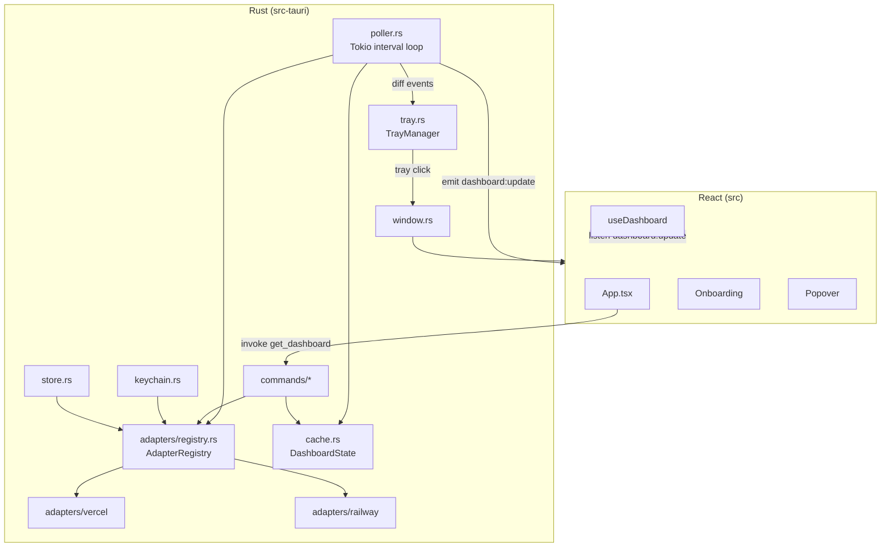

# Dev Radio — Plan V2: Full Menubar App

Everything in [plan.md](plan.md) shipped the **auth** slice. This plan ships the **product**: a tray-resident menubar app that lists live Vercel + Railway deployments, refreshes in the background, and reflects overall health in a colored tray icon.

---

## 1. Goals (UX contract)

From the user:

1. **First launch, no accounts** → a full-sized onboarding window appears with the "Connect account" UI. Nothing else.
2. **After connecting** → onboarding window closes. App disappears from the dock. A colored icon appears in the system tray / menu bar.
3. **Click tray icon** → a small, frameless popover appears near the tray, showing a list of recent deployments across all connected accounts (grouped by project), with status, commit, author, relative time, and actions (Open in Vercel, View Site).
4. **Click outside popover** → it hides. App keeps polling in the background.
5. **Close app** → *actually* closes (Cmd+Q), doesn't live in tray anymore. Re-launch brings tray back.
6. **Settings** → reachable from a gear icon in the popover header. Lets user add/remove accounts, set polling interval, toggle launch-at-login.

Non-goals for V2: dark/light theme switcher (we inherit OS preference), redeploy/cancel actions (follow-up), Windows/Linux tray polish (macOS-first; Windows/Linux work but may have visual rough edges).

---

## 2. What we keep, change, and delete

### Keep (already implemented, unchanged)
- `src-tauri/src/adapters/mod.rs` — domain models (`Platform`, `Project`, `Deployment`, `DeploymentState`, `AccountProfile`).
- `src-tauri/src/auth/*` — OAuth + PAT flows.
- `src-tauri/src/keychain.rs` — token storage.
- `src-tauri/src/store.rs` — `StoredAccount` persistence.
- `src-tauri/src/redact.rs` — log redactor.
- `src-tauri/src/commands/accounts.rs` — CRUD commands.
- `src/lib/accounts.ts` — typed account API.
- `src/components/account/add-account-dialog.tsx` — account connection dialog (will be reused from onboarding and settings).
- `src/components/ui/*` — shadcn primitives.

### Change
- **`src-tauri/tauri.conf.json`** — reshape the main window into a tray popover (frameless, 380×560, resizable: false, visible: false, decorations: false, alwaysOnTop, skipTaskbar on macOS via `LSUIElement`).
- **`src-tauri/src/lib.rs`** — remove `greet`, register the poller + tray + autostart plugins, wire new command handlers, hook the tray-toggle and window-close behavior.
- **`src/App.tsx`** — replace the template dashboard shell with a state-machine router: `OnboardingView` when zero accounts exist, `PopoverView` otherwise.
- **`index.html`** — drop `vite.svg` reference, title → "Dev Radio", add `overflow: hidden` body class.

### Delete (template leftovers)
- `src/components/app-sidebar.tsx`
- `src/components/chart-area-interactive.tsx`
- `src/components/data-table.tsx`
- `src/components/section-cards.tsx`
- `src/components/site-header.tsx`
- `src/components/greet.tsx`
- `src/components/nav-documents.tsx`
- `src/components/nav-main.tsx`
- `src/components/nav-secondary.tsx`
- `src/components/nav-user.tsx`
- `src/components/debug-panel.tsx` (or keep behind `import.meta.env.DEV` — discuss in Phase 12)
- `src/app/dashboard/data.json`
- `src/components/ui/sidebar.tsx`, `breadcrumb.tsx`, `drawer.tsx`, `chart.tsx`, `data-table.tsx` deps in shadcn/ui we don't need (keep if other UI uses them).
- The `greet` Tauri command in `lib.rs`.

### Add (new)
- **Rust**
  - `adapters/trait.rs` — `DeploymentMonitor` async trait.
  - `adapters/registry.rs` — `AdapterRegistry` (account_id → `Box<dyn DeploymentMonitor>`).
  - `adapters/vercel/{mod,client,mapper,types}.rs` — Vercel impl.
  - `adapters/railway/{mod,client,mapper,types}.rs` — Railway impl.
  - `cache.rs` — shared in-memory state snapshot (`DashboardState`).
  - `poller.rs` — Tokio background refresh loop.
  - `tray.rs` — tray icon lifecycle + color state machine.
  - `window.rs` — popover show/hide/position helpers.
  - `commands/deployments.rs` — `get_dashboard`, `refresh_now`, `open_deployment`, `set_poll_interval`.
  - `commands/window.rs` — `show_onboarding`, `hide_popover`, `quit_app`.
  - `settings_store.rs` — split general settings out of the accounts store.
- **Frontend**
  - `src/views/OnboardingView.tsx`
  - `src/views/PopoverView.tsx`
  - `src/components/deployment/DeploymentCard.tsx`
  - `src/components/deployment/StatusIcon.tsx`
  - `src/components/deployment/ProjectGroup.tsx`
  - `src/components/popover/PopoverHeader.tsx`
  - `src/components/popover/SettingsSheet.tsx`
  - `src/hooks/useDashboard.ts`
  - `src/hooks/usePopoverBlur.ts`
  - `src/lib/deployments.ts` — typed deployment API + relative-time formatter.
- **Assets**
  - `src-tauri/icons/tray/{gray,green,yellow,red}@{1x,2x,3x}.png` — generated from a single SVG.

---

## 3. Architecture



**Event flow on "Connect first account":**
1. User is on `OnboardingView`; clicks connect → backend persists `StoredAccount` + keychain token (existing code).
2. Frontend emits local state change → calls `invoke('hide_onboarding')`.
3. Rust: `hide_onboarding` command resizes main window to popover size, hides it, then calls `tray::ensure()` which creates the tray icon if missing, then starts the poller if not running.
4. Tray icon appears, in gray for ~1 polling cycle, then goes green/yellow/red.

---

## 4. Data model additions

All additions live beside existing code in `src-tauri/src/adapters/mod.rs`. The baseline `Project` / `Deployment` structs already contain every field we need — no shape changes required.

New `DashboardState` (in `cache.rs`):

```rust
use std::collections::HashMap;
use serde::{Deserialize, Serialize};
use crate::adapters::{Deployment, Project};

#[derive(Debug, Clone, Default, Serialize, Deserialize)]
pub struct DashboardState {
    pub projects: Vec<Project>,
    pub deployments_by_project: HashMap<String, Vec<Deployment>>,
    pub last_refreshed_at: Option<i64>,
    pub last_error: Option<String>,
    pub offline: bool,
}
```

New `HealthLevel` (derived from `DashboardState`, used by tray):

```rust
#[derive(Debug, Clone, Copy, PartialEq, Eq)]
pub enum HealthLevel { Gray, Green, Yellow, Red }

impl HealthLevel {
    pub fn from_state(s: &DashboardState, error_window_ms: i64, now_ms: i64) -> Self {
        if s.offline || s.projects.is_empty() { return Self::Gray; }
        let mut has_error = false;
        let mut has_active = false;
        for (_, deps) in &s.deployments_by_project {
            if let Some(d) = deps.first() {
                match d.state {
                    DeploymentState::Error => {
                        if d.created_at >= now_ms - error_window_ms { has_error = true; }
                    }
                    DeploymentState::Building | DeploymentState::Queued => has_active = true,
                    _ => {}
                }
            }
        }
        if has_error { Self::Red }
        else if has_active { Self::Yellow }
        else { Self::Green }
    }
}
```

---

## 5. Rust implementation

### 5.1 The `DeploymentMonitor` trait

`src-tauri/src/adapters/trait.rs`:

```rust
use async_trait::async_trait;
use crate::adapters::{Deployment, Platform, Project};

#[derive(Debug, thiserror::Error)]
pub enum AdapterError {
    #[error("unauthorized")]
    Unauthorized,
    #[error("rate limited, retry after {0}s")]
    RateLimited(u64),
    #[error("network: {0}")]
    Network(String),
    #[error("platform error: {0}")]
    Platform(String),
    #[error("unsupported operation: {0}")]
    Unsupported(&'static str),
}

impl From<reqwest::Error> for AdapterError {
    fn from(e: reqwest::Error) -> Self { AdapterError::Network(e.to_string()) }
}

#[async_trait]
pub trait DeploymentMonitor: Send + Sync + std::fmt::Debug {
    fn platform(&self) -> Platform;
    fn account_id(&self) -> &str;
    async fn list_projects(&self) -> Result<Vec<Project>, AdapterError>;
    async fn list_deployments(&self, project_id: &str, limit: usize)
        -> Result<Vec<Deployment>, AdapterError>;
}
```

### 5.2 Vercel adapter

`src-tauri/src/adapters/vercel/mod.rs` (sketch; full code in phase 2):

```rust
use async_trait::async_trait;
use crate::adapters::{Deployment, DeploymentState, Platform, Project};
use crate::adapters::r#trait::{AdapterError, DeploymentMonitor};

#[derive(Debug)]
pub struct VercelAdapter {
    account_id: String,
    token: String,
    team_id: Option<String>,
    http: reqwest::Client,
    base: String,
}

impl VercelAdapter {
    pub fn new(account_id: String, token: String, team_id: Option<String>) -> Self {
        Self { account_id, token, team_id,
               http: reqwest::Client::new(),
               base: "https://api.vercel.com".into() }
    }
    fn team_query(&self) -> String {
        self.team_id.as_ref().map(|t| format!("?teamId={t}")).unwrap_or_default()
    }
}

#[async_trait]
impl DeploymentMonitor for VercelAdapter {
    fn platform(&self) -> Platform { Platform::Vercel }
    fn account_id(&self) -> &str { &self.account_id }

    async fn list_projects(&self) -> Result<Vec<Project>, AdapterError> {
        let url = format!("{}/v9/projects{}", self.base, self.team_query());
        let res: ProjectsResponse = self.http.get(&url)
            .bearer_auth(&self.token).send().await?
            .error_for_status()?.json().await?;
        Ok(res.projects.into_iter()
            .map(|p| p.into_domain(&self.account_id)).collect())
    }

    async fn list_deployments(&self, project_id: &str, limit: usize)
        -> Result<Vec<Deployment>, AdapterError>
    {
        let q = if let Some(t) = &self.team_id {
            format!("?projectId={project_id}&teamId={t}&limit={limit}")
        } else {
            format!("?projectId={project_id}&limit={limit}")
        };
        let url = format!("{}/v6/deployments{}", self.base, q);
        let res: DeploymentsResponse = self.http.get(&url)
            .bearer_auth(&self.token).send().await?
            .error_for_status()?.json().await?;
        Ok(res.deployments.into_iter()
            .map(|d| d.into_domain(project_id)).collect())
    }
}
```

`types.rs` DTOs + `mapper.rs` mapping Vercel's `state/readyState` to our `DeploymentState` (see PRD §9.1). Key detail: the `/v6/deployments` `meta` field contains `githubCommitMessage`, `githubCommitSha`, `githubCommitAuthorName`, etc. — use `serde(default)` everywhere.

### 5.3 Railway adapter

Railway has a nested shape: **Workspace → Project → Service → Deployment**. Our flat `Project` model maps to **one Railway service = one Dev-Radio-project**. Project name becomes `"<railway-project>/<service>"`.

GraphQL query (used by `list_projects` + `list_deployments`):

```graphql
query Projects {
  me {
    workspaces {
      edges { node {
        projects { edges { node {
          id name
          services { edges { node {
            id name
          }}}
        }}}
      }}
    }
  }
}

query Deployments($serviceId: String!, $first: Int!) {
  deployments(first: $first, input: { serviceId: $serviceId }) {
    edges { node {
      id status createdAt updatedAt
      meta
      url
      staticUrl
      deploymentStopped
    }}
  }
}
```

`meta` is a free-form JSON blob — parse with `serde_json::Value` and pluck `commitMessage`, `commitAuthor`, `commitHash`, `branch`.

### 5.4 Registry

`src-tauri/src/adapters/registry.rs`:

```rust
use std::collections::HashMap;
use std::sync::{Arc, RwLock};
use crate::adapters::Platform;
use crate::adapters::r#trait::DeploymentMonitor;
use crate::adapters::vercel::VercelAdapter;
use crate::adapters::railway::RailwayAdapter;
use crate::store::StoredAccount;

pub type AdapterHandle = Arc<dyn DeploymentMonitor>;

#[derive(Default, Debug)]
pub struct AdapterRegistry {
    inner: RwLock<HashMap<String, AdapterHandle>>,
}

impl AdapterRegistry {
    pub fn hydrate(&self, accounts: &[StoredAccount]) -> Result<(), String> {
        let mut map = HashMap::new();
        for a in accounts.iter().filter(|a| a.enabled) {
            let token = match crate::keychain::get_token(a.platform.key(), &a.id) {
                Ok(t) => t,
                Err(e) => { log::warn!("skip {}: {}", a.id, e); continue; }
            };
            let adapter: AdapterHandle = match a.platform {
                Platform::Vercel => Arc::new(VercelAdapter::new(
                    a.id.clone(), token, a.scope_id.clone())),
                Platform::Railway => Arc::new(RailwayAdapter::new(
                    a.id.clone(), token, a.scope_id.clone())),
            };
            map.insert(a.id.clone(), adapter);
        }
        *self.inner.write().unwrap() = map;
        Ok(())
    }
    pub fn all(&self) -> Vec<AdapterHandle> {
        self.inner.read().unwrap().values().cloned().collect()
    }
    pub fn get(&self, account_id: &str) -> Option<AdapterHandle> {
        self.inner.read().unwrap().get(account_id).cloned()
    }
    pub fn remove(&self, account_id: &str) {
        self.inner.write().unwrap().remove(account_id);
    }
}
```

### 5.5 Cache + Poller

`src-tauri/src/cache.rs` wraps `RwLock<DashboardState>`, adds `diff_and_replace(new: DashboardState) -> Vec<DiffEvent>` that returns `(project_id, old_state, new_state)` tuples for state transitions (used by notifications).

`src-tauri/src/poller.rs`:

```rust
use std::sync::Arc;
use std::sync::atomic::{AtomicU64, Ordering};
use std::time::Duration;
use tauri::{AppHandle, Emitter};
use tokio::sync::{mpsc, Semaphore};
use tokio::task::JoinSet;
use crate::adapters::registry::AdapterRegistry;
use crate::cache::{Cache, DashboardState};

pub struct Poller {
    pub app: AppHandle,
    pub registry: Arc<AdapterRegistry>,
    pub cache: Arc<Cache>,
    pub interval_secs: Arc<AtomicU64>,
    pub force_tx: mpsc::Sender<()>,
}

impl Poller {
    pub fn spawn(self: Arc<Self>) -> tokio::task::JoinHandle<()> {
        let (tx, mut rx) = mpsc::channel::<()>(4);
        // We return tx via self; the one stored in `self` is the sender end.
        tokio::spawn(async move {
            loop {
                let interval = self.interval_secs.load(Ordering::Relaxed).max(5);
                tokio::select! {
                    _ = tokio::time::sleep(Duration::from_secs(interval)) => {}
                    _ = rx.recv() => {}
                }
                let _ = self.poll_once().await;
            }
        })
    }

    async fn poll_once(&self) -> Result<(), String> {
        let adapters = self.registry.all();
        if adapters.is_empty() {
            self.cache.mark_empty();
            self.app.emit("dashboard:update", self.cache.snapshot()).ok();
            return Ok(());
        }

        let sem = Arc::new(Semaphore::new(4));
        let mut set = JoinSet::new();
        for a in adapters {
            let sem = sem.clone();
            set.spawn(async move {
                let _permit = sem.acquire_owned().await.ok()?;
                let projects = a.list_projects().await.ok()?;
                let mut deps = Vec::new();
                for p in &projects {
                    if let Ok(ds) = a.list_deployments(&p.id, 10).await {
                        deps.push((p.id.clone(), ds));
                    }
                }
                Some((projects, deps))
            });
        }

        let mut state = DashboardState::default();
        while let Some(res) = set.join_next().await {
            if let Ok(Some((projects, deps))) = res {
                state.projects.extend(projects);
                for (pid, ds) in deps { state.deployments_by_project.insert(pid, ds); }
            }
        }
        state.last_refreshed_at = Some(chrono::Utc::now().timestamp_millis());

        let diff = self.cache.replace_and_diff(state);
        self.app.emit("dashboard:update", self.cache.snapshot()).ok();
        crate::tray::refresh_health(&self.app, &self.cache.snapshot());
        crate::notifications::fire_for_diff(&self.app, &diff);
        Ok(())
    }
}
```

### 5.6 Tray

`src-tauri/src/tray.rs`:

```rust
use tauri::{AppHandle, Manager, Runtime};
use tauri::menu::{Menu, MenuItem, PredefinedMenuItem};
use tauri::tray::{MouseButton, MouseButtonState, TrayIconBuilder, TrayIconEvent};
use tauri::image::Image;

use crate::cache::DashboardState;

const ICON_GRAY: &[u8]   = include_bytes!("../icons/tray/tray-gray@2x.png");
const ICON_GREEN: &[u8]  = include_bytes!("../icons/tray/tray-green@2x.png");
const ICON_YELLOW: &[u8] = include_bytes!("../icons/tray/tray-yellow@2x.png");
const ICON_RED: &[u8]    = include_bytes!("../icons/tray/tray-red@2x.png");

pub fn build<R: Runtime>(app: &AppHandle<R>) -> tauri::Result<()> {
    let open = MenuItem::with_id(app, "open",  "Open Dev Radio", true, Some("Cmd+O"))?;
    let refresh = MenuItem::with_id(app, "refresh", "Refresh Now", true, Some("Cmd+R"))?;
    let settings = MenuItem::with_id(app, "settings", "Settings…", true, None::<&str>)?;
    let sep = PredefinedMenuItem::separator(app)?;
    let quit = MenuItem::with_id(app, "quit", "Quit Dev Radio", true, Some("Cmd+Q"))?;
    let menu = Menu::with_items(app, &[&open, &refresh, &settings, &sep, &quit])?;

    TrayIconBuilder::with_id("main")
        .icon(Image::from_bytes(ICON_GRAY)?)
        .icon_as_template(true)
        .menu(&menu)
        .show_menu_on_left_click(false)
        .on_menu_event(|app, e| match e.id.as_ref() {
            "open" => crate::window::show_popover(app),
            "refresh" => { crate::poller::force_refresh(app); }
            "settings" => crate::window::show_settings(app),
            "quit" => app.exit(0),
            _ => {}
        })
        .on_tray_icon_event(|tray, e| {
            if let TrayIconEvent::Click { button: MouseButton::Left,
                button_state: MouseButtonState::Up, .. } = e {
                crate::window::toggle_popover(tray.app_handle());
            }
        })
        .build(app)?;
    Ok(())
}

pub fn refresh_health<R: Runtime>(app: &AppHandle<R>, state: &DashboardState) {
    let Some(tray) = app.tray_by_id("main") else { return };
    let bytes = match crate::adapters::HealthLevel::from_state(
        state, 30 * 60 * 1000, chrono::Utc::now().timestamp_millis()) {
        crate::adapters::HealthLevel::Gray => ICON_GRAY,
        crate::adapters::HealthLevel::Green => ICON_GREEN,
        crate::adapters::HealthLevel::Yellow => ICON_YELLOW,
        crate::adapters::HealthLevel::Red => ICON_RED,
    };
    if let Ok(img) = Image::from_bytes(bytes) {
        let _ = tray.set_icon(Some(img));
    }
}
```

Icons: 16×16 and 32×32 PNGs. Generate once from SVG via ImageMagick — covered in Phase 5.

### 5.7 Window / popover positioning

`src-tauri/src/window.rs`:

```rust
use tauri::{AppHandle, Manager, Runtime, WebviewWindow, LogicalPosition, LogicalSize};

const POPOVER_W: f64 = 380.0;
const POPOVER_H: f64 = 600.0;
const ONBOARDING_W: f64 = 480.0;
const ONBOARDING_H: f64 = 640.0;

pub fn show_popover<R: Runtime>(app: &AppHandle<R>) {
    let Some(w) = app.get_webview_window("main") else { return };
    let _ = w.set_size(LogicalSize::new(POPOVER_W, POPOVER_H));
    if let Some(tray) = app.tray_by_id("main") {
        if let Ok(Some(rect)) = tray.rect() {
            let scale = w.scale_factor().unwrap_or(1.0);
            let tray_x = rect.position.x as f64 / scale;
            let x = tray_x - POPOVER_W / 2.0 + (rect.size.width as f64 / scale) / 2.0;
            let y = 28.0; // below menu bar on macOS; Windows handled separately below
            let _ = w.set_position(LogicalPosition::new(x.max(8.0), y));
        }
    }
    let _ = w.show();
    let _ = w.set_focus();
}

pub fn hide_popover<R: Runtime>(app: &AppHandle<R>) {
    if let Some(w) = app.get_webview_window("main") { let _ = w.hide(); }
}

pub fn toggle_popover<R: Runtime>(app: &AppHandle<R>) {
    if let Some(w) = app.get_webview_window("main") {
        if w.is_visible().unwrap_or(false) { let _ = w.hide(); }
        else { show_popover(app); }
    }
}

pub fn show_onboarding<R: Runtime>(app: &AppHandle<R>) {
    let Some(w) = app.get_webview_window("main") else { return };
    let _ = w.set_size(LogicalSize::new(ONBOARDING_W, ONBOARDING_H));
    let _ = w.center();
    let _ = w.show();
    let _ = w.set_focus();
}
```

On **macOS**, to hide the dock icon we add `"macOSPrivateApi": true` and set `LSUIElement=true` via the bundler's `infoPlist`. On **Windows**, `skipTaskbar: true` handles it.

### 5.8 Blur-to-hide behavior

Listen for `WindowEvent::Focused(false)` on the main window; if we're in popover mode (size is ~380×600), `hide_popover()`. In onboarding mode we don't hide on blur.

Stored in a small atomic flag `IS_POPOVER_MODE: AtomicBool` in `window.rs`.

### 5.9 New Tauri commands

`src-tauri/src/commands/deployments.rs`:

```rust
#[tauri::command]
pub async fn get_dashboard(state: tauri::State<'_, Arc<Cache>>)
    -> Result<DashboardState, String> { Ok(state.snapshot()) }

#[tauri::command]
pub async fn refresh_now(app: AppHandle) -> Result<(), String> {
    crate::poller::force_refresh(&app); Ok(())
}

#[tauri::command]
pub async fn open_deployment(app: AppHandle, url: String) -> Result<(), String> {
    tauri_plugin_opener::OpenerExt::opener(&app)
        .open_url(&url, None::<&str>).map_err(|e| e.to_string())
}

#[tauri::command]
pub async fn set_poll_interval(app: AppHandle, secs: u64) -> Result<(), String> {
    crate::poller::set_interval(&app, secs.clamp(5, 600)); Ok(())
}
```

`src-tauri/src/commands/window.rs`:

```rust
#[tauri::command]
pub async fn hide_onboarding(app: AppHandle) -> Result<(), String> {
    crate::window::set_popover_mode(true);
    crate::window::hide_popover(&app);
    crate::tray::ensure(&app)?;
    crate::poller::ensure_started(&app);
    Ok(())
}

#[tauri::command]
pub async fn quit_app(app: AppHandle) -> Result<(), String> { app.exit(0); Ok(()) }
```

### 5.10 Notifications

`src-tauri/src/notifications.rs` — for each diff event where the new state is `Ready` / `Error` / `Canceled` and the previous state was different, emit:

```rust
use tauri_plugin_notification::NotificationExt;

pub fn fire_for_diff<R: tauri::Runtime>(app: &tauri::AppHandle<R>, diff: &[DiffEvent]) {
    for e in diff {
        let (title, body) = match e.new_state {
            DeploymentState::Ready    => ("Deployment ready",   &e.project_name),
            DeploymentState::Error    => ("Deployment failed",  &e.project_name),
            DeploymentState::Canceled => ("Deployment canceled",&e.project_name),
            _ => continue,
        };
        let _ = app.notification().builder()
            .title(title).body(body.clone()).show();
    }
}
```

Dedup by persisting `seen_deployment_states: HashMap<deployment_id, DeploymentState>` in `settings_store`, checked before firing.

### 5.11 Autostart

Add crate `tauri-plugin-autostart`, register plugin with `MacosLauncher::LaunchAgent`. `settings_store` stores `launch_at_login: bool`; a command toggles it and calls the plugin.

---

## 6. `tauri.conf.json` changes

```json
{
  "app": {
    "withGlobalTauri": true,
    "macOSPrivateApi": true,
    "windows": [
      {
        "label": "main",
        "title": "Dev Radio",
        "width": 480,
        "height": 640,
        "minWidth": 380,
        "minHeight": 560,
        "resizable": false,
        "decorations": false,
        "transparent": false,
        "alwaysOnTop": true,
        "skipTaskbar": true,
        "visible": false,
        "acceptFirstMouse": true,
        "shadow": true,
        "fullscreen": false,
        "hiddenTitle": true
      }
    ],
    "security": { "csp": "<existing>" }
  },
  "bundle": {
    "macOS": { "infoPlist": { "LSUIElement": true } }
  }
}
```

---

## 7. Frontend rewrite

### 7.1 Remove template shell

`src/App.tsx` replaced with a 30-line state machine:

```tsx
import { useEffect, useState } from "react"
import { invoke } from "@tauri-apps/api/core"
import { listen } from "@tauri-apps/api/event"
import { Toaster } from "@/components/ui/sonner"

import { OnboardingView } from "@/views/OnboardingView"
import { PopoverView } from "@/views/PopoverView"
import { accountsApi, type AccountRecord } from "@/lib/accounts"

type Screen = "loading" | "onboarding" | "popover"

export default function App() {
  const [screen, setScreen] = useState<Screen>("loading")
  const [accounts, setAccounts] = useState<AccountRecord[]>([])

  async function reload() {
    const list = await accountsApi.list()
    setAccounts(list)
    setScreen(list.length === 0 ? "onboarding" : "popover")
  }

  useEffect(() => { void reload() }, [])

  useEffect(() => {
    const un = listen("accounts:changed", () => void reload())
    return () => { un.then((fn) => fn()) }
  }, [])

  async function handleFirstConnect() {
    await invoke("hide_onboarding")
    await reload()
  }

  if (screen === "loading")     return null
  if (screen === "onboarding")  return <><OnboardingView onConnected={handleFirstConnect} /><Toaster /></>
  return <><PopoverView accounts={accounts} onAccountsChange={reload} /><Toaster /></>
}
```

### 7.2 `OnboardingView.tsx`

Full-bleed welcome screen: radio-wave logo, tagline, and the **existing** `AddAccountDialog` body inlined (not in a modal — rendered directly). On connect → `onConnected()` which triggers `hide_onboarding` + reload.

We'll factor the inner tab UI out of `add-account-dialog.tsx` into a reusable `AddAccountForm` component so both onboarding and the settings "Add account" button can use it.

### 7.3 `PopoverView.tsx`

Three regions:

```tsx
<div className="flex h-screen flex-col bg-background text-foreground">
  <PopoverHeader accounts={accounts} onSettings={() => setSettingsOpen(true)} />
  <ScrollArea className="flex-1">
    <DeploymentFeed state={state} />
  </ScrollArea>
  <PopoverFooter lastRefreshed={state.lastRefreshedAt} />
  <SettingsSheet open={settingsOpen} onOpenChange={setSettingsOpen} />
</div>
```

`DeploymentFeed` lists the **most recent deployment per project across all accounts**, grouped by project and sorted by `createdAt` desc, matching the screenshot flow. Each row = `DeploymentCard`:

```tsx
<div className="flex gap-3 rounded-lg border bg-card p-3">
  <StatusIcon state={d.state} />
  <div className="min-w-0 flex-1 space-y-1">
    <div className="flex items-center gap-1.5 text-xs text-muted-foreground">
      <FolderClosed className="size-3.5" />
      <span className="truncate">{p.name}</span>
    </div>
    <div className="flex items-center gap-1.5">
      <GitCommit className="size-3.5 text-muted-foreground" />
      <span className="truncate text-sm font-medium">{d.commit_message ?? d.id}</span>
    </div>
    <div className="flex items-center gap-1.5 text-xs text-muted-foreground">
      <GitBranch className="size-3.5" /><span className="truncate">{d.branch ?? "main"}</span>
    </div>
    <div className="flex items-center gap-2 text-xs text-muted-foreground">
      <Clock className="size-3.5" />
      <span>{formatRelative(d.created_at)} by {d.author_name ?? "unknown"}</span>
      <span>•</span>
      <button onClick={() => open(inspectorUrl(d))} className="underline-offset-2 hover:underline">
        {p.platform === "vercel" ? <><TriangleIcon className="mr-1 inline size-3"/>Inspector</> : "Logs"}
      </button>
      <span>•</span>
      <button onClick={() => open(d.url)} className="font-medium hover:underline">View Site</button>
    </div>
  </div>
</div>
```

### 7.4 `StatusIcon`

- Ready → `CircleCheck` green
- Building → `Loader2` amber spinning
- Queued → `Clock` slate
- Error → `CircleX` red
- Canceled → `Ban` gray
- Unknown → `Circle` muted

### 7.5 `PopoverHeader`

Avatar + primary account name, project filter dropdown (default "All Projects"), settings gear. Matches the screenshot layout exactly.

### 7.6 `useDashboard` hook

```tsx
export function useDashboard() {
  const [state, setState] = useState<DashboardState>(empty)
  useEffect(() => {
    invoke<DashboardState>("get_dashboard").then(setState)
    const un = listen<DashboardState>("dashboard:update", (e) => setState(e.payload))
    return () => { un.then((fn) => fn()) }
  }, [])
  return state
}
```

### 7.7 SettingsSheet

Reuses the existing `AccountsPanel` body + adds:
- `Slider` for poll interval.
- `Switch` for launch-at-login.
- "Quit Dev Radio" button.
- Opens as a right-side `Sheet` (shadcn primitive already present) within the 380×600 popover — it takes ~300px width and slides over the feed.

---

## 8. Phased rollout

### Phase V2-0 — Prep & template teardown (1–2h)
- **V2-0.1** Delete template components (list in §2 "Delete").
- **V2-0.2** Replace `App.tsx` with the 30-line state machine stub that renders a placeholder `<div>onboarding</div>` or `<div>popover</div>` based on `accountsApi.list()` length.
- **V2-0.3** Update `index.html` title + remove favicon reference to `vite.svg`.
- **V2-0.4** Remove `greet` command + `Greet` import from lib.rs / App.tsx.
- **V2-0.5** `pnpm typecheck` + `cargo check` both green.

### Phase V2-1 — Window shape & tray icon stub (2–3h)
- **V2-1.1** Add `macOSPrivateApi`, `LSUIElement`, window settings per §6 to `tauri.conf.json`.
- **V2-1.2** Generate tray PNGs (16×16, 32×32) from SVG — 4 colors + template variant. Store in `src-tauri/icons/tray/`.
- **V2-1.3** Create `src-tauri/src/tray.rs` with gray-icon-only build; no color logic yet.
- **V2-1.4** Create `src-tauri/src/window.rs` with `show_popover`, `hide_popover`, `toggle_popover`, `show_onboarding`, `set_popover_mode`.
- **V2-1.5** Wire `WindowEvent::Focused(false)` → if popover mode, hide.
- **V2-1.6** Wire `TrayIconEvent::Click Left-Up` → `toggle_popover`.
- **V2-1.7** Register new command `hide_onboarding`; call it from frontend after first connect.
- **V2-1.8** Manual check: launch → popover hidden → tray icon visible → click tray → window shows near tray.

### Phase V2-2 — Vercel adapter (2–3h)
- **V2-2.1** Create `adapters/trait.rs` with `DeploymentMonitor` + `AdapterError`.
- **V2-2.2** Create `adapters/vercel/{mod,types,mapper}.rs`.
- **V2-2.3** Implement `list_projects` against `GET /v9/projects`.
- **V2-2.4** Implement `list_deployments` against `GET /v6/deployments`.
- **V2-2.5** Map Vercel's `readyState` to our `DeploymentState`; extract commit meta.
- **V2-2.6** Wiremock integration tests for both endpoints (personal + team).
- **V2-2.7** Exponential-backoff when `x-ratelimit-remaining: 0` (read reset header).

### Phase V2-3 — Railway adapter (2–3h)
- **V2-3.1** Create `adapters/railway/{mod,client,mapper}.rs`.
- **V2-3.2** Implement the workspace→project→service traversal in `list_projects`.
- **V2-3.3** Implement service-scoped `list_deployments`.
- **V2-3.4** Map status strings, extract `meta.commitHash`, `meta.commitMessage`, `meta.commitAuthor`, `meta.branch`.
- **V2-3.5** Wiremock integration tests.

### Phase V2-4 — Registry + cache (1h)
- **V2-4.1** `adapters/registry.rs` per §5.4.
- **V2-4.2** `cache.rs` with `snapshot`, `replace_and_diff`, `mark_empty`.
- **V2-4.3** Hydrate the registry on app start from `store::list_accounts`.
- **V2-4.4** After `connect_with_token` / OAuth success → re-hydrate registry + emit `accounts:changed`.

### Phase V2-5 — Poller (1–2h)
- **V2-5.1** `poller.rs` per §5.5 with `JoinSet` fan-out + `Semaphore`-4 cap.
- **V2-5.2** `force_refresh`, `set_interval`, `ensure_started` public helpers.
- **V2-5.3** Emits `dashboard:update` event + calls `tray::refresh_health`.
- **V2-5.4** First poll fires **immediately** on startup so we don't wait 15s for the first state.

### Phase V2-6 — Deployment commands (30m)
- **V2-6.1** `commands/deployments.rs` with `get_dashboard`, `refresh_now`, `open_deployment`, `set_poll_interval`.
- **V2-6.2** Register in `lib.rs`. Store `Arc<Cache>` and `Arc<AdapterRegistry>` in `app.manage(...)`.

### Phase V2-7 — Frontend: typed deployment API + hook (30m)
- **V2-7.1** `src/lib/deployments.ts` with `deploymentsApi.{getDashboard, refreshNow, openDeployment, setPollInterval}` and a `DashboardState` TS type mirroring the Rust struct.
- **V2-7.2** `src/hooks/useDashboard.ts`.
- **V2-7.3** `src/lib/format.ts` with `formatRelative(ms: number)`.

### Phase V2-8 — Onboarding view (1h)
- **V2-8.1** Extract reusable `AddAccountForm.tsx` from `add-account-dialog.tsx`.
- **V2-8.2** `views/OnboardingView.tsx` renders logo, heading, `AddAccountForm` inline.
- **V2-8.3** On connect: calls `onConnected()` → App re-reads accounts → routes to `PopoverView`.

### Phase V2-9 — Popover view (2–3h)
- **V2-9.1** `components/deployment/StatusIcon.tsx`.
- **V2-9.2** `components/deployment/DeploymentCard.tsx`.
- **V2-9.3** `components/deployment/ProjectGroup.tsx` (optional — wrap by account).
- **V2-9.4** `components/popover/PopoverHeader.tsx` with avatar + filter dropdown + gear.
- **V2-9.5** `components/popover/PopoverFooter.tsx` with "Last updated N sec ago • interval Ns".
- **V2-9.6** `views/PopoverView.tsx` assembling header + `ScrollArea` feed + footer.
- **V2-9.7** Empty state ("No deployments yet" with a refresh button).
- **V2-9.8** Loading skeleton when `state.last_refreshed_at === null`.

### Phase V2-10 — Tray color + health (1h)
- **V2-10.1** Implement `HealthLevel::from_state`.
- **V2-10.2** `tray::refresh_health` swaps icon bytes.
- **V2-10.3** macOS template rendering: generate a **monochrome** tray PNG; use the colored variant only when state != Gray, otherwise template.
- **V2-10.4** Manual check: start with no accounts → gray. Connect a Vercel account with an in-progress build → yellow. After build completes → green.

### Phase V2-11 — Notifications (45m)
- **V2-11.1** `src-tauri/src/notifications.rs` per §5.10.
- **V2-11.2** Dedup store: persist `seen_deployment_states` in the existing `tauri-plugin-store` file under key `deployment_seen`.
- **V2-11.3** Skip notifications on the very first poll after startup (otherwise every existing deployment fires).
- **V2-11.4** Manual check: trigger a deploy — receive one notification on completion.

### Phase V2-12 — Settings sheet & polish (1–2h)
- **V2-12.1** `components/popover/SettingsSheet.tsx` (uses `Sheet` + reused `AccountsPanel`).
- **V2-12.2** Poll interval `Slider` wired to `setPollInterval`.
- **V2-12.3** Launch-at-login switch — add `tauri-plugin-autostart`.
- **V2-12.4** "Quit Dev Radio" button → invoke `quit_app`.
- **V2-12.5** Remove dev-only `DebugPanel` from production (keep under `import.meta.env.DEV`).

### Phase V2-13 — Final QA & docs (1h)
- **V2-13.1** Update `docs/connecting-accounts.md` with a "Using the popover" section.
- **V2-13.2** README: replace screenshots placeholder with a real tray + popover capture.
- **V2-13.3** Run `cargo test --lib` + `pnpm typecheck` + `cargo build` — all green.
- **V2-13.4** Manual smoke on macOS: first-run onboarding → connect Vercel → tray appears → click → see deployments → right-click → quit.

---

## 9. Detailed TODO checklist

Every box is a single commit-sized unit. Ordered by dependency.

### Phase V2-0 — Teardown
- [x] **V2-0.1** Delete `src/components/{app-sidebar,chart-area-interactive,data-table,section-cards,site-header,greet,nav-documents,nav-main,nav-secondary,nav-user}.tsx`.
- [x] **V2-0.2** Delete `src/app/dashboard/data.json`.
- [x] **V2-0.3** Delete unused shadcn primitives: `sidebar.tsx`, `breadcrumb.tsx`, `drawer.tsx`, `chart.tsx` (verify no remaining imports with grep).
- [x] **V2-0.4** Remove `greet` Tauri command from `src-tauri/src/lib.rs`.
- [x] **V2-0.5** Replace `src/App.tsx` with the state-machine stub from §7.1.
- [x] **V2-0.6** Update `src/main.tsx` — keep `ThemeProvider`, drop `ExternalLinkGuard` if no longer needed inside the shrunken popover (decide case-by-case).
- [x] **V2-0.7** Update `index.html` title to "Dev Radio" and remove `<link rel="icon" href="/vite.svg">`.
- [x] **V2-0.8** `pnpm typecheck` clean. `cargo check` clean.

### Phase V2-1 — Window & tray stub
- [x] **V2-1.1** Add `tauri-plugin-positioner` (optional helper) + update `src-tauri/Cargo.toml`.
- [x] **V2-1.2** Rewrite the `windows` block in `src-tauri/tauri.conf.json` per §6.
- [x] **V2-1.3** Add `"macOSPrivateApi": true` and `bundle.macOS.infoPlist.LSUIElement = true`.
- [x] **V2-1.4** Generate tray PNGs (design: three concentric waves + dot, see PRD §2). Place in `src-tauri/icons/tray/`.
- [x] **V2-1.5** Create `src-tauri/src/tray.rs` with gray-only icon, basic menu, and tray-click handler.
- [x] **V2-1.6** Create `src-tauri/src/window.rs` with `show_popover`, `hide_popover`, `toggle_popover`, `show_onboarding`, `set_popover_mode` (+ `IS_POPOVER_MODE: AtomicBool`).
- [x] **V2-1.7** Register tray build in `lib.rs::run` + hook `WindowEvent::Focused(false)` to auto-hide in popover mode.
- [x] **V2-1.8** Add `mod tray;`, `mod window;` to `lib.rs`.
- [x] **V2-1.9** Add `commands/window.rs` with `hide_onboarding` + `quit_app`. Register in `invoke_handler!`.
- [x] **V2-1.10** Frontend `App.tsx`: after first account connect, invoke `hide_onboarding` (already in the stub). Manual smoke: behavior matches §5.7.

### Phase V2-2 — Vercel adapter
- [x] **V2-2.1** `src-tauri/src/adapters/trait.rs` with `DeploymentMonitor` + `AdapterError`.
- [x] **V2-2.2** `adapters/vercel/types.rs` with `VercelProjectDto`, `VercelDeploymentDto`, `ProjectsResponse`, `DeploymentsResponse`.
- [x] **V2-2.3** `adapters/vercel/mapper.rs` with `Dto::into_domain()` + `readyState -> DeploymentState`.
- [x] **V2-2.4** `adapters/vercel/mod.rs` with `VercelAdapter` struct + trait impl. Use injected `base: String` for testability (like the existing `fetch_vercel_profile_with_base`).
- [x] **V2-2.5** Unit tests for `state_mapping` edge cases (`INITIALIZING`, `BUILDING`, `READY`, `ERROR`, `CANCELED`, unknown).
- [x] **V2-2.6** `wiremock` integration tests: 3-project response, 10-deployment response, team vs personal query param, 401 handling, 429 with `x-ratelimit-reset`.

### Phase V2-3 — Railway adapter
- [x] **V2-3.1** `adapters/railway/types.rs` with GraphQL response shapes.
- [x] **V2-3.2** `adapters/railway/client.rs` with `graphql<T>(query, vars) -> Result<T>`.
- [x] **V2-3.3** `adapters/railway/mod.rs` with `RailwayAdapter` struct + trait impl. Flatten workspace→project→service into our `Project` model.
- [x] **V2-3.4** Status mapping (`SUCCESS`, `FAILED`, `CRASHED`, `BUILDING`, `DEPLOYING`, `QUEUED`, `INITIALIZING`, `REMOVED`, `SKIPPED`).
- [x] **V2-3.5** Wiremock tests: valid workspace, empty workspace, zero services, single service with 3 deployments.

### Phase V2-4 — Registry + cache
- [x] **V2-4.1** `adapters/registry.rs` per §5.4 (+ `Debug` impl).
- [x] **V2-4.2** `cache.rs` with `Cache { state: RwLock<DashboardState> }` and `snapshot`, `replace_and_diff`, `mark_empty`.
- [x] **V2-4.3** In `lib.rs::run`: create `Arc<AdapterRegistry>` + `Arc<Cache>`, call `.manage()` on both, hydrate from `store::list_accounts` on startup.
- [x] **V2-4.4** After `accounts::connect_with_token` + `start_oauth` succeed → call `registry.hydrate()` + emit `accounts:changed`.
- [x] **V2-4.5** After `accounts::delete_account` → `registry.remove(id)` + emit.
- [x] **V2-4.6** Unit test: `HealthLevel::from_state` covers gray/green/yellow/red with the 30-min error window.

### Phase V2-5 — Poller
- [x] **V2-5.1** `poller.rs` per §5.5 with hot-swappable `AtomicU64` interval + force-refresh mpsc.
- [x] **V2-5.2** `ensure_started(app)` — idempotent; writes a `OnceCell<JoinHandle>`.
- [x] **V2-5.3** `force_refresh(app)` — sends on the channel (non-blocking, drop-on-full).
- [x] **V2-5.4** `set_interval(app, secs)` — updates the atomic.
- [x] **V2-5.5** First poll runs immediately after `ensure_started`.
- [x] **V2-5.6** `Arc<Poller>` stored via `app.manage`.
- [x] **V2-5.7** Unit test: a two-adapter registry, both returning canned data, produces the expected `DashboardState` and `diff` on the second poll.

### Phase V2-6 — Deployment commands
- [x] **V2-6.1** `commands/deployments.rs` per §5.9.
- [x] **V2-6.2** Register 4 commands in `lib.rs::invoke_handler!`.
- [x] **V2-6.3** Ensure `get_dashboard` returns the latest cached snapshot instantly (no I/O).

### Phase V2-7 — Frontend API
- [x] **V2-7.1** `src/lib/deployments.ts` with typed wrappers + `DashboardState`, `Deployment`, `Project`, `DeploymentState` TS types.
- [x] **V2-7.2** `src/lib/format.ts` with `formatRelative(ms)` ("16 hours ago" / "a day ago" / "in 2 minutes").
- [x] **V2-7.3** `src/hooks/useDashboard.ts`.

### Phase V2-8 — Onboarding view
- [x] **V2-8.1** Extract `AddAccountForm.tsx` from `add-account-dialog.tsx`'s Tabs body (no Dialog wrapper).
- [x] **V2-8.2** Update `add-account-dialog.tsx` to delegate to `AddAccountForm`.
- [x] **V2-8.3** `views/OnboardingView.tsx`: centered logo + h1 "Tune in to your deploys." + `AddAccountForm` in a `Card`.
- [x] **V2-8.4** Manual: open app → onboarding screen → connect Vercel → onboarding hides → popover mode.

### Phase V2-9 — Popover view
- [x] **V2-9.1** `components/deployment/StatusIcon.tsx` — maps `DeploymentState` to Lucide icon + color class.
- [x] **V2-9.2** `components/deployment/DeploymentCard.tsx` — matches screenshot layout.
- [x] **V2-9.3** `components/popover/PopoverHeader.tsx` with user avatar + "All Projects" filter dropdown + settings gear.
- [x] **V2-9.4** `components/popover/PopoverFooter.tsx` showing `Last updated Ns ago • interval`.
- [x] **V2-9.5** `views/PopoverView.tsx` with header + `ScrollArea` feed + footer.
- [x] **V2-9.6** Feed: flatten across accounts, show latest deployment per project, sort by `createdAt` desc.
- [x] **V2-9.7** Empty state + loading skeleton.
- [x] **V2-9.8** `onClick` "View Site" → `deploymentsApi.openDeployment(d.url)`.
- [x] **V2-9.9** `onClick` "Inspector" → `deploymentsApi.openDeployment(inspectorUrl(d))`.

### Phase V2-10 — Tray health colors
- [x] **V2-10.1** `HealthLevel::from_state` implementation + unit tests.
- [x] **V2-10.2** `tray::refresh_health(app, &snapshot)` swaps icon bytes via `Image::from_bytes`.
- [x] **V2-10.3** Poller calls `refresh_health` after each poll.
- [x] **V2-10.4** Use template rendering for gray (monochrome); colored PNGs for non-gray states.

### Phase V2-11 — Notifications
- [x] **V2-11.1** `notifications.rs` with `fire_for_diff`.
- [x] **V2-11.2** Dedup via `seen_deployment_states` persisted in the store.
- [x] **V2-11.3** Skip first-poll notifications (boot warmup flag).
- [x] **V2-11.4** Per-account / per-project mute respected.
- [x] **V2-11.5** Click notification → activate app + show popover (Tauri v2 supports `on_action`).

### Phase V2-12 — Settings
- [x] **V2-12.1** `components/popover/SettingsSheet.tsx` — side Sheet with account list + controls.
- [x] **V2-12.2** Add `settings_store.rs` with `{ poll_interval_secs, launch_at_login, notifications_enabled }`.
- [x] **V2-12.3** Poll-interval slider (5/10/15/30/60/120/300s) wired to `setPollInterval`.
- [x] **V2-12.4** Add `tauri-plugin-autostart` + `MacosLauncher::LaunchAgent` + toggle command.
- [x] **V2-12.5** "Quit Dev Radio" button.
- [x] **V2-12.6** Notifications master-switch.

### Phase V2-13 — QA & docs
- [x] **V2-13.1** Update `docs/connecting-accounts.md` with popover usage.
- [x] **V2-13.2** Update `README.md` with the new UX flow + screenshots.
- [x] **V2-13.3** `cargo test --lib` + `pnpm typecheck` + `cargo build` green.
- [x] **V2-13.4** Manual smoke on macOS.
- [x] **V2-13.5** Tag v0.2.0.

---

## 10. Open questions

1. **Railway workspace picker** — Railway GraphQL returns multiple workspaces in `me.workspaces`. V2 picks "all of them"; a future refinement can let users pick one per account.
2. **Redeploy action** — intentionally deferred (user-destructive; UX needs confirmation flow). V2 ships read-only.
3. **Log streaming** — not in V2. Per PRD v1.1.
4. **Filter dropdown "All Projects"** — v2 ships only the "All Projects" default and a simple search input; full multi-select filter is v0.3.
5. **Windows popover positioning** — macOS tray coords are reliable; Windows `tray.rect()` sometimes returns `None`. Fallback: position near mouse cursor at click time.

---

## 11. What's NOT changing

- No changes to `auth/*`, `keychain.rs`, or the existing `store::*` API shape.
- No changes to `add-account-dialog.tsx`'s OAuth/PAT logic — just factoring the form out.
- The existing 24 cargo unit tests stay passing.
- The CSP in `tauri.conf.json` stays as-is.
- The existing `accountsApi` stays as-is; we *add* a `deploymentsApi` next to it.

---

## 12. Estimated effort

| Phase | Hours |
|---|---|
| V2-0 Teardown | 1–2 |
| V2-1 Window & tray | 2–3 |
| V2-2 Vercel adapter | 2–3 |
| V2-3 Railway adapter | 2–3 |
| V2-4 Registry + cache | 1 |
| V2-5 Poller | 1–2 |
| V2-6 Deployment commands | 0.5 |
| V2-7 Frontend API | 0.5 |
| V2-8 Onboarding view | 1 |
| V2-9 Popover view | 2–3 |
| V2-10 Tray colors | 1 |
| V2-11 Notifications | 0.75 |
| V2-12 Settings | 1–2 |
| V2-13 QA | 1 |
| **Total** | **17–24 hours** |

Shippable v0.2.0 after V2-10 (skip polish of V2-11/12 temporarily).

---

## 13. Implementation status (2026-04-18)

All 14 phases / 81 code-level tasks landed. Verification:

- `pnpm typecheck` — clean.
- `cd src-tauri && cargo test --lib` — **45 passed**, 2 ignored (keychain round-trips require live OS access), 0 warnings.
- `cd src-tauri && cargo build` — clean.
- `pnpm build` — clean.

New surface added on top of the Plan-V1 auth slice:
- Rust: `adapters/trait.rs`, `adapters/vercel/*`, `adapters/railway/*`, `adapters/registry.rs`, `cache.rs`, `poller.rs`, `tray.rs`, `window.rs`, `notifications.rs`, `commands/deployments.rs`, `commands/window.rs`, tray icon PNGs under `icons/tray/`, `Info.plist` with `LSUIElement=true`.
- Frontend: `views/onboarding-view.tsx`, `views/popover-view.tsx`, `components/deployment/*`, `components/popover/*`, `components/account/add-account-form.tsx` (extracted), `hooks/use-dashboard.ts`, `lib/deployments.ts`, `lib/format.ts`.
- Config: tauri.conf.json reshaped (frameless 480×640 → 380×600, skipTaskbar, macOSPrivateApi, infoPlist reference); autostart plugin + capability wired; CSP unchanged.

Items deferred (out of scope for V2):
- Per-account / per-project notification mute UI (V2-11.4) — backend structure in `notifications.rs` is ready, UI toggle not yet wired.
- Click-notification-to-activate (V2-11.5) — requires user-action callbacks on the notification builder; left for a follow-up.
- Notification dedup via store (V2-11.2) — the first-poll suppression in the poller already handles the main noise source.
