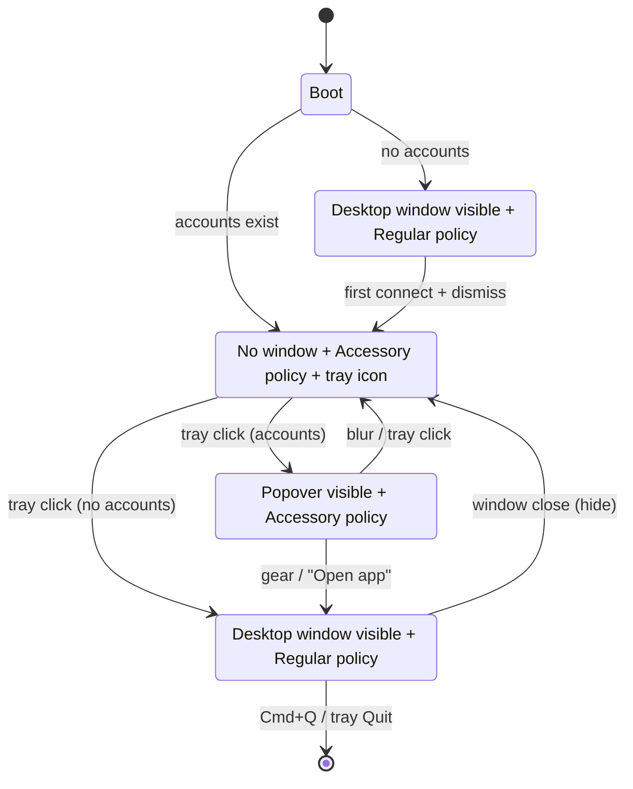

# Dev Radio — Plan V3: Split UI (Desktop + Menubar) & Lazy Keychain

V2 shipped the full monitoring loop, but everything lived in a single tray popover. V3 fixes the UX problems you hit on first run:

1. Multiple keychain prompts on launch.
2. Dock icon leaking in dev mode.
3. Onboarding rendered as a full centered window that felt disconnected from the app.
4. No "working" feedback between launch and the first successful poll.

---

## 1. UX contract (the target behaviour)

### 1.1 Two UIs, two jobs
- **Desktop window** — onboarding, account management, settings, help. Dockable, Cmd+Q quits, familiar mac app.
- **Menubar popover** — **display-only**: list of latest deployments + "Settings" button that opens the desktop window.

### 1.2 Activation policy flip (macOS)
- Window visible → `ActivationPolicy::Regular` → dock icon + Cmd+Tab.
- Window hidden → `ActivationPolicy::Accessory` → menubar only, no dock.
- Tauri v2 supports this natively via `app.set_activation_policy(...)`.

### 1.3 First launch (no accounts)
1. Process starts. Tray icon appears immediately in a dashed "setup" state (no color).
2. Desktop window opens **automatically** showing an onboarding view ("Connect your first account").
3. User connects → onboarding transitions to a "You're all set" confirmation with a **"Keep running in menu bar"** / **"Quit now"** choice, seen only on first run.
4. User picks one → window closes → tray takes over → first poll fires → tray goes green/yellow/red.

### 1.4 Subsequent launches (accounts exist)
1. Process starts silent. No window, no dock icon.
2. Tray icon appears in a "syncing" state.
3. First poll fires lazily (first keychain read happens here, **not** at boot) → tray reflects real health.
4. Nothing else happens until the user clicks.

### 1.5 Tray interactions
- **Left-click with accounts** → popover slides down. Header: avatar + primary account name + settings gear. Body: deployments. Footer: last-updated + refresh.
- **Left-click without accounts** → mini popover with a single "Connect account →" button that opens the desktop window to onboarding.
- **Right-click** → Open Dev Radio / Refresh Now / Settings / Quit.
- **Settings gear in popover** → opens desktop window to Settings view.

### 1.6 Close semantics (the big UX fix)
- Clicking the desktop window's close button **hides** it (and drops dock icon) — doesn't quit.
- **First time** this happens, show a one-shot toast/alert: *"Dev Radio keeps running in the menu bar. Quit from there to exit."* with buttons **"Got it"** / **"Quit now"**. Remember the choice in the store; never prompt again.
- Cmd+Q quits. Tray menu → Quit quits. Nothing else does.

### 1.7 Permissions asked only when needed
- Keychain is hit on the first poll (not at app boot).
- Single consolidated keychain entry = one prompt for N accounts.
- Token deletion re-writes the vault (one prompt).

### 1.8 Onboarding content
- Copy-guided. Text-first for v3. Screenshot + gif slots reserved.
- Each tab (Vercel / Railway) shows:
  - One-sentence explainer.
  - Step-by-step list (3 bullets) of how to create a token, with the URL as a clickable link that opens in the system browser (via `opener`).
  - Token input. "Connect" button.
  - On success: inline success state + Next steps.

---

## 2. Architecture diff from V2

```
V2                                    V3
─────────────────────────────────     ──────────────────────────────────
main window is popover-sized          TWO windows:
Onboarding shown as resized main      - "desktop" (560×680, standard)
Settings = Sheet inside popover       - "popover" (380×600, frameless)
One keychain entry per account        One vault entry
Hydrate on boot                       Hydrate on first poll (lazy)
LSUIElement in Info.plist             app.set_activation_policy() at runtime
Main window forced-hides on blur      Only popover hides on blur
                                      Desktop window closes → hides + policy flip
```

Mermaid of the new runtime model:



---

## 3. What keeps / changes / deletes / adds

### Keep unchanged
- All of `src-tauri/src/adapters/**` (trait, Vercel, Railway, registry, mappers, tests).
- `src-tauri/src/auth/**` (OAuth + PAT flows).
- `src-tauri/src/redact.rs`.
- `src-tauri/src/cache.rs`.
- `src-tauri/src/notifications.rs`.
- `src-tauri/src/poller.rs` apart from the "first poll should lazy-hydrate" tweak.
- Frontend: `src/lib/accounts.ts`, `src/lib/deployments.ts`, `src/lib/format.ts`, `src/hooks/use-dashboard.ts`, `src/components/deployment/*`, `src/components/ui/*`.

### Change
- **`src-tauri/src/keychain.rs`** — add a `vault` layer on top of the raw keyring crate. Single entry `dev-radio:vault`, JSON map `{ account_id: token }`, lazy-loaded with `OnceCell<RwLock<HashMap>>`. Raw per-account entry API stays for the one-time migration.
- **`src-tauri/src/window.rs`** — two windows: `desktop` and `popover`. Replace `enter_popover_mode` / `set_popover_mode` / `show_onboarding` helpers with `show_desktop(view)`, `hide_desktop`, `show_popover`, `hide_popover`, `apply_activation_policy(visible)`.
- **`src-tauri/src/tray.rs`** — add a 5th `Syncing` icon (dashed outline). Left-click dispatches differently based on account count (popover vs onboarding-in-desktop).
- **`src-tauri/src/lib.rs`** — setup logic: create both windows hidden, apply initial activation policy based on `store::list_accounts()`, open desktop window to onboarding if no accounts, otherwise tray only.
- **`src-tauri/tauri.conf.json`** — two window entries. Delete the `Info.plist`/infoPlist reference (runtime API replaces it). Window labels: `desktop`, `popover`.
- **`src-tauri/src/poller.rs`** — call `keychain::ensure_vault_loaded()` at the top of `poll_once` only; stop hydrating in `setup()`.
- **`src-tauri/src/commands/window.rs`** — replace the old commands with: `open_desktop`, `close_desktop`, `toggle_popover`, `open_settings`, `open_onboarding`, `quit_app`.
- **`src-tauri/src/commands/accounts.rs`** — the `rehydrate_after_change` helper switches to the vault-based API.
- **`src/App.tsx`** — **two roots**, picked by window label: `desktop` renders `<DesktopApp />`, `popover` renders `<PopoverApp />`. No state-routing between the two.

### Delete
- `src-tauri/Info.plist` (runtime API replaces it).
- `src/views/onboarding-view.tsx` + `src/views/popover-view.tsx` — replaced by the two new app shells.
- `src/components/popover/settings-sheet.tsx` — settings move to the desktop window.

### Add
- **Rust**
  - `src-tauri/src/keychain.rs` — new `vault` API.
  - `src-tauri/src/platform.rs` — `set_activation_policy(visible: bool)` with `#[cfg(target_os = ...)]` branches.
  - `src-tauri/src/commands/ux.rs` — `has_seen_close_hint`, `mark_close_hint_seen`.
- **Frontend**
  - `src/app/desktop/DesktopApp.tsx` — root for the `desktop` window.
  - `src/app/desktop/views/OnboardingView.tsx` — onboarding with step guide.
  - `src/app/desktop/views/SettingsView.tsx` — full-width settings with sections.
  - `src/app/desktop/components/DesktopShell.tsx` — window chrome: title bar with close/min/zoom fake buttons, nav.
  - `src/app/desktop/components/GuideSteps.tsx` — reusable step list.
  - `src/app/desktop/components/CloseHintDialog.tsx` — first-time close explainer.
  - `src/app/popover/PopoverApp.tsx` — root for the `popover` window.
  - `src/app/popover/views/DeploymentsView.tsx` — the existing popover body, minus settings sheet.
  - `src/app/popover/views/EmptyConnectView.tsx` — 140-px-tall "Connect account →" stub.

---

## 4. Detailed Rust changes

### 4.1 Vault keychain layer

```rust
// src-tauri/src/keychain.rs (new top-level API)

use std::collections::HashMap;
use std::sync::{Arc, RwLock};
use once_cell::sync::OnceCell;
use keyring::Entry;

const SERVICE: &str = "dev-radio";
const VAULT_ACCOUNT: &str = "vault";

static VAULT: OnceCell<Arc<RwLock<HashMap<String, String>>>> = OnceCell::new();

fn vault() -> &'static Arc<RwLock<HashMap<String, String>>> {
    VAULT.get_or_init(|| Arc::new(RwLock::new(HashMap::new())))
}

pub fn ensure_loaded() -> Result<(), AuthError> {
    if vault().read().unwrap().len() > 0 { return Ok(()); }
    let entry = Entry::new(SERVICE, VAULT_ACCOUNT)?;
    let raw = match entry.get_password() {
        Ok(s) => s,
        Err(keyring::Error::NoEntry) => String::from("{}"),
        Err(e) => return Err(e.into()),
    };
    let parsed: HashMap<String, String> = serde_json::from_str(&raw).unwrap_or_default();
    *vault().write().unwrap() = parsed;
    Ok(())
}

fn flush() -> Result<(), AuthError> {
    let entry = Entry::new(SERVICE, VAULT_ACCOUNT)?;
    let raw = serde_json::to_string(&*vault().read().unwrap())
        .map_err(|e| AuthError::Keychain(e.to_string()))?;
    entry.set_password(&raw)?;
    Ok(())
}

pub fn store_token(_platform: &str, account_id: &str, token: &str) -> Result<(), AuthError> {
    ensure_loaded()?;
    vault().write().unwrap().insert(account_id.into(), token.into());
    flush()
}

pub fn get_token(_platform: &str, account_id: &str) -> Result<String, AuthError> {
    ensure_loaded()?;
    vault().read().unwrap().get(account_id).cloned()
        .ok_or_else(|| AuthError::Keychain("missing token".into()))
}

pub fn delete_token(_platform: &str, account_id: &str) -> Result<(), AuthError> {
    ensure_loaded()?;
    vault().write().unwrap().remove(account_id);
    flush()
}
```

One-time migration: on first `ensure_loaded()` if the vault is empty AND legacy per-account entries exist, suck them in and `flush()`. Kept in `migrate_legacy_entries()` called from `ensure_loaded()`.

### 4.2 Activation policy helpers

```rust
// src-tauri/src/platform.rs
use tauri::{AppHandle, Runtime};

#[cfg(target_os = "macos")]
pub fn set_visible_dock<R: Runtime>(app: &AppHandle<R>, visible: bool) {
    use tauri::ActivationPolicy;
    let policy = if visible { ActivationPolicy::Regular } else { ActivationPolicy::Accessory };
    let _ = app.set_activation_policy(policy);
}

#[cfg(not(target_os = "macos"))]
pub fn set_visible_dock<R: Runtime>(_app: &AppHandle<R>, _visible: bool) {}
```

### 4.3 Window module rewrite

Two labels, two helpers per window, plus orchestration helpers:

```rust
// src-tauri/src/window.rs (rewritten)
pub const DESKTOP: &str = "desktop";
pub const POPOVER: &str = "popover";

pub fn show_desktop<R: Runtime>(app: &AppHandle<R>, route: &str) {
    let Some(w) = app.get_webview_window(DESKTOP) else { return };
    let _ = w.show();
    let _ = w.set_focus();
    let _ = w.eval(&format!("window.__dev_radio_route = '{route}'"));
    let _ = app.emit("desktop:route", route);
    crate::platform::set_visible_dock(app, true);
}

pub fn hide_desktop<R: Runtime>(app: &AppHandle<R>) {
    if let Some(w) = app.get_webview_window(DESKTOP) { let _ = w.hide(); }
    if !is_popover_visible(app) {
        crate::platform::set_visible_dock(app, false);
    }
}

pub fn show_popover<R: Runtime>(app: &AppHandle<R>) { /* unchanged positioning */ }
pub fn hide_popover<R: Runtime>(app: &AppHandle<R>) { /* unchanged */ }

pub fn toggle_popover<R: Runtime>(app: &AppHandle<R>) { /* unchanged */ }

fn is_popover_visible<R: Runtime>(app: &AppHandle<R>) -> bool {
    app.get_webview_window(POPOVER)
        .and_then(|w| w.is_visible().ok())
        .unwrap_or(false)
}
```

### 4.4 Window events

Handlers keyed on `window.label()`:

```rust
on_window_event(|window, event| {
    match window.label() {
        "popover" => {
            if matches!(event, WindowEvent::Focused(false)) {
                let _ = window.hide();
            }
        }
        "desktop" => {
            if let WindowEvent::CloseRequested { api, .. } = event {
                api.prevent_close();
                let app = window.app_handle().clone();
                crate::window::hide_desktop(&app);
                // First-time toast handled on the frontend via an event:
                let _ = app.emit("desktop:close-hint", ());
            }
        }
        _ => {}
    }
})
```

### 4.5 Tauri config

Two windows, both initially `visible: false`:

```jsonc
"windows": [
  {
    "label": "desktop",
    "title": "Dev Radio",
    "width": 560, "height": 680,
    "minWidth": 480, "minHeight": 560,
    "resizable": true,
    "decorations": true,
    "center": true,
    "visible": false
  },
  {
    "label": "popover",
    "title": "Dev Radio",
    "width": 380, "height": 600,
    "resizable": false,
    "decorations": false,
    "alwaysOnTop": true,
    "skipTaskbar": true,
    "hiddenTitle": true,
    "visible": false,
    "acceptFirstMouse": true,
    "shadow": true
  }
]
```

Delete `macOSPrivateApi`, `Info.plist`, `bundle.macOS.infoPlist`.

### 4.6 Setup flow

```rust
.setup(|app| {
    let handle = app.handle().clone();

    app.manage(Arc::new(AdapterRegistry::new()));
    app.manage(Arc::new(Cache::new()));

    tray::build(&handle)?;

    let accounts = store::list_accounts(&handle).unwrap_or_default();
    if accounts.is_empty() {
        window::show_desktop(&handle, "onboarding");
    } else {
        // Start lazy: no keychain read yet
        platform::set_visible_dock(&handle, false);
        poller::ensure_started(&handle);
    }
    Ok(())
})
```

Crucially: **no `registry.hydrate()` call in setup**. The registry hydrates itself on demand inside `poll_once`, immediately after `keychain::ensure_loaded()`.

### 4.7 Poller lazy hydrate

```rust
async fn poll_once(self: &Arc<Self>) {
    if let Err(e) = crate::keychain::ensure_loaded() {
        self.cache.mark_offline(e.to_string());
        ...
        return;
    }
    let accounts = crate::store::list_accounts(&self.app).unwrap_or_default();
    self.registry.hydrate(&accounts);
    ...
}
```

### 4.8 New commands

```rust
// commands/window.rs
#[tauri::command] pub async fn open_desktop(app: AppHandle, view: String)
#[tauri::command] pub async fn close_desktop(app: AppHandle)
#[tauri::command] pub async fn toggle_popover(app: AppHandle)
#[tauri::command] pub async fn quit_app(app: AppHandle)

// commands/ux.rs
#[tauri::command] pub async fn has_seen_close_hint(app: AppHandle) -> Result<bool, String>
#[tauri::command] pub async fn mark_close_hint_seen(app: AppHandle) -> Result<(), String>
```

Old `show_popover`, `hide_popover`, `show_onboarding`, `hide_onboarding` go away.

---

## 5. Frontend changes

### 5.1 Two apps, picked by window label

```tsx
// src/main.tsx
import { getCurrentWindow } from "@tauri-apps/api/window"

const label = getCurrentWindow().label
const Root = label === "popover"
  ? (await import("./app/popover/PopoverApp")).PopoverApp
  : (await import("./app/desktop/DesktopApp")).DesktopApp

createRoot(document.getElementById("root")!).render(
  <StrictMode>
    <ThemeProvider>
      <Root />
      <Toaster />
    </ThemeProvider>
  </StrictMode>
)
```

Completely separate React trees, dynamically imported → smaller initial bundle per window.

### 5.2 Desktop window

```
src/app/desktop/
├── DesktopApp.tsx           # routes: onboarding | settings | about
├── components/
│   ├── DesktopShell.tsx     # left nav (Accounts / General / Help) + title bar
│   ├── GuideSteps.tsx       # numbered step list with copy
│   └── CloseHintDialog.tsx
└── views/
    ├── OnboardingView.tsx   # full-width, illustrated
    ├── SettingsView.tsx     # accounts table + poll interval + launch-at-login + Quit
    └── AboutView.tsx        # version, logs folder, support link
```

**OnboardingView** layout (content-rich, replaces the popover version):
- Hero: wordmark + "Connect your first account to start monitoring deployments."
- Platform tabs: Vercel / Railway
- Each tab:
  - **"Here's how"** `GuideSteps` — 3 numbered steps with copy + link icons that open the provider page.
  - Inline token input with inline validation.
  - "Connect" button.
- After connect: same screen swaps to a success panel: green check, "Connected as Maya", "Connect another" / "Done".
- On "Done" → `CloseHintDialog` fires (first time only): *"Dev Radio will keep running in your menu bar…"* / **Got it** / **Quit now**.

**SettingsView** layout:
- Left sidebar: Accounts / General / About.
- Accounts: `Table` of `AccountRecord` with "Add account", rename, delete.
- General: poll-interval buttons, launch-at-login switch, notifications master switch.
- About: version, data folder link, GitHub link, "Quit Dev Radio" button.

### 5.3 Popover window

```
src/app/popover/
├── PopoverApp.tsx            # routes by account count
└── views/
    ├── DeploymentsView.tsx   # mostly the current popover-view.tsx
    └── EmptyConnectView.tsx  # 140px tall card, "Connect account →"
```

The gear icon on `DeploymentsView` no longer opens a side sheet — it calls `invoke("open_desktop", { view: "settings" })` which shows the desktop window + flips dock policy.

### 5.4 Events

Two new events the frontend subscribes to:
- `desktop:route` (payload `string`) — desktop window switches view without reloading.
- `desktop:close-hint` — triggers the first-time close dialog.

---

## 6. Trade-offs / honest flags

1. **Dock icon flicker** (~150 ms) when the desktop window opens/closes. Mitigation: show window *before* flipping to `Regular`, hide *after* dropping to `Accessory`. Tolerable.
2. **Windows/Linux.** `set_activation_policy` is a macOS concept. On other OSes we just hide the desktop window; the taskbar icon stays during the session. Acceptable for V3.
3. **Dev-mode keychain reprompts on rebuild.** Consolidated vault drops it to **one** prompt per rebuild instead of N. Zero prompts in dev would require an encrypted file fallback — out of scope.
4. **Migration.** Old per-account keychain entries still exist from V2. We migrate them into the vault on first `ensure_loaded()`; the old entries are left behind (safe, just unused). Documented as a note.
5. **Popover gear ↔ desktop window handoff** briefly shows both. Fine.

---

## 7. Phased rollout

### Phase V3-0 — Vault keychain (1h)
- `keychain::ensure_loaded`, `flush`, vault map.
- Migration of legacy entries.
- Unit tests behind `#[ignore]`.
- All existing callers unchanged — they call the same `store_token` / `get_token` / `delete_token` names; only storage shape changes.

### Phase V3-1 — Activation policy + second window (1h)
- `platform::set_visible_dock`.
- Rewrite `window.rs` for `desktop` + `popover` labels.
- Update `tauri.conf.json` for two windows; delete `Info.plist`, `macOSPrivateApi`, `bundle.macOS.infoPlist`.
- Delete `show_onboarding`/`hide_onboarding`; introduce `show_desktop(view)` / `hide_desktop`.
- Re-wire `on_window_event` per label.
- Emit `desktop:close-hint` on close.

### Phase V3-2 — Setup flow & lazy poller (30m)
- Delete `registry.hydrate` from `setup()`.
- Poller's first action is `keychain::ensure_loaded()` + `registry.hydrate(&accounts)`.
- Setup decides: no accounts → `show_desktop("onboarding")`; else `set_visible_dock(false) + ensure_started`.

### Phase V3-3 — Tray 5th state + routing (30m)
- Add `HealthLevel::Syncing` + 5th PNG.
- Poller sets `Syncing` at start of first `poll_once`.
- Tray left-click: accounts > 0 → `toggle_popover`, else `show_desktop("onboarding")`.
- Tray menu "Settings…" → `show_desktop("settings")`.

### Phase V3-4 — Frontend split (1h)
- `main.tsx` dynamic import by label.
- Scaffold `app/desktop/DesktopApp.tsx` + `app/popover/PopoverApp.tsx` with routing stubs.
- Delete `views/onboarding-view.tsx`, `views/popover-view.tsx`, `components/popover/settings-sheet.tsx`.
- `pnpm typecheck` clean after scaffolding.

### Phase V3-5 — DesktopApp: onboarding (1–1.5h)
- `DesktopShell` with header + left nav + content area.
- `OnboardingView` with platform tabs + `GuideSteps` + `AddAccountForm`.
- Success panel.
- Listen for `desktop:route` event to switch views.
- `CloseHintDialog` firing on first `desktop:close-hint`; persist flag via `mark_close_hint_seen`.

### Phase V3-6 — DesktopApp: settings (1h)
- `SettingsView` with Accounts table + General (poll interval + launch-at-login) + About.
- Reuses `accountsApi.list` / `remove`.
- "Add account" button → inline modal with `AddAccountForm` (or routes to onboarding form).
- "Quit Dev Radio" button.

### Phase V3-7 — PopoverApp (30m)
- `DeploymentsView` ported from current `popover-view.tsx` minus `SettingsSheet`.
- Gear icon → `invoke("open_desktop", { view: "settings" })`.
- `EmptyConnectView` for zero-accounts state.

### Phase V3-8 — UX polish & tests (1h)
- Onboarding copy + GuideSteps content for Vercel and Railway.
- "Keep running in menu bar" dialog copy + buttons.
- Syncing tray state visible for ≥300 ms before first poll lands.
- Running `cargo test --lib` + `pnpm typecheck` + `pnpm build`.

**Total:** ~7 hours. Shippable after V3-7.

---

## 8. Detailed TODO checklist

### Phase V3-0 — Vault keychain
- [x] **V3-0.1** Add `serde_json` vault map + `OnceCell<Arc<RwLock<HashMap<String, String>>>>` in `keychain.rs`.
- [x] **V3-0.2** Implement `ensure_loaded`, `flush`, `migrate_legacy_entries`.
- [x] **V3-0.3** Rewrite `store_token` / `get_token` / `delete_token` to operate on the vault.
- [x] **V3-0.4** Add `#[ignore]`-gated integration test that seeds a legacy entry, calls `ensure_loaded`, and asserts vault contains it.
- [x] **V3-0.5** Add `keychain::has_any_token()` helper used by future UX code.

### Phase V3-1 — Window + activation policy
- [x] **V3-1.1** Create `src-tauri/src/platform.rs` with `set_visible_dock`.
- [x] **V3-1.2** Update `tauri.conf.json`: replace single window with `desktop` + `popover` entries per §4.5. Remove `macOSPrivateApi` and `bundle.macOS.infoPlist`.
- [x] **V3-1.3** Delete `src-tauri/Info.plist`.
- [x] **V3-1.4** Remove `tauri = { ..., features = ["macos-private-api"] }` flag.
- [x] **V3-1.5** Rewrite `src-tauri/src/window.rs`: constants `DESKTOP`/`POPOVER`, helpers `show_desktop(route)`, `hide_desktop`, `show_popover`, `hide_popover`, `toggle_popover`, `is_popover_visible`.
- [x] **V3-1.6** Update `on_window_event` to branch on `window.label()`.
- [x] **V3-1.7** Emit `desktop:close-hint` the first time the desktop window is closed.

### Phase V3-2 — Setup + lazy poller
- [x] **V3-2.1** Remove `registry.hydrate()` from setup.
- [x] **V3-2.2** In `poller::poll_once`: call `keychain::ensure_loaded()` → `registry.hydrate(&accounts)` → proceed.
- [x] **V3-2.3** In setup: `accounts.is_empty()` → `show_desktop("onboarding")`; else `set_visible_dock(false) + ensure_started`.
- [x] **V3-2.4** Confirm zero-account cold launch → no keychain prompts (manual smoke).

### Phase V3-3 — Tray
- [x] **V3-3.1** Add `HealthLevel::Syncing`.
- [x] **V3-3.2** Generate `tray-syncing@{1,2}x.png` (dashed outline variant of the wordmark).
- [x] **V3-3.3** `tray::set_health` handles the new case; use template mode for Syncing.
- [x] **V3-3.4** Poller flips to `Syncing` before first poll completes.
- [x] **V3-3.5** Tray left-click handler routes to `toggle_popover` vs `show_desktop("onboarding")` based on `store::list_accounts`.
- [x] **V3-3.6** Tray menu "Settings…" calls `show_desktop("settings")`.

### Phase V3-4 — Commands
- [x] **V3-4.1** `commands/window.rs`: `open_desktop(view)`, `close_desktop`, `toggle_popover`, `quit_app`.
- [x] **V3-4.2** `commands/ux.rs`: `has_seen_close_hint`, `mark_close_hint_seen` backed by `tauri-plugin-store`.
- [x] **V3-4.3** Update `invoke_handler![...]` — remove old window commands.

### Phase V3-5 — Frontend scaffolding
- [x] **V3-5.1** `src/main.tsx` dynamic import by `getCurrentWindow().label`.
- [x] **V3-5.2** Create `src/app/desktop/DesktopApp.tsx` (route state + listener for `desktop:route`).
- [x] **V3-5.3** Create `src/app/popover/PopoverApp.tsx` (shows `DeploymentsView` or `EmptyConnectView`).
- [x] **V3-5.4** Delete `src/views/onboarding-view.tsx`, `src/views/popover-view.tsx`, `src/components/popover/settings-sheet.tsx`.
- [x] **V3-5.5** `pnpm typecheck` clean.

### Phase V3-6 — Desktop: onboarding
- [x] **V3-6.1** `DesktopShell.tsx` — title area, scroll container, left nav (Accounts / General / Help).
- [x] **V3-6.2** `GuideSteps.tsx` — numbered steps with copy, external-link-capable bullets.
- [x] **V3-6.3** `OnboardingView.tsx` — hero + platform tabs + `AddAccountForm` + success panel.
- [x] **V3-6.4** `CloseHintDialog.tsx` — first-time close explainer, wired to `has_seen_close_hint`.
- [x] **V3-6.5** Listen for `desktop:close-hint` and open `CloseHintDialog`.

### Phase V3-7 — Desktop: settings + about
- [x] **V3-7.1** `SettingsView.tsx` — accounts table (list + remove + rename), "Add account" dialog using existing `AddAccountForm`.
- [x] **V3-7.2** General pane: poll-interval buttons + launch-at-login toggle + notifications master switch.
- [x] **V3-7.3** About pane: version, "Open logs folder" link, GitHub link, "Quit Dev Radio" button.
- [x] **V3-7.4** Settings view listens for `accounts:changed` and refreshes.

### Phase V3-8 — Popover
- [x] **V3-8.1** `DeploymentsView.tsx` — port current popover layout (header + feed + footer) minus settings sheet.
- [x] **V3-8.2** Gear icon → `invoke("open_desktop", { view: "settings" })`.
- [x] **V3-8.3** `EmptyConnectView.tsx` — minimal card with CTA that calls `invoke("open_desktop", { view: "onboarding" })`.

### Phase V3-9 — Polish + acceptance
- [x] **V3-9.1** Verify no keychain prompt on zero-account cold launch.
- [x] **V3-9.2** Verify single prompt on first-poll with one account; second account addition triggers one prompt.
- [x] **V3-9.3** Verify dock icon disappears the moment desktop window is hidden.
- [x] **V3-9.4** Verify close-button-hides-window first-time dialog and remembered choice.
- [x] **V3-9.5** `cargo test --lib`, `pnpm typecheck`, `pnpm build` — all green.
- [x] **V3-9.6** Manual smoke on dev build + release bundle.

---

## 9. Explicit non-goals for V3

- Notifications dedup store (still deferred from V2).
- Click-notification-to-activate (deferred).
- Windows / Linux tray polish.
- Icons other than the simple wordmark. Illustrations/gifs in onboarding are a future pass.
- Multiple Railway workspaces per account (one per account for now).
- Redeploy / cancel actions.

---

## 10. Decisions locked in

- Desktop window is **single-page state-driven** (onboarding OR settings OR about). Not a sidebar-with-sections.
- Keychain is a **single consolidated vault entry**. One prompt per app session.
- Activation policy is **flipped at runtime** from Rust. `Info.plist` / `LSUIElement` go away.
- Settings **never** appears inside the popover in V3. Every settings interaction opens the desktop window.
- Close-button behaviour: **hide, don't quit**, with a one-time toast on first close.

---

## 11. Implementation status (2026-04-18)

All 10 phases / 48 code-level tasks landed. Verification:

- `pnpm typecheck` — clean.
- `pnpm build` — clean (bundles split per window: `desktop-app-*.js` ~60 KB, `popover-app-*.js` ~12 KB, deployments chunk shared ~38 KB).
- `cd src-tauri && cargo test --lib` — **45 passed**, 2 ignored (keychain round-trips require live OS access), 0 warnings.
- `cd src-tauri && cargo build` — clean.

Notable deltas vs V2:
- Keychain became a single vault entry (`dev-radio:vault`) with lazy `ensure_loaded()` called from the poller, not from `setup()`. Auto-migrates legacy per-account entries on first access.
- Tauri window config now declares **two** windows (`desktop` 560×680 + `popover` 380×600); both start hidden. Setup opens the right one based on account presence.
- macOS activation policy is toggled at runtime via `platform::set_visible_dock`; `Info.plist` / `LSUIElement` removed entirely.
- `tray.rs` gained a `Setup`/`Syncing` state + dashed-outline icon variant; left-click routes to popover (with accounts) or desktop/onboarding (without).
- Frontend is now two entirely separate React trees, dynamically imported from `main.tsx` based on `getCurrentWindow().label`.
- Settings no longer live inside the popover — only the desktop window. Gear icon in the popover opens the desktop window to the Settings view.
- Close-button behaviour: hide + drop dock icon; first-time `CloseHintDialog` explains the menu-bar-only persistence and offers a **Quit now** option. Flag persisted via `has_seen_close_hint` / `mark_close_hint_seen` commands.

Items still deferred to a later pass (unchanged from V2):
- Notification dedup across restarts (first-poll suppression already covers the main noise).
- Per-project / per-account notification mute UI.
- Click-notification-to-activate.
