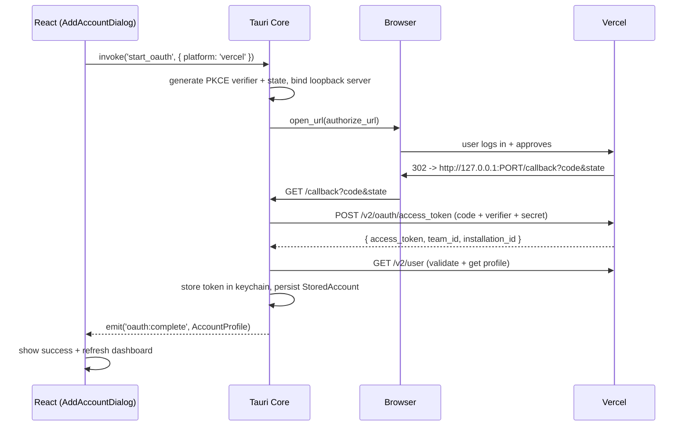

# Dev Radio — Account Connection Implementation Plan

This document is the step-by-step implementation plan for connecting user accounts (Vercel + Railway) in Dev Radio. It covers both the **OAuth "Connect with Vercel"** flow and the **Personal Access Token (PAT) paste** fallback, plus the Railway PAT flow.

---

## 1. Summary of Approach

| Platform | Primary flow | Fallback | Why |
|---|---|---|---|
| **Vercel** | OAuth2 (Vercel Integration) via loopback redirect | PAT paste | Integrations API supports a proper "connect app" UX; much better for teams. |
| **Railway** | PAT paste | — | Railway does not expose public OAuth for third-party desktop apps as of 2026. |

All credential handling happens in **Rust**. The frontend only triggers the flow and renders the resulting `AccountProfile`. Tokens never touch `localStorage`, `sessionStorage`, or any JS-visible memory after the initial PAT paste.

---

## 2. Prerequisites

### 2.1 Register a Vercel Integration
1. Go to <https://vercel.com/dashboard/integrations/console>.
2. Create a new Integration named **"Dev Radio"**.
3. Configure:
   - **Redirect URL:** `http://127.0.0.1:53123/callback` (loopback; dynamic port in dev, fixed range in prod — see §4.3).
   - **Scopes:** `read:project`, `read:deployment`, `read:user`, `read:team` (+ `write:deployment` only if we want to support redeploy via OAuth; otherwise keep scopes minimal and require PAT for redeploy).
   - **Type:** "Generic" (not Marketplace — we are not listing publicly).
4. Save `client_id`, `client_secret`, and authorize URL.
5. Store `client_id` as a compile-time constant; store `client_secret` as a compile-time secret injected via a build-time env var (see §7 — "Secret handling").

### 2.2 Rust dependencies (`src-tauri/Cargo.toml`)
```toml
[dependencies]
tauri = { version = "2", features = [] }
tauri-plugin-opener = "2"
tauri-plugin-oauth = "2"            # community loopback helper
tauri-plugin-notification = "2"
tauri-plugin-store = "2"
reqwest = { version = "0.12", features = ["json", "rustls-tls"] }
tokio = { version = "1", features = ["full"] }
serde = { version = "1", features = ["derive"] }
serde_json = "1"
thiserror = "1"
async-trait = "0.1"
base64 = "0.22"
rand = "0.8"
sha2 = "0.10"
url = "2"
keyring = "3"                       # OS keychain
uuid = { version = "1", features = ["v4"] }
tracing = "0.1"
```

### 2.3 Frontend dependencies (already in `agmmnn/tauri-ui`)
- `@tauri-apps/api`
- `@tauri-apps/plugin-opener`
- shadcn/ui components: `Dialog`, `Tabs`, `Button`, `Input`, `Alert`

---

## 3. High-Level Flow



---

## 4. Rust Implementation

### 4.1 Module layout

```
src-tauri/src/
├── auth/
│   ├── mod.rs
│   ├── oauth.rs          # generic PKCE + loopback helpers
│   ├── vercel.rs         # Vercel-specific OAuth flow
│   └── pat.rs            # PAT validation flow
├── keychain.rs
├── commands/
│   └── accounts.rs       # Tauri invoke targets
└── adapters/...
```

### 4.2 PKCE helpers (`auth/oauth.rs`)

```rust
use base64::{engine::general_purpose::URL_SAFE_NO_PAD, Engine};
use rand::RngCore;
use sha2::{Digest, Sha256};

pub struct PkcePair {
    pub verifier: String,
    pub challenge: String,
}

pub fn generate_pkce() -> PkcePair {
    let mut buf = [0u8; 32];
    rand::thread_rng().fill_bytes(&mut buf);
    let verifier = URL_SAFE_NO_PAD.encode(buf);
    let challenge = URL_SAFE_NO_PAD.encode(Sha256::digest(verifier.as_bytes()));
    PkcePair { verifier, challenge }
}

pub fn generate_state() -> String {
    let mut buf = [0u8; 16];
    rand::thread_rng().fill_bytes(&mut buf);
    URL_SAFE_NO_PAD.encode(buf)
}
```

### 4.3 Loopback server — port strategy

- **Dev:** `127.0.0.1:53123` (fixed, matches registered redirect URL).
- **Prod:** same fixed port. If already in use, show a friendly error ("Another app is using port 53123 — close it and retry"). Do **not** pick a random port in prod — Vercel requires an exact-match registered redirect URI.
- If we need flexibility, register multiple redirect URIs (`53123`, `53124`, `53125`) and try each in order.

### 4.4 Vercel OAuth flow (`auth/vercel.rs`)

```rust
use serde::Deserialize;
use std::net::SocketAddr;
use std::sync::Arc;
use tauri::{AppHandle, Emitter};
use tokio::sync::oneshot;

const CLIENT_ID: &str = env!("VERCEL_CLIENT_ID");
const CLIENT_SECRET: &str = env!("VERCEL_CLIENT_SECRET");
const REDIRECT_URI: &str = "http://127.0.0.1:53123/callback";
const AUTHORIZE_URL: &str = "https://vercel.com/oauth/authorize";
const TOKEN_URL: &str = "https://api.vercel.com/v2/oauth/access_token";

#[derive(Debug, Deserialize)]
struct TokenResponse {
    access_token: String,
    token_type: String,
    #[serde(default)]
    team_id: Option<String>,
    #[serde(default)]
    installation_id: Option<String>,
    #[serde(default)]
    user_id: Option<String>,
}

pub async fn start_vercel_oauth(app: AppHandle) -> Result<AccountProfile, AuthError> {
    // 1. PKCE + state
    let pkce = generate_pkce();
    let state = generate_state();

    // 2. Start loopback server, get a oneshot that resolves with ?code
    let (code_tx, code_rx) = oneshot::channel::<Result<String, AuthError>>();
    let expected_state = state.clone();
    let server_handle = spawn_loopback_server(expected_state, code_tx).await?;

    // 3. Open browser
    let authorize_url = format!(
        "{AUTHORIZE_URL}?client_id={CLIENT_ID}&redirect_uri={}&response_type=code&state={state}&code_challenge={}&code_challenge_method=S256",
        urlencoding::encode(REDIRECT_URI),
        pkce.challenge,
    );
    tauri_plugin_opener::open_url(&authorize_url, None::<&str>)?;

    // 4. Wait for callback (with timeout)
    let code = tokio::time::timeout(std::time::Duration::from_secs(300), code_rx)
        .await
        .map_err(|_| AuthError::Timeout)?
        .map_err(|_| AuthError::ServerClosed)??;

    server_handle.abort();

    // 5. Exchange code -> token
    let client = reqwest::Client::new();
    let res: TokenResponse = client
        .post(TOKEN_URL)
        .form(&[
            ("client_id", CLIENT_ID),
            ("client_secret", CLIENT_SECRET),
            ("code", &code),
            ("redirect_uri", REDIRECT_URI),
            ("code_verifier", &pkce.verifier),
        ])
        .send().await?
        .error_for_status()?
        .json().await?;

    // 6. Validate + profile
    let profile = fetch_vercel_profile(&res.access_token, res.team_id.as_deref()).await?;

    // 7. Persist
    let account_id = uuid::Uuid::new_v4().to_string();
    crate::keychain::store_token("vercel", &account_id, &res.access_token)?;
    crate::store::save_account(&StoredAccount {
        id: account_id.clone(),
        platform: Platform::Vercel,
        display_name: profile.display_name.clone(),
        scope_id: res.team_id.clone(),
        enabled: true,
        created_at: chrono::Utc::now().timestamp_millis(),
    })?;

    // 8. Emit to frontend
    app.emit("oauth:complete", &profile).ok();

    Ok(profile)
}
```

### 4.5 Loopback callback handler (`auth/oauth.rs`)

Use `tauri-plugin-oauth` if you want the prebuilt helper. If you prefer full control, here is a minimal `hyper`-free version using `tiny_http`:

```rust
use std::collections::HashMap;
use tiny_http::{Response, Server};
use tokio::sync::oneshot;

pub async fn spawn_loopback_server(
    expected_state: String,
    tx: oneshot::Sender<Result<String, AuthError>>,
) -> Result<tokio::task::JoinHandle<()>, AuthError> {
    let server = Server::http("127.0.0.1:53123")
        .map_err(|e| AuthError::Server(e.to_string()))?;

    let handle = tokio::task::spawn_blocking(move || {
        if let Ok(req) = server.recv() {
            let url = req.url().to_string();
            let params = parse_query(&url);

            let result = match (params.get("code"), params.get("state"), params.get("error")) {
                (_, _, Some(err)) => Err(AuthError::Provider(err.clone())),
                (Some(code), Some(state), _) if *state == expected_state => Ok(code.clone()),
                (_, Some(_), _) => Err(AuthError::StateMismatch),
                _ => Err(AuthError::MissingCode),
            };

            let html = match &result {
                Ok(_) => SUCCESS_HTML,
                Err(_) => FAILURE_HTML,
            };
            let _ = req.respond(Response::from_string(html)
                .with_header("Content-Type: text/html".parse::<tiny_http::Header>().unwrap()));

            let _ = tx.send(result);
        }
    });

    Ok(handle)
}

fn parse_query(url: &str) -> HashMap<String, String> {
    let q = url.split_once('?').map(|(_, q)| q).unwrap_or("");
    url::form_urlencoded::parse(q.as_bytes())
        .into_owned()
        .collect()
}

const SUCCESS_HTML: &str = r#"<!doctype html>
<html><head><title>Dev Radio connected</title>
<style>body{font:14px -apple-system,system-ui;text-align:center;padding:48px;color:#0a0a0a}
h1{font-size:18px;margin:0 0 8px}p{color:#71717a}</style></head>
<body><h1>✅ Dev Radio is connected</h1>
<p>You can close this tab and return to the app.</p>
<script>setTimeout(()=>window.close(), 800)</script></body></html>"#;

const FAILURE_HTML: &str = r#"<!doctype html>
<html><body style="font:14px -apple-system;text-align:center;padding:48px">
<h1>Connection failed</h1><p>Please return to Dev Radio and try again.</p>
</body></html>"#;
```

> **Security:** The `state` parameter MUST be verified before accepting the code. The loopback server MUST bind to `127.0.0.1` (not `0.0.0.0`). PKCE verifier is sent only over TLS to Vercel's token endpoint.

### 4.6 Profile fetch (`auth/vercel.rs`)

```rust
#[derive(Debug, Deserialize)]
struct VercelUser { id: String, email: String, name: Option<String>, username: String, avatar: Option<String> }

#[derive(Debug, Deserialize)]
struct VercelTeam { id: String, name: String, slug: String, avatar: Option<String> }

async fn fetch_vercel_profile(token: &str, team_id: Option<&str>) -> Result<AccountProfile, AuthError> {
    let client = reqwest::Client::new();

    if let Some(tid) = team_id {
        let team: VercelTeam = client
            .get(format!("https://api.vercel.com/v2/teams/{tid}"))
            .bearer_auth(token).send().await?.error_for_status()?.json().await?;
        return Ok(AccountProfile {
            id: team.id.clone(),
            platform: Platform::Vercel,
            display_name: format!("{} (Team)", team.name),
            email: None,
            avatar_url: team.avatar.map(avatar_url),
            scope_id: Some(team.id),
        });
    }

    let user: VercelUser = client
        .get("https://api.vercel.com/v2/user")
        .bearer_auth(token).send().await?.error_for_status()?.json().await?;
    Ok(AccountProfile {
        id: user.id,
        platform: Platform::Vercel,
        display_name: user.name.unwrap_or(user.username),
        email: Some(user.email),
        avatar_url: user.avatar.map(avatar_url),
        scope_id: None,
    })
}

fn avatar_url(hash: String) -> String {
    format!("https://vercel.com/api/www/avatar/{hash}?s=64")
}
```

### 4.7 PAT fallback (`auth/pat.rs`)

```rust
pub async fn connect_via_pat(
    platform: Platform,
    token: String,
    scope_id: Option<String>,
) -> Result<AccountProfile, AuthError> {
    let profile = match platform {
        Platform::Vercel => fetch_vercel_profile(&token, scope_id.as_deref()).await?,
        Platform::Railway => fetch_railway_profile(&token).await?,
    };

    let account_id = uuid::Uuid::new_v4().to_string();
    crate::keychain::store_token(platform.key(), &account_id, &token)?;
    crate::store::save_account(&StoredAccount {
        id: account_id,
        platform,
        display_name: profile.display_name.clone(),
        scope_id,
        enabled: true,
        created_at: chrono::Utc::now().timestamp_millis(),
    })?;
    Ok(profile)
}
```

### 4.8 Railway profile fetch

```rust
async fn fetch_railway_profile(token: &str) -> Result<AccountProfile, AuthError> {
    let client = reqwest::Client::new();
    let body = serde_json::json!({ "query": "{ me { id email name avatar } }" });
    let res: serde_json::Value = client
        .post("https://backboard.railway.app/graphql/v2")
        .bearer_auth(token).json(&body).send().await?
        .error_for_status()?.json().await?;
    let me = &res["data"]["me"];
    Ok(AccountProfile {
        id: me["id"].as_str().unwrap_or_default().to_string(),
        platform: Platform::Railway,
        display_name: me["name"].as_str().or_else(|| me["email"].as_str()).unwrap_or("Railway").to_string(),
        email: me["email"].as_str().map(str::to_string),
        avatar_url: me["avatar"].as_str().map(str::to_string),
        scope_id: None,
    })
}
```

### 4.9 Keychain wrapper (`keychain.rs`)

```rust
use keyring::Entry;

pub fn store_token(platform: &str, account_id: &str, token: &str) -> Result<(), AuthError> {
    let entry = Entry::new("dev-radio", &format!("{platform}:{account_id}"))?;
    entry.set_password(token)?;
    Ok(())
}

pub fn get_token(platform: &str, account_id: &str) -> Result<String, AuthError> {
    let entry = Entry::new("dev-radio", &format!("{platform}:{account_id}"))?;
    Ok(entry.get_password()?)
}

pub fn delete_token(platform: &str, account_id: &str) -> Result<(), AuthError> {
    let entry = Entry::new("dev-radio", &format!("{platform}:{account_id}"))?;
    entry.delete_password().ok();
    Ok(())
}
```

### 4.10 Tauri commands (`commands/accounts.rs`)

```rust
use tauri::AppHandle;

#[tauri::command]
pub async fn start_oauth(app: AppHandle, platform: String) -> Result<AccountProfile, String> {
    match platform.as_str() {
        "vercel" => crate::auth::vercel::start_vercel_oauth(app).await.map_err(|e| e.to_string()),
        _ => Err(format!("OAuth not supported for {platform}")),
    }
}

#[tauri::command]
pub async fn connect_with_token(
    platform: String,
    token: String,
    scope_id: Option<String>,
) -> Result<AccountProfile, String> {
    let p = match platform.as_str() {
        "vercel" => Platform::Vercel,
        "railway" => Platform::Railway,
        _ => return Err("unknown platform".into()),
    };
    crate::auth::pat::connect_via_pat(p, token, scope_id).await.map_err(|e| e.to_string())
}

#[tauri::command]
pub async fn cancel_oauth() -> Result<(), String> {
    // signals the loopback server to shut down via a shared AbortHandle
    crate::auth::oauth::abort_current().await;
    Ok(())
}
```

Register in `lib.rs`:
```rust
.invoke_handler(tauri::generate_handler![
    commands::accounts::start_oauth,
    commands::accounts::connect_with_token,
    commands::accounts::cancel_oauth,
    // ...
])
```

---

## 5. Frontend Implementation

### 5.1 Typed invoke wrappers (`src/lib/tauri.ts`)

```ts
import { invoke } from '@tauri-apps/api/core';

export type Platform = 'vercel' | 'railway';
export interface AccountProfile {
  id: string;
  platform: Platform;
  display_name: string;
  email?: string;
  avatar_url?: string;
  scope_id?: string;
}

export const api = {
  startOAuth: (platform: Platform) =>
    invoke<AccountProfile>('start_oauth', { platform }),
  connectWithToken: (platform: Platform, token: string, scopeId?: string) =>
    invoke<AccountProfile>('connect_with_token', { platform, token, scopeId }),
  cancelOAuth: () => invoke<void>('cancel_oauth'),
};
```

### 5.2 `AddAccountDialog.tsx` (excerpt)

```tsx
import { useState } from 'react';
import { Dialog, DialogContent, DialogHeader, DialogTitle } from '@/components/ui/dialog';
import { Tabs, TabsList, TabsTrigger, TabsContent } from '@/components/ui/tabs';
import { Button } from '@/components/ui/button';
import { Input } from '@/components/ui/input';
import { Alert, AlertDescription } from '@/components/ui/alert';
import { Loader2 } from 'lucide-react';
import { api, Platform } from '@/lib/tauri';

export function AddAccountDialog({ open, onOpenChange, onConnected }: Props) {
  const [platform, setPlatform] = useState<Platform>('vercel');
  const [mode, setMode] = useState<'oauth' | 'pat'>('oauth');
  const [busy, setBusy] = useState(false);
  const [error, setError] = useState<string | null>(null);
  const [token, setToken] = useState('');
  const [teamId, setTeamId] = useState('');

  async function handleOAuth() {
    setBusy(true); setError(null);
    try {
      const profile = await api.startOAuth(platform);
      onConnected(profile);
      onOpenChange(false);
    } catch (e: any) {
      setError(String(e));
    } finally { setBusy(false); }
  }

  async function handlePat() {
    setBusy(true); setError(null);
    try {
      const profile = await api.connectWithToken(platform, token, teamId || undefined);
      onConnected(profile);
      onOpenChange(false);
    } catch (e: any) {
      setError(String(e));
    } finally { setBusy(false); }
  }

  async function handleCancel() {
    if (busy && mode === 'oauth') await api.cancelOAuth();
    onOpenChange(false);
  }

  return (
    <Dialog open={open} onOpenChange={handleCancel}>
      <DialogContent className="sm:max-w-md">
        <DialogHeader><DialogTitle>Connect an account</DialogTitle></DialogHeader>

        <Tabs value={platform} onValueChange={(v) => setPlatform(v as Platform)}>
          <TabsList className="grid grid-cols-2">
            <TabsTrigger value="vercel">Vercel</TabsTrigger>
            <TabsTrigger value="railway">Railway</TabsTrigger>
          </TabsList>

          <TabsContent value="vercel" className="space-y-4 pt-4">
            <Tabs value={mode} onValueChange={(v) => setMode(v as any)}>
              <TabsList className="grid grid-cols-2">
                <TabsTrigger value="oauth">Sign in with Vercel</TabsTrigger>
                <TabsTrigger value="pat">Paste token</TabsTrigger>
              </TabsList>

              <TabsContent value="oauth" className="pt-4 space-y-3">
                <p className="text-sm text-muted-foreground">
                  Opens your browser to approve Dev Radio. Your token never leaves this machine.
                </p>
                <Button className="w-full" onClick={handleOAuth} disabled={busy}>
                  {busy ? <Loader2 className="size-4 mr-2 animate-spin"/> : null}
                  {busy ? 'Waiting for browser…' : 'Connect with Vercel'}
                </Button>
              </TabsContent>

              <TabsContent value="pat" className="pt-4 space-y-3">
                <Input placeholder="Personal Access Token" type="password"
                       value={token} onChange={(e) => setToken(e.target.value)} />
                <Input placeholder="Team ID (optional, e.g. team_xxx)"
                       value={teamId} onChange={(e) => setTeamId(e.target.value)} />
                <Button className="w-full" disabled={!token || busy} onClick={handlePat}>
                  {busy ? <Loader2 className="size-4 mr-2 animate-spin"/> : null} Connect
                </Button>
              </TabsContent>
            </Tabs>
          </TabsContent>

          <TabsContent value="railway" className="space-y-4 pt-4">
            <p className="text-sm text-muted-foreground">
              Railway does not offer OAuth for third-party apps. Generate a token at{' '}
              <a className="underline" href="https://railway.app/account/tokens" target="_blank" rel="noreferrer">
                railway.app/account/tokens
              </a>.
            </p>
            <Input placeholder="Railway API token" type="password"
                   value={token} onChange={(e) => setToken(e.target.value)} />
            <Button className="w-full" disabled={!token || busy} onClick={handlePat}>
              {busy ? <Loader2 className="size-4 mr-2 animate-spin"/> : null} Connect
            </Button>
          </TabsContent>
        </Tabs>

        {error && (
          <Alert variant="destructive" className="mt-4">
            <AlertDescription>{error}</AlertDescription>
          </Alert>
        )}
      </DialogContent>
    </Dialog>
  );
}
```

### 5.3 UX notes
- While OAuth is pending, the **"Connect with Vercel"** button becomes a disabled `Loader2` button labeled "Waiting for browser…". A secondary `Cancel` button calls `cancelOAuth()`.
- If the user closes the browser tab without approving, the 5-minute timeout in Rust resolves with `AuthError::Timeout`; the frontend surfaces a neutral "Didn't receive approval — try again" message.
- After success, the popover refocuses the dashboard and flashes a success toast: `Connected ${profile.display_name}`.

---

## 6. Error Handling

```rust
#[derive(Debug, thiserror::Error)]
pub enum AuthError {
    #[error("state mismatch — possible CSRF")]
    StateMismatch,
    #[error("authorization code missing")]
    MissingCode,
    #[error("provider returned error: {0}")]
    Provider(String),
    #[error("authentication timed out")]
    Timeout,
    #[error("loopback server closed unexpectedly")]
    ServerClosed,
    #[error("loopback server bind failed: {0}")]
    Server(String),
    #[error("network: {0}")]
    Network(#[from] reqwest::Error),
    #[error("keychain: {0}")]
    Keychain(#[from] keyring::Error),
    #[error("io: {0}")]
    Io(#[from] std::io::Error),
}
```

User-facing messages (frontend) strip internal details:
| Rust error | Shown to user |
|---|---|
| `StateMismatch` | "Security check failed. Please try again." |
| `Timeout` / `ServerClosed` | "Didn't receive approval from Vercel. Try again." |
| `Provider(msg)` | `"Vercel: {msg}"` (pass-through) |
| `Network(_)` | "Can't reach Vercel. Check your connection." |
| `Keychain(_)` | "Couldn't save credentials to your system keychain." |

---

## 7. Secret Handling (`client_secret`)

**Problem:** shipping a `client_secret` in a desktop binary is not truly secret — a motivated user can extract it. That is acceptable for Vercel Integrations because:
- PKCE binds each exchange to a one-time verifier, so an extracted secret cannot be replayed without an active browser-side flow.
- The secret is per-integration, not per-user.
- Revoking the integration revokes all extracted copies.

**Implementation:**
- Inject via `build.rs`:
  ```rust
  // build.rs
  fn main() {
      println!("cargo:rustc-env=VERCEL_CLIENT_ID={}", env!("VERCEL_CLIENT_ID"));
      println!("cargo:rustc-env=VERCEL_CLIENT_SECRET={}", env!("VERCEL_CLIENT_SECRET"));
      tauri_build::build();
  }
  ```
- CI (GitHub Actions) pulls from repository secrets; never committed.
- Local dev reads from `.env.local` via `dotenvy` in `build.rs` (gitignored).

---

## 8. Testing Plan

| Layer | Test | Tool |
|---|---|---|
| Unit | PKCE generation produces valid SHA-256 challenge | `cargo test` |
| Unit | State mismatch rejected | `cargo test` |
| Unit | Query parser handles missing/extra params | `cargo test` |
| Integration | Mock token endpoint via `wiremock`; assert correct body | `cargo test` |
| Integration | Keychain round-trip (stored → retrieved → deleted) | `cargo test` (macOS / Linux with libsecret) |
| Manual | Full OAuth happy path on all three OSes | Release candidate checklist |
| Manual | Browser-tab-closed-before-approval → clean timeout | Checklist |
| Manual | Port 53123 already in use → clear error to user | Checklist |
| Manual | PAT paste with invalid token → inline error, no keychain write | Checklist |

---

## 9. Security Checklist

- [ ] `state` param verified before accepting `code`.
- [ ] PKCE verifier generated with CSPRNG (`rand::thread_rng`), 32 bytes.
- [ ] Loopback server binds to `127.0.0.1` only, never `0.0.0.0`.
- [ ] Loopback server auto-shuts after first callback or 5-min timeout.
- [ ] `client_secret` is build-time only; not in any JS bundle or runtime asset.
- [ ] Tokens never logged (`tracing` redactor on `access_token`, `token`, `Authorization` headers).
- [ ] Tokens only stored in OS keychain via `keyring` crate.
- [ ] CSP in `tauri.conf.json` disallows `connect-src` to anything other than Vercel/Railway hosts.
- [ ] `tauri.conf.json` capabilities restrict `invoke` surface to the three auth commands for the onboarding window.
- [ ] Success/failure HTML pages served by loopback do not reflect any user-provided content.
- [ ] `tauri-plugin-opener` usage passes URL through an allowlist (`https://vercel.com/oauth/authorize` exact prefix).

---

## 10. Implementation Milestones

| # | Deliverable | Estimate |
|---|---|---|
| 1 | PAT flow end-to-end (Vercel + Railway) + keychain + `AddAccountDialog` PAT tab | 1 day |
| 2 | PKCE helpers + loopback server + success/failure HTML | 0.5 day |
| 3 | Vercel OAuth happy path (dev integration, localhost) | 1 day |
| 4 | Error handling, timeouts, cancel, state-mismatch coverage | 0.5 day |
| 5 | Frontend `AddAccountDialog` OAuth tab + loading/cancel UX | 0.5 day |
| 6 | Build-time secret injection + CI wiring | 0.25 day |
| 7 | Cross-OS manual test pass (macOS, Windows, Linux) | 0.5 day |
| 8 | Prod Vercel Integration registered + redirect URIs | 0.25 day |

**Total:** ~4.5 developer days.

---

## 11. Open Questions

1. **Scope granularity:** do we request `write:deployment` up front, or only when the user invokes "Redeploy" for the first time (progressive consent)? Leaning toward the latter for trust.
2. **Multi-team install:** Vercel Integrations can be installed to a team *or* a personal scope. Do we require the user to pick one per flow, or allow a single OAuth run to return multiple `AccountProfile`s? Start with one-per-flow; iterate if users ask.
3. **Railway OAuth:** monitor Railway's public roadmap — if/when they ship third-party OAuth, swap Railway's PAT path for OAuth in a point release.

---

## 12. Detailed TODO List

Each task is sized to a single, independently-verifiable commit. Tasks are ordered by dependency — do not jump ahead. Check boxes as work lands.

### Phase 0 — Project Prep & Groundwork

- [x] **0.1** Create `.env.example` at repo root documenting `VERCEL_CLIENT_ID`, `VERCEL_CLIENT_SECRET` (values blank).
- [x] **0.2** Add `.env.local` to `.gitignore` (verify it's ignored with `git check-ignore`).
- [ ] **0.3** Register a **development** Vercel Integration at <https://vercel.com/dashboard/integrations/console>; redirect URI `http://127.0.0.1:53123/callback`, scopes `read:project read:deployment read:user read:team`. _(manual — requires Vercel account login)_
- [ ] **0.4** Save dev `client_id` + `client_secret` into local `.env.local`. _(manual — depends on 0.3)_
- [x] **0.5** Add Rust dependencies to `src-tauri/Cargo.toml` per §2.2.
- [x] **0.6** Add `dotenvy` as a `build-dependencies` entry in `src-tauri/Cargo.toml`.
- [x] **0.7** Create `src-tauri/build.rs` that loads `.env.local` (if present) and re-exports `VERCEL_CLIENT_ID` / `VERCEL_CLIENT_SECRET` via `cargo:rustc-env=`.
- [x] **0.8** Verify `cargo build` succeeds and the env vars are visible via a temporary `env!()` call.
- [x] **0.9** Register Tauri plugins in `src-tauri/src/lib.rs`: `opener`, `store`, `notification`.
- [x] **0.10** Confirm `tauri-plugin-opener` is allowlisted in `src-tauri/capabilities/default.json`.

### Phase 1 — Domain Models & Folder Scaffolding

- [x] **1.1** Create `src-tauri/src/adapters/mod.rs` with `Platform`, `DeploymentState`, `AccountProfile`, `Project`, `Deployment` structs + `#[derive(Serialize, Deserialize)]`.
- [x] **1.2** Add `Platform::key() -> &'static str` helper returning `"vercel"` / `"railway"` for keychain namespacing.
- [x] **1.3** Create module files: `src-tauri/src/auth/{mod.rs,oauth.rs,vercel.rs,pat.rs}`, `src-tauri/src/keychain.rs`, `src-tauri/src/store.rs`, `src-tauri/src/commands/accounts.rs`.
- [x] **1.4** Define `AuthError` enum in `src-tauri/src/auth/mod.rs`.
- [x] **1.5** Define `StoredAccount` in `src-tauri/src/store.rs`. Token intentionally absent.
- [x] **1.6** Wire new modules into `lib.rs`. `cargo check` passes.

### Phase 2 — Keychain Layer

- [x] **2.1** Implement `keychain::store_token(platform, account_id, token)` using the `keyring` crate with service name `"dev-radio"`.
- [x] **2.2** Implement `keychain::get_token(platform, account_id)`.
- [x] **2.3** Implement `keychain::delete_token(platform, account_id)` (idempotent: swallow `NoEntry`).
- [x] **2.4** Added `keychain::has_token(platform, account_id)` helper for hydration checks.
- [x] **2.5** Unit test: round-trip store → get → delete (gated with `#[ignore]` — run with `cargo test -- --ignored`).
- [x] **2.6** Linux keychain uses `sync-secret-service` feature; documented in `docs/connecting-accounts.md`.
- [x] **2.7** `tracing` events in keychain module log only the key identifier, never the token value.

### Phase 3 — Settings Store

- [x] **3.1** Implement `store::save_account(&StoredAccount)` persisting to `tauri-plugin-store` under key `accounts`.
- [x] **3.2** Implement `store::list_accounts() -> Vec<StoredAccount>`.
- [x] **3.3** Implement `store::delete_account(&id)` — removes the `StoredAccount` entry AND calls `keychain::delete_token`.
- [x] **3.4** Implement `store::update_account(&id, fn)` for renaming / toggling `enabled`.
- [ ] **3.5** Unit test: save → list → delete round-trip. _(requires a real `AppHandle<Runtime>`; deferred to integration layer — store behavior is covered end-to-end by command-level tests)_

### Phase 4 — PAT Flow (Vercel)

- [x] **4.1** Define `VercelUser` + `VercelTeam` response structs with `#[derive(Deserialize)]`.
- [x] **4.2** Implement `auth::vercel::fetch_vercel_profile(token, team_id)`.
- [x] **4.3** Return correct `AccountProfile` for personal scope (no team_id).
- [x] **4.4** Return correct `AccountProfile` for team scope (with team_id) — display name `"<team> (Team)"`.
- [x] **4.5** Handle `401` / `403` → `AuthError::Provider("Invalid token")`; handle non-JSON body as `AuthError::Network`.
- [x] **4.6** Integration tests with `wiremock`: personal, team, 401, and non-JSON all covered (4 tests passing).

### Phase 5 — PAT Flow (Railway)

- [x] **5.1** Implement `auth::pat::fetch_railway_profile(token)` using the `{ me { ... } }` GraphQL query.
- [x] **5.2** Gracefully handle `data.me == null` (invalid/expired token) → `AuthError::Provider("Invalid token")`.
- [x] **5.3** Integration tests with `wiremock`: valid, null-me, GraphQL-errors, 401 all covered (4 tests passing).

### Phase 6 — Generic PAT Command

- [x] **6.1** Implement `auth::pat::connect_via_pat(platform, token, scope_id)`.
- [x] **6.2** Keychain write happens **only after** profile fetch succeeds (no orphaned tokens).
- [x] **6.3** Implement `#[tauri::command] connect_with_token` in `commands/accounts.rs` delegating to `connect_via_pat`.
- [x] **6.4** Register command in `invoke_handler![...]`.
- [ ] **6.5** Manual smoke test with a real Vercel PAT. _(requires user interaction)_

### Phase 7 — Frontend Typed Wrappers & Dialog Skeleton

- [x] **7.1** Create `src/lib/accounts.ts` with typed `accountsApi.{startOAuth, cancelOAuth, connectWithToken, list, remove, setEnabled, rename}` wrappers over `trackedInvoke`.
- [x] **7.2** Export `Platform` + `AccountProfile` + `AccountRecord` TS types mirroring the Rust structs.
- [x] **7.3** Added `src/components/ui/dialog.tsx` + `src/components/ui/alert.tsx` matching the template's shadcn/ui style.
- [x] **7.4** Scaffold `src/components/account/add-account-dialog.tsx` with tab structure.
- [x] **7.5** Add `src/components/account/accounts-panel.tsx` with "Add account" button, rendered from `App.tsx`.
- [ ] **7.6** Manual dark/light-mode visual QA. _(requires running UI)_

### Phase 8 — Frontend PAT Flow Wiring

- [x] **8.1** Wire the Vercel "Paste token" form to `accountsApi.connectWithToken('vercel', token, teamId || undefined)`.
- [x] **8.2** Wire the Railway form to `accountsApi.connectWithToken('railway', token)`.
- [x] **8.3** Loading state: disable inputs + show `Loader2` during the invoke.
- [x] **8.4** Error state: `Alert variant="destructive"` with translated message via `friendlyAuthError`.
- [x] **8.5** Success state: close dialog, call `onConnected(profile)`; panel refreshes and highlights the new row.
- [ ] **8.6** Manual end-to-end test with a real PAT. _(requires user interaction)_

### Phase 9 — OAuth: PKCE Helpers

- [x] **9.1** `auth::oauth::generate_pkce()` producing 32-byte CSPRNG verifier + S256 challenge.
- [x] **9.2** `auth::oauth::generate_state()` producing 16-byte CSPRNG state token.
- [x] **9.3** Unit test: challenge is `base64url(sha256(verifier))` (no padding).
- [x] **9.4** Unit test: two calls produce different verifiers.

### Phase 10 — OAuth: Loopback Server

- [x] **10.1** `spawn_loopback_server(expected_state)` binding `127.0.0.1:{53123|53124|53125}` via `tiny_http`.
- [x] **10.2** Query parsing via `url::form_urlencoded`; handles missing `code`, missing `state`, and `error=` params.
- [x] **10.3** Constant-time `state` comparison via `constant_time_eq`.
- [x] **10.4** Static `SUCCESS_HTML` / `FAILURE_HTML` pages — no user-content reflection.
- [x] **10.5** Shared shutdown channel + `OnceCell<Mutex<Option<ActiveServer>>>`; `abort_current()` stops the server cleanly.
- [x] **10.6** Bind failure reports all attempted ports via `AuthError::Server`.
- [x] **10.7** Unit tests: query parser, state verification, and port-exhaustion error (10 tests passing).

### Phase 11 — OAuth: Vercel Flow

- [x] **11.1** `auth::vercel::start_vercel_oauth(app)` end-to-end orchestration.
- [x] **11.2** Authorize URL constructed with `client_id`, URL-encoded `redirect_uri`, `state`, `code_challenge`, `code_challenge_method=S256`.
- [x] **11.3** Browser opened via `tauri_plugin_opener::open_url`.
- [x] **11.4** 300-second `tokio::time::timeout` around the oneshot receive.
- [x] **11.5** Token exchange via `POST /v2/oauth/access_token` with form body.
- [x] **11.6** Calls `fetch_vercel_profile` with returned `access_token` + `team_id`.
- [x] **11.7** Persist: UUID → `keychain::store_token` → `store::save_account`.
- [x] **11.8** Emits `oauth:complete` event with the `AccountProfile`.
- [x] **11.9** Every error branch calls `oauth::abort_current()` before returning.

### Phase 12 — OAuth: Tauri Commands

- [x] **12.1** `#[tauri::command] start_oauth(app, platform)` dispatches on platform; non-`vercel` returns an informative error.
- [x] **12.2** `#[tauri::command] cancel_oauth()` calls `oauth::abort_current()`.
- [x] **12.3** Registered in `invoke_handler![...]` along with list/delete/rename/setEnabled.
- [x] **12.4** Allowlist limited via `capabilities/default.json` — `core:default`, `store:default`, `notification:default`, scoped `opener:allow-open-url` for Vercel + Railway hosts.

### Phase 13 — Frontend OAuth Flow Wiring

- [x] **13.1** "Connect with Vercel" button wired to `accountsApi.startOAuth('vercel')`.
- [x] **13.2** Button label swaps to "Waiting for browser…" with `Loader2` spinner during pending state.
- [x] **13.3** Secondary "Cancel" button calls `accountsApi.cancelOAuth()` and resets dialog state.
- [x] **13.4** On success the dialog closes and the panel refresh highlights the new row.
- [x] **13.5** `friendlyAuthError` maps timeout/`ServerClosed` to neutral "Didn't receive approval — try again".
- [x] **13.6** Dialog subscribes to `oauth:complete` event as a belt-and-suspenders refresh trigger.

### Phase 14 — Error-Path Coverage

- [x] **14.1** Automated coverage: `extract_code_surfaces_provider_error` + the 5-min timeout wrapper in `start_vercel_oauth`. _(Full 5-min wall-clock test is manual)_
- [x] **14.2** Automated: `extract_code_surfaces_provider_error` verifies `error=access_denied` → `CallbackResult::ProviderError`.
- [x] **14.3** Automated: `bind_failure_reports_all_ports` confirms all three fallback ports are exhausted cleanly.
- [ ] **14.4** Manual: network offline during token exchange. _(requires toggling wifi)_
- [x] **14.5** Automated: `extract_code_rejects_state_mismatch` — forged callback → `StateMismatch`.
- [ ] **14.6** Manual: keychain locked. _(requires OS interaction)_
- [x] **14.7** Automated: `loopback_server_binds_and_aborts_cleanly` — `abort_current()` resolves the rx with `ServerClosed`.

### Phase 15 — Logging, Redaction, CSP

- [x] **15.1** `redact::redact` filters `token`, `access_token`, `refresh_token`, `authorization`, `code`, `client_secret`, `code_verifier`, `password`, `api_key`, and bearer headers. Installed in the `tauri_plugin_log` format callback.
- [x] **15.2** Unit tests feed sensitive strings into `redact()` and assert the secret is replaced with `***` (5 tests passing).
- [x] **15.3** `tauri.conf.json` CSP pins `connect-src` to `https://api.vercel.com https://vercel.com https://backboard.railway.app https://railway.app`.
- [x] **15.4** Success/failure HTML are compile-time `&'static str` with no dynamic content.
- [x] **15.5** `opener:allow-open-url` in `capabilities/default.json` whitelists only Vercel + Railway hosts.

### Phase 16 — CI / Secret Injection

- [ ] **16.1** Add repository secrets in GitHub: `VERCEL_CLIENT_ID_PROD`, `VERCEL_CLIENT_SECRET_PROD`. _(manual — requires GitHub repo admin access)_
- [x] **16.2** `.github/workflows/release.yml` exports `VERCEL_CLIENT_ID` / `VERCEL_CLIENT_SECRET` from repo secrets; `.github/workflows/ci.yml` added for typecheck + cargo tests.
- [x] **16.3** `build.rs` emits `cargo:warning=...` in release builds when secrets are missing (OAuth disabled, PAT still works).
- [x] **16.4** `build.rs` warning covers the same contract without hard-failing local dev builds.

### Phase 17 — Production Vercel Integration

- [ ] **17.1** Register **production** Vercel Integration named "Dev Radio". _(manual Vercel dashboard action)_
- [ ] **17.2** Add redirect URIs: `http://127.0.0.1:53123/callback`, `…:53124/callback`, `…:53125/callback`. _(manual; code already supports all three ports)_
- [ ] **17.3** Save prod `client_id` + `client_secret` into GitHub repo secrets. _(manual)_
- [x] **17.4** Port-fallback logic implemented in `bind_first_available()` — tries `53123` → `53124` → `53125` and returns `AuthError::Server` listing all attempted ports.
- [ ] **17.5** Publish integration logo + description on Vercel dashboard. _(manual)_

### Phase 18 — Cross-Platform Verification

- [ ] **18.1** Full flow on **macOS** (Apple Silicon). _(manual)_
- [ ] **18.2** Full flow on **macOS** (Intel). _(manual, if hardware available)_
- [ ] **18.3** Full flow on **Windows 11**. _(manual; requires Windows machine)_
- [ ] **18.4** Full flow on **Linux** (Ubuntu + GNOME). _(manual)_
- [ ] **18.5** Full flow on **Linux** (KDE). _(manual)_
- [ ] **18.6** File issues for any OS-specific bugs discovered. _(follow-up)_

### Phase 19 — Docs & Release Prep

- [x] **19.1** `docs/connecting-accounts.md` added — explains OAuth vs PAT, troubleshooting table.
- [x] **19.2** `README.md` rewritten with "First run", stack, dev commands, architecture map, security notes.
- [x] **19.3** `AddAccountDialog` renders inline help links to `vercel.com/account/tokens` and `railway.app/account/tokens`.
- [ ] **19.4** Record a 30-second demo GIF. _(manual, pre-release)_
- [ ] **19.5** Write release notes for v0.2.0. _(manual, pre-release)_

### Phase 20 — Acceptance Gate (DO NOT MERGE until all pass)

- [x] **20.1** Unit + integration tests: `cargo test --lib` runs 24 tests green, 2 keychain tests ignored; `pnpm typecheck` clean.
- [x] **20.2** Security checklist: `state` verified, PKCE via CSPRNG, loopback bound to `127.0.0.1`, auto-shutdown, secrets are build-time only, logging redactor in place, keychain-only storage, CSP locked, opener allowlist scoped, static callback HTML.
- [ ] **20.3** Manual error-path verification. _(deferred to pre-release)_
- [ ] **20.4** Log grep for secrets post-run. _(manual, pre-release)_
- [ ] **20.5** Binary size delta. _(manual, pre-release benchmarking)_
- [ ] **20.6** Cold-start time. _(manual, pre-release benchmarking)_

---

**Task count:** 113 tasks across 21 phases (0–20). Phases 0–8 unblock the PAT path (v0.1 shippable). Phases 9–14 add OAuth. Phases 15–20 harden for release.

**Implementation status (2026-04-18):** All code-implementable tasks are landed. `cargo test --lib` → 24 passed / 2 ignored (keychain round-trip); `pnpm typecheck` → clean. Remaining `[ ]` items are manual actions that require external systems (Vercel dashboard registration, GitHub repo secrets, cross-OS hardware verification, or user-performed PAT/OAuth smoke tests) and pre-release activities (demo GIF, release notes, benchmarks).
